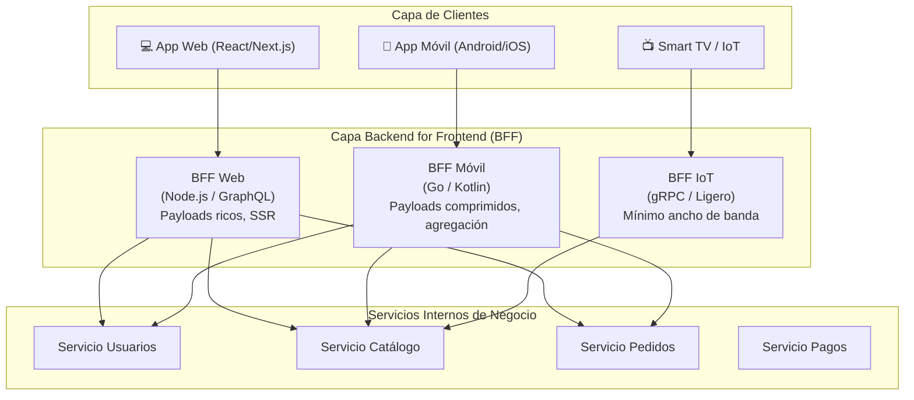

#architecture #system-design #bff #backend-for-frontend #api #microservices

# Arquitectura BFF (Backend for Frontend)

El patrón **BFF (Backend for Frontend)** es un patrón de diseño arquitectónico en el que se crean **servicios backend dedicados y especializados para cada tipo específico de interfaz de usuario** (por ejemplo: un BFF para la aplicación web de escritorio, un BFF para la aplicación móvil iOS/Android, y un BFF para dispositivos IoT o Smart TVs).

Fue conceptualizado y formalizado por **Sam Newman** (autor de *"Building Microservices"*) y popularizado por empresas con múltiples clientes cliente-servidor a escala masiva como **SoundCloud**, **Netflix** y **Spotify**.

---

## Índice

- [[Diseño y Arquitectura/Diseño y Arquitectura.md|<- Volver a Diseño y Arquitectura]]
- [[Diseño y Arquitectura/APIs y Comunicación/Diseño de APIs.md|Ver Diseño de APIs]]
- [[Diseño y Arquitectura/Diseño y Arquitectura.md|Ver Patrones Arquitectónicos]]
- [[Diseño y Arquitectura/Sistemas Distribuidos/Rate Limit.md|Ver Rate Limiting]]

---

## El Problema: La API Única Universal (*"One API to Rule Them All"*)

Tradicionalmente, las arquitecturas de microservicios exponían una única API REST pública o un API Gateway genérico para todos los clientes posibles:

```
┌─────────────┐     ┌─────────────┐     ┌─────────────┐
│   App Web   │     │ App Móvil   │     │  Smart TV   │
│  (Desktop)  │     │ (iOS/Andr.) │     │   / IoT     │
└──────┬──────┘     └──────┬──────┘     └──────┬──────┘
       │                   │                   │
       └───────────────┐   │   ┌───────────────┘
                       ▼   ▼   ▼
            ┌─────────────────────────┐
            │   API Gateway Genérico   │  ← Un único contrato para todos
            └────────────┬────────────┘
                         ▼
             [ Microservicios Backend ]
```

### Síntomas y Limitaciones de una API Genérica:
1. **Over-fetching (Sobrecarga de datos)**: La app móvil solo necesita mostrar el nombre y la foto de un producto, pero la API devuelve 40 campos (detalles técnicos, reseñas, especificaciones) pensados para la web de escritorio, saturando el plan de datos y la memoria del móvil.
2. **Under-fetching y Comunicación Ruidosa (*Chatty I/O*)**: Para renderizar la pantalla de inicio, la app móvil debe encadenar 5 peticiones HTTP independientes (perfil, recomendaciones, notificaciones, carrito). En redes celulares 4G/5G con alta latencia, esto provoca pantallas en blanco y mala experiencia.
3. **Ciclos de Despliegue Acoplados**: Los cambios solicitados por el equipo móvil impactan o retrasan al equipo web porque ambos comparten el mismo backend/gateway.

---

## La Solución BFF: Un Backend a Medida por Cliente

En el modelo BFF, cada tipo de cliente interactúa exclusivamente con un backend intermediario optimizado para sus necesidades de pantalla, red y ciclo de vida:



---

## Responsabilidades Clave de un BFF

Un BFF actúa como una capa de **traducción, agregación y orquestación**:

```
                       ┌──► [Servicio Usuarios]   (Retorna JSON 1)
                       │
App Móvil ──► [BFF Móvil] ──► [Servicio Pedidos]    (Retorna JSON 2)
  (1 sola      (Agrega │
  llamada)   y recorta)└──► [Servicio Inventario] (Retorna JSON 3)
```

1. **Agregación de Datos (*Data Aggregation*)**:
   - Recibe una única llamada desde el cliente móvil (`GET /home-screen`) y ejecuta en paralelo 4 llamadas internas de baja latencia (vía gRPC o red interna) hacia los microservicios de backend.
2. **Recorte y Adaptación de Payloads (*Payload Trimming*)**:
   - Filtra y descarta todos los campos innecesarios, enviando por la red móvil únicamente los bytes indispensables para la UI.
3. **Manejo de Autenticación y Sesión**:
   - Puede traducir tokens públicos (JWT, cookies) a credenciales internas seguras (*mTLS* o tokens entre servicios).
4. **Formato Optimizado**:
   - Puede implementar **GraphQL** para la web y respuestas en formato binario comprimido o JSON reducido para apps móviles.

> [!IMPORTANT] Regla Fundamental de Propiedad del Código
> La mejor práctica de la arquitectura BFF establece que **el BFF debe ser propiedad y mantenerse por el mismo equipo que construye la aplicación cliente** (el equipo de iOS/Android mantiene el BFF Móvil; el equipo frontend mantiene el BFF Web). 
> **¡Cuidado!**: El BFF **no debe contener lógica de negocio de dominio** (esa lógica pertenece estrictamente a los microservicios internos). El BFF solo contiene lógica de orquestación y formato para la presentación.

---

## Comparativa: API Gateway Tradicional vs. BFF

| Dimensión | API Gateway Clásico | Arquitectura BFF |
| :--- | :--- | :--- |
| **Enfoque** | Orientado a los servicios de backend (*Inside-Out*). | Orientado a la experiencia del usuario (*Outside-In*). |
| **Número de Gateways**| Uno solo compartido para toda la empresa. | Múltiples (uno por cada tipo o familia de cliente). |
| **Equipo Responsable**| Equipo de Infraestructura / Backend central. | Equipos de Frontend / Mobile específicos. |
| **Riesgo de Despliegue**| Alto: un fallo en el gateway afecta a todos los clientes. | Aislado: un cambio en el BFF móvil no impacta a la web. |
| **Tamaño de Payload** | Genérico (suele incluir campos de más). | Extremadamente optimizado y exacto. |

---

## Ventajas y Desventajas

### Ventajas
- **Rendimiento Móvil Superior**: Reduce drásticamente el número de conexiones de red y la latencia en dispositivos móviles.
- **Autonomía de Equipos**: El equipo frontend puede evolucionar su BFF y lanzar nuevas versiones a producción sin depender del calendario del backend central.
- **Flexibilidad de Tecnologías**: El BFF web puede escribirse en TypeScript/Node.js para aprovechar SSR (Server-Side Rendering), mientras el BFF móvil puede estar en Go o Kotlin para máxima eficiencia.

### Desventajas
- **Duplicación de Código**: Puede existir cierta duplicación de llamadas a microservicios entre distintos BFFs si no se comparten librerías comunes de cliente.
- **Mayor Infraestructura**: Requiere desplegar, monitorear y mantener más servicios en producción.

---

## Referencias y Enlaces

- [[Diseño y Arquitectura/Diseño y Arquitectura.md|Índice de Diseño y Arquitectura]]
- [[Diseño y Arquitectura/APIs y Comunicación/Diseño de APIs.md|Diseño de APIs (REST, GraphQL, gRPC)]]
- [[Diseño y Arquitectura/Sistemas Distribuidos/Rate Limit.md|Rate Limiting]]
- Sam Newman: *Pattern: Backends For Frontends (2015).*
- SoundCloud Engineering: *How we ended up with microservices and BFFs.*
