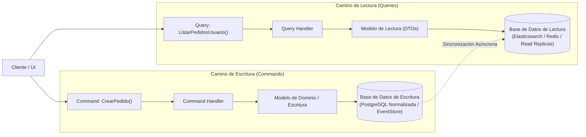

#architecture #design-patterns #cqrs #cqs #distributed-systems #databases

# Patrón Arquitectónico: CQRS (Command Query Responsibility Segregation)

**CQRS (Segregación de Responsabilidad de Comandos y Consultas)** es un patrón de diseño arquitectónico que **separa las operaciones que modifican datos (*Commands*) de las operaciones que leen datos (*Queries*)** en dos modelos conceptuales y de ejecución completamente independientes.

Fue formulado por **Greg Young** en 2010 como una evolución del principio **CQS (*Command-Query Separation*)** introducido originalmente por **Bertrand Meyer** en el lenguaje Eiffel.

---

## Índice

- [[Diseño y Arquitectura/Diseño y Arquitectura.md|<- Volver a Diseño y Arquitectura]]
- [[Diseño y Arquitectura/Patrones de Arquitectura/Patrón Arquitectónico - Event Sourcing.md|Ver Event Sourcing]]
- [[Diseño y Arquitectura/Sistemas Distribuidos/Teorema PACELC.md|Ver Teorema PACELC]]
- [[Diseño y Arquitectura/Patrones de Arquitectura/Patrón Arquitectónico - Microservicios.md|Ver Microservicios]]

---

## La Problemática del Modelo Único de Datos

En las aplicaciones tradicionales existe un único modelo compartido tanto para leer como para escribir:

```
           ┌──────────────────────────────────────────────┐
           │        Entidad de Dominio / Tabla Única      │
           └──────────────────────┬───────────────────────┘
                                  │
                  ┌───────────────┴───────────────┐
                  ▼                               ▼
       Escritura (Command)                 Lectura (Query)
   (Validaciones complejas,            (Necesita 8 JOINs para la UI,
    bloqueos, integridad)               agregaciones, velocidad)
```

- **Para escribir**: Se requiere un modelo altamente normalizado (3FN) con validaciones estrictas e invariantes de negocio para evitar datos corruptos.
- **Para leer**: Se requieren vistas desnormalizadas, proyecciones rápidas, búsquedas de texto y paginación masiva sin costosos `JOINs` que degraden la base de datos.
- **El conflicto**: Un modelo de datos único siempre es un compromiso forzado que perjudica tanto a las lecturas como a las escrituras.

---

## La Solución CQRS: Separación Total de Caminos



### 1. Commands (Comandos / Escrituras)
- Representan una intención de cambio de estado (`PagarFactura`, `CambiarEmail`, `CancelarPedido`).
- **No devuelven datos de negocio**, solo confirmación de éxito o fallo (vacío / `void` o ID generado).
- Se ejecutan sobre el modelo de dominio rico con validaciones e invariantes transaccionales.

### 2. Queries (Consultas / Lecturas)
- Solo devuelven datos en forma de DTOs planos listos para la pantalla.
- **Tienen efecto secundario cero**: jamás alteran el estado del sistema.
- Se ejecutan directamente sobre almacenes de lectura optimizados sin pasar por la lógica pesada del dominio.

---

## Niveles de Adopción de CQRS

1. **CQRS Básico (Mismo Almacén de Datos)**:
   - Se utiliza una única base de datos física, pero en el código se separan las clases de comando y consulta en paquetes distintos.
2. **CQRS con Bases de Datos Separadas**:
   - Una base de datos relacional para escrituras (ACID) y bases de datos NoSQL/Caché para lecturas (Elasticsearch, Mongo, Redis).
   - Se sincronizan de forma asíncrona mediante eventos (*Event-Driven*).
3. **CQRS + Event Sourcing**:
   - El estado de escritura se almacena como eventos inmutables en un *Event Store*, y los proyectores alimentan las vistas de lectura.

---

## Ventajas y Desventajas

| Ventajas | Desventajas |
| :--- | :--- |
| **Escalabilidad Asimétrica**: En la mayoría de apps la proporción de lecturas frente a escrituras es de $100:1$. CQRS permite escalar solo las réplicas de lectura. | **Complejidad Arquitectónica**: Duplica el número de modelos, clases y posibles bases de datos. |
| **Modelos de Lectura Óptimos**: Las pantallas cargan instantáneamente sin requerir JOINs costosos ni transformaciones. | **Consistencia Eventual**: Si la sincronización entre bases de datos es asíncrona, existe un desfase temporal (*Lag*) donde el usuario puede no ver su cambio reflejado de inmediato. |
| **Seguridad Mejorada**: Fácil de aplicar permisos estrictos (usuarios con permiso de lectura no tienen acceso a rutas de comandos). | **Riesgo de Sobre-ingeniería**: No apto para aplicaciones CRUD simples donde las lecturas y escrituras son equivalentes. |

---

## Referencias y Enlaces

- [[Diseño y Arquitectura/Diseño y Arquitectura.md|Índice de Diseño y Arquitectura]]
- [[Diseño y Arquitectura/Patrones de Arquitectura/Patrón Arquitectónico - Event Sourcing.md|Event Sourcing]]
- [[Diseño y Arquitectura/Sistemas Distribuidos/Teorema PACELC.md|Teorema PACELC]]
- Greg Young: *CQRS Documents (2010).*
- Martin Fowler: *CQRS.*
