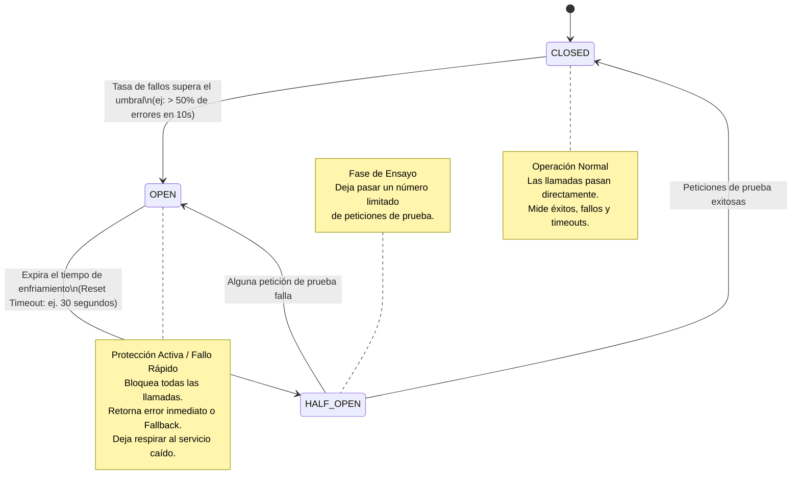

#architecture #system-design #distributed-systems #resilience #circuit-breaker #microservices

# Patrón Circuit Breaker (Cortacircuitos)

El **Patrón Circuit Breaker (Cortacircuitos)** es un patrón de diseño de resiliencia y estabilidad en sistemas distribuidos y arquitecturas de microservicios. Su propósito principal es **detener las peticiones hacia un servicio remoto que está experimentando fallos recurrentes**, evitando fallos en cascada (*Cascading Failures*) y permitiendo que el sistema falle rápido (*Fail Fast*) o entregue respuestas degradadas (*Graceful Degradation*).

Fue popularizado en el software por **Michael Nygard** en su libro seminal *"Release It!"* (2007) y adoptado globalmente por **Netflix** a través de su librería pionera *Hystrix*.

---

## Índice

- [[Diseño y Arquitectura/Diseño y Arquitectura.md|<- Volver a Diseño y Arquitectura]]
- [[Diseño y Arquitectura/Sistemas Distribuidos/Rate Limit.md|Ver Rate Limiting]]
- [[Diseño y Arquitectura/Patrones de Arquitectura/Patrón Arquitectónico - Saga.md|Ver Patrón Arquitectónico: Saga]]
- [[Diseño y Arquitectura/Diseño y Arquitectura.md|Ver Arquitectura de Software]]

---

## El Problema: El Efecto Dominó de los Fallos en Cascada

En una red de microservicios interconectados, un fallo lento en un servicio de soporte puede tumbar toda la plataforma:

```
[Usuario] ──► [Servicio Web] ──► [Servicio Pedidos] ──► [Pasarela de Pago Caída]
```

1. La **Pasarela de Pago** se cuelga o tarda 30 segundos en responder por timeout.
2. Cada usuario que intenta comprar bloquea un hilo (*Thread*) y una conexión de red en el **Servicio de Pedidos**.
3. En pocos segundos, el pool de hilos y conexiones del Servicio de Pedidos se agota por completo.
4. El **Servicio Web** empieza a fallar porque el Servicio de Pedidos no responde.
5. **Resultado**: La caída de un único servicio secundario colapsa todos los servicios principales del negocio (*Fallo en Cascada*).

---

## Metáfora Eléctrica

Al igual que el interruptor termomagnético de tu hogar corta la electricidad cuando detecta una sobrecarga para evitar que los cables se quemen, un **Circuit Breaker de software envuelve las llamadas remotas peligrosas y corta el paso de peticiones** cuando la tasa de fallos supera un límite de seguridad.

---

## La Máquina de Estados del Circuit Breaker

El cortacircuitos opera como una máquina de estados con **tres estados posibles**:



### 1. CLOSED (Cerrado - Funcionamiento Normal)
- El circuito está "cerrado" (la corriente fluye libremente).
- Las llamadas hacia el microservicio externo se ejecutan con normalidad.
- El cortacircuitos mantiene un contador de peticiones exitosas, fallidas y timeouts dentro de una ventana deslizante.
- Si el porcentaje de fallos supera un umbral predefinido (ej. $50\%$ de errores en los últimos $20$ intentos), el circuito pasa inmediatamente a **OPEN**.

### 2. OPEN (Abierto - Protección Activa y Fallo Rápido)
- El circuito está "abierto" (la corriente está cortada).
- **Ninguna llamada llega al servicio remoto caído**.
- Las peticiones entrantes **fallan de inmediato (*Fail Fast*)** sin esperar timeouts de red, o ejecutan una estrategia alternativa (**Fallback**).
- Se inicia un temporizador de enfriamiento (*Sleep Window / Reset Timeout*, por ejemplo 30 segundos), dando tiempo al servicio remoto para reiniciarse, vaciar colas o recuperarse.

### 3. HALF-OPEN (Semi-abierto - Prueba de Recuperación)
- Al finalizar el tiempo de enfriamiento, el circuito pasa a estado semi-abierto.
- Permite pasar un **número pequeño de peticiones de prueba** (ej. 3 a 5 peticiones reales).
- **Si todas las llamadas de prueba tienen éxito**: El cortacircuitos concluye que el servicio remoto se ha recuperado por completo y regresa al estado **CLOSED**.
- **Si alguna llamada de prueba falla**: Asume que el servicio sigue convaleciente y vuelve inmediatamente a **OPEN** por otro ciclo de enfriamiento.

---

## Estrategias de Fallback (Degradación Elegante)

Cuando el circuito está **OPEN**, el sistema puede responder con elegancia en lugar de arrojar un error genérico:

```
Llamada Remota ──► [Circuit Breaker: OPEN] ──► ¿Estrategia Fallback?
                                                 ├── 1. Caché Local (Último dato conocido)
                                                 ├── 2. Valor Seguro por Defecto
                                                 └── 3. Encolar para Reintento Posterior
```

1. **Caché Local Estale**: Si el servicio de catálogo de productos cae, la app muestra los productos almacenados en la caché local de Redis del día anterior.
2. **Valor por Defecto Seguro (*Stubbed Data*)**: Si el servicio de recomendaciones personalizadas con IA no responde, se muestran los 10 productos más vendidos en general.
3. **Encolar para Procesamiento Asíncrono**: Si el servicio de notificaciones por email está caído, el mensaje se guarda en una cola local o mensaje en disco para enviarse cuando el circuito se cierre.

---

## Sinergia de Patrones de Resiliencia: Retry vs. Circuit Breaker vs. Rate Limit

| Patrón | Enfoque Principal | ¿Cuándo actúa? | Riesgo sin el patrón |
| :--- | :--- | :--- | :--- |
| **Retry** (Reintento) | Superar fallos transitorios de red de pocos milisegundos. | Inmediatamente tras un fallo único. | **Peligro**: Reintentos masivos sin control actúan como un ataque DDoS involuntario sobre un servidor moribundo. |
| **Circuit Breaker** | Proteger al cliente y permitir respirar al servidor ante fallos persistentes. | Cuando los fallos superan un umbral continuo. | Agotamiento de hilos, bloqueos de conexión y fallos en cascada globales. |
| [[Diseño y Arquitectura/Sistemas Distribuidos/Rate Limit.md\|Rate Limit]] | Proteger al servidor contra saturación provocada por exceso de clientes. | En todo momento en el borde o API Gateway. | Caída del backend por exceso de tráfico o abusos intencionados. |

> [!TIP] La Combinación Ideal
> El patrón **Retry con Exponential Backoff y Jitter** debe colocarse **por detrás** del **Circuit Breaker**. Si el fallo es aislado, el retry lo resuelve; si el fallo persiste, el Circuit Breaker frena los reintentos antes de causar estragos.

---

## Implementación en la Industria

1. **Librerías a Nivel de Código**:
   - **Resilience4j** (Java / Spring Boot - sucesor moderno de Netflix Hystrix).
   - **Polly** (C# / .NET).
   - **sony/gobreaker** o **afex/hystrix-go** (Go).
   - **opossum** (Node.js / JavaScript).
2. **A Nivel de Infraestructura (Service Mesh / Proxy)**:
   - **Envoy Proxy** e **Istio**: Implementan cortacircuitos transparentes a nivel de red sin necesidad de modificar el código de los microservicios (*Sidecar Pattern*).

---

## Referencias y Enlaces

- [[Diseño y Arquitectura/Diseño y Arquitectura.md|Índice de Diseño y Arquitectura]]
- [[Diseño y Arquitectura/Sistemas Distribuidos/Rate Limit.md|Rate Limiting]]
- [[Diseño y Arquitectura/Patrones de Arquitectura/Patrón Arquitectónico - Saga.md|Patrón Arquitectónico: Saga]]
- [[Diseño y Arquitectura/Diseño y Arquitectura.md|Arquitectura de Software]]
- Michael Nygard: *Release It! Design and Deploy Production-Ready Software (2007).*
- Martin Fowler: *Circuit Breaker Pattern (2014).*
