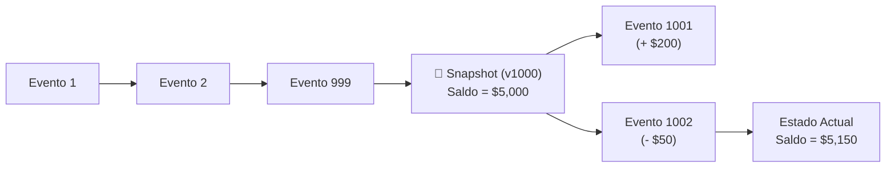

#architecture #system-design #event-sourcing #cqrs #databases #distributed-systems

# Event Sourcing (Almacenamiento Basado en Eventos)

**Event Sourcing** es un patrón arquitectónico y de persistencia en el que **el estado de una entidad no se guarda mediante sobrescritura (*UPDATE*), sino como una secuencia cronológica inmutable de eventos pasados**.

A diferencia de las bases de datos relacionales tradicionales donde cada actualización destruye el valor anterior, en Event Sourcing **cada cambio es un hecho histórico inmutable (*Fact*)** almacenado en un registro de solo anexar (*Append-Only Log*). El estado actual de la entidad se reconstruye recalculando o reproduciendo todos sus eventos históricos.

---

## Índice

- [[Diseño y Arquitectura/Diseño y Arquitectura.md|<- Volver a Diseño y Arquitectura]]
- [[Diseño y Arquitectura/Patrones de Arquitectura/Patrón Arquitectónico - CQRS.md|Ver Patrón Arquitectónico: CQRS]]
- [[Diseño y Arquitectura/Patrones de Arquitectura/Patrón Arquitectónico - Saga.md|Ver Patrón Arquitectónico: Saga]]
- [[Diseño y Arquitectura/Sistemas Distribuidos/Teorema CAP.md|Ver Teorema CAP]]

---

## Metáfora: El Libro Mayor Contable vs. CRUD Tradicional

La contabilidad profesional inventó Event Sourcing hace siglos:

| Enfoque CRUD Tradicional (Destructivo) | Enfoque Event Sourcing (Inmutable) |
| :--- | :--- |
| Una tabla guarda solo el saldo actual: | Un libro contable anota cada movimiento: |
| `UPDATE cuentas SET saldo = 150 WHERE id = 1;` | 1. `CuentaAbierta(saldo = 0)`<br>2. `DineroDepositado(+200)`<br>3. `RetiroEnCajero(-50)` |
| **Pérdida de contexto**: Si el saldo es $150, no sabemos cómo llegó a esa cifra ni qué transacciones ocurrieron a menos que exista un log secundario no garantizado. | **Auditoría matemática perfecta**: El saldo actual ($150) es el resultado matemático de reproducir el historial completo de eventos. |

---

## Conceptos Fundamentales

```
             ┌─────────────────────────────────────────────────────────────┐
             │            Event Stream del Agregado "Cuenta-42"            │
             └──────┬──────────────────────┬──────────────────────┬────────┘
                    │                      │                      │
                    ▼                      ▼                      ▼
           ┌─────────────────┐    ┌─────────────────┐    ┌─────────────────┐
           │  CuentaCreada   │ ─► │ DineroAcreditado│ ─► │ DineroDebitado  │
           │  (Monto: $100)  │    │  (Monto: $50)   │    │  (Monto: $30)   │
           └─────────────────┘    └─────────────────┘    └─────────────────┘
                 Versión 1              Versión 2              Versión 3
                                                                   │
                                                                   ▼
                                                            Estado Calculado:
                                                             Saldo = $120
```

1. **Event (Evento)**:
   - Representa un hecho inmutable que **ya ocurrió en el pasado** en el dominio del negocio.
   - Se nombra siempre en tiempo pretérito: `OrdenCreada`, `PagoProcesado`, `ArticuloAgregado`, `DireccionCambiada`.
   - Una vez escrito en el almacén, **jamás se modifica ni se elimina**.
2. **Event Stream (Flujo de Eventos de un Agregado)**:
   - La lista secuencial ordenada de eventos que pertenecen a una instancia de negocio específica (ej. todos los eventos de la orden `ord-9871`).
3. **Event Store (Almacén de Eventos)**:
   - Base de datos especializada de solo anexar (*Append-Only*) que garantiza consistencia atómica y control de concurrencia optimista mediante números de versión (`version = 1, 2, 3...`).
4. **Rehidratación (*Rehydration / State Folding*)**:
   - Proceso de cargar todos los eventos de un agregado desde la base de datos y aplicarlos secuencialmente sobre un objeto en memoria para reconstruir su estado actual.

---

## Optimización: Snapshots (Instantáneas)

Si un agregado acumula miles de eventos (por ejemplo, una cuenta bancaria con 10 años de uso), reconstruir el estado desde el evento número 1 puede penalizar la latencia. Para resolverlo se utiliza el concepto de **Snapshot**:



- En lugar de leer los primeros 1,000 eventos, el sistema carga directamente la foto guardada en la versión 1,000 y solo aplica los eventos posteriores.

---

## La Pareja Perfecta: Event Sourcing + CQRS

Event Sourcing rara vez se utiliza solo; casi siempre se implementa junto con **CQRS (Command Query Responsibility Segregation)**:

```mermaid
flowchart TD
    subgraph Write_Side ["Lado de Escritura (Command Side)"]
        Cmd["Comando: RetirarDinero($50)"] --> Agg["Agregado / Lógica Dominio\n(Valida saldo suficiente)"]
        Agg -->|Genera| Evt["Evento: DineroRetirado($50)"]
        Evt -->|Append| EStore[("Event Store\n(Fuente de la Verdad)")]
    end

    subgraph Read_Side ["Lado de Lectura (Query Side - Proyecciones)"]
        EStore -.->|Publica Evento (Async)| Proj["Proyectores / Handlers"]
        Proj --> ReadDB1[("PostgreSQL / RDBMS\n(Tablas optimizadas para UI)")]
        Proj --> ReadDB2[("Elasticsearch\n(Búsqueda de texto)")]
        Proj --> ReadDB3[("Redis\n(Caché de saldos rápidos)")]
    end

    Query["Consulta: GET /saldo"] --> ReadDB3
```

1. **Lado de Escritura (Commands)**:
   - Solo se enfoca en validar reglas de negocio e insertar eventos de manera ultrarrápida (las escrituras append-only son las operaciones de base de datos más rápidas que existen porque no hay bloqueos de índices complejos ni lecturas previas pesadas).
2. **Lado de Lectura (Queries)**:
   - Los eventos se leen de forma asíncrona y se **proyectan** en bases de datos de lectura diseñadas a la medida de la pantalla que las necesita (Elasticsearch para búsquedas, Redis para contadores rápidos, PostgreSQL relacional para tablas y reportes).

---

## Ventajas y Desventajas

| Ventajas | Desventajas |
| :--- | :--- |
| **Auditoría Total al 100%**: Cumplimiento legal, regulatorio y financiero. Ningún dato se borra jamás. | **Curva de Aprendizaje Compleja**: Requiere abandonar la mentalidad CRUD imperativa tradicional. |
| **Consultas Temporales (*Time-Travel*)**: Capacidad de responder *"¿cuál era el estado exacto del sistema el 15 de marzo a las 14:00?"*. | **Consistencia Eventual en Lecturas**: Existe un breve retraso (*lag*) entre que el evento se escribe y las vistas de consulta se actualizan. |
| **Nuevas Vistas Retrospectivas**: Puedes crear una nueva base de datos analítica hoy y poblarla reproduciendo los eventos de los últimos 5 años. | **Evolución del Esquema (*Event Versioning*)**: Como los eventos no se modifican, si la estructura de un evento cambia hay que soportar *upcasting* (adaptadores de versión). |
| **Cero Conflictos de Bloqueos en DB**: Escrituras concurrentes basadas en inserciones sin locks de fila destructivos. | **Mayor Volumen de Almacenamiento**: Requiere más capacidad de disco al almacenar la historia completa. |

---

## ¿Cuándo Utilizar Event Sourcing?

- **Sistemas Financieros y Contables**: Bancos, transferencias, facturación y monederos virtuales.
- **Comercio Electrónico y Logística**: Seguimiento de pedidos (*Creado $\rightarrow$ Pagado $\rightarrow$ Empaquetado $\rightarrow$ En tránsito $\rightarrow$ Entregado*).
- **Herramientas de Colaboración en Tiempo Real**: Aplicaciones con historial de cambios y función "Deshacer / Rehacer" (*Undo/Redo*), como Figma o Google Docs.
- **Sistemas Médicos y Legales**: Donde las leyes prohíben estrictamente alterar u ocultar modificaciones sobre registros previos.

---

## Tecnologías y Frameworks Comunes

- **Bases de Datos de Eventos Nativas**: **EventStoreDB**, **Apache Kafka** (como log de eventos distribuido).
- **Frameworks de Aplicación**: **Axon Framework** (Java/Spring), **Marten** (C# / .NET sobre PostgreSQL), **Eventide** (Ruby).

---

## Referencias y Enlaces

- [[Diseño y Arquitectura/Diseño y Arquitectura.md|Índice de Diseño y Arquitectura]]
- [[Diseño y Arquitectura/Patrones de Arquitectura/Patrón Arquitectónico - CQRS.md|Patrón Arquitectónico: CQRS]]
- [[Diseño y Arquitectura/Patrones de Arquitectura/Patrón Arquitectónico - Saga.md|Patrón Arquitectónico: Saga]]
- [[Diseño y Arquitectura/Sistemas Distribuidos/Teorema PACELC.md|Teorema PACELC]]
- Martin Fowler: *Event Sourcing (2005).*
- Greg Young: *CQRS and Event Sourcing documents.*
