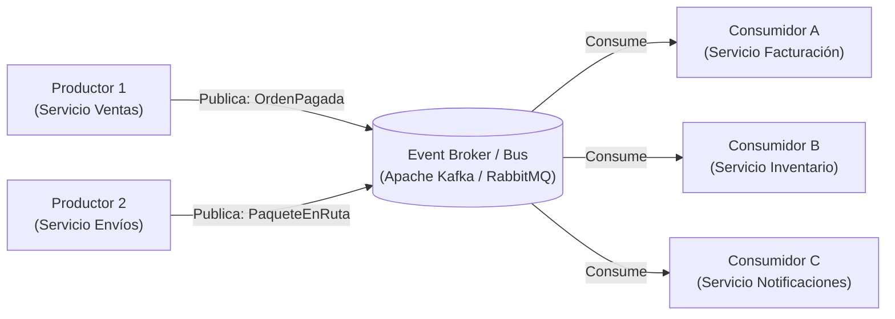

#architecture #system-design #event-driven #eda #async #messaging #kafka #rabbitmq

# Patrón Arquitectónico: Event-Driven (Orientado a Eventos)

La **Arquitectura Orientada a Eventos (*Event-Driven Architecture / EDA*)** es un patrón arquitectónico en el que la captura, comunicación, procesamiento y persistencia de información se estructuran en torno a la **producción y consumo de eventos asíncronos**.

En lugar de que los servicios se llamen directamente entre sí de forma bloqueante (*Request - Response síncrono*), los emisores publican hechos que ocurrieron en el sistema sin saber quién ni cuándo los consumirá, logrando el máximo desacoplamiento espacial y temporal.

---

## Índice

- [[Diseño y Arquitectura/Diseño y Arquitectura.md|<- Volver a Diseño y Arquitectura]]
- [[Diseño y Arquitectura/Patrones de Arquitectura/Patrón Arquitectónico - Saga.md|Ver Patrón Saga]]
- [[Diseño y Arquitectura/Patrones de Arquitectura/Patrón Arquitectónico - Event Sourcing.md|Ver Event Sourcing]]
- [[Diseño y Arquitectura/Patrones de Arquitectura/Patrón Arquitectónico - Microservicios.md|Ver Microservicios]]

---

## Anatomía de una Arquitectura EDA

1. **Event Producer (Emisor / Productor)**:
   - Detecta un cambio de estado en su dominio y emite un evento inmutable hacia un canal.
   - **No espera respuesta** del receptor; continúa su ejecución de inmediato.
2. **Event Channel / Broker (Canal o Broker de Eventos)**:
   - Infraestructura especializada encargada de recibir, enrutar, almacenar y entregar eventos a los suscriptores (ej. **Apache Kafka**, **RabbitMQ**, **AWS SNS/SQS**, **Google Cloud Pub/Sub**).
3. **Event Consumer (Receptor / Consumidor)**:
   - Se suscribe a tipos específicos de eventos y ejecuta su propia lógica de negocio cuando un evento llega.

---

## Las Dos Topologías Principales de EDA

### 1. Topología Broker (Descentralizada - Pub/Sub Puro)
No existe un coordinador central. Un evento se emite y múltiples servicios reaccionan de forma autónoma.
- **Caso de uso**: Cuando la lógica de los consumidores no requiere una secuencia estricta ni supervisión central.
- **Ejemplo**: Al emitirse `UsuarioRegistrado`, el servicio de email envía bienvenida, el servicio de analítica registra la métrica y el servicio de marketing prepara una campaña, todo en paralelo.

### 2. Topología Mediador (Orquestada)
Un componente mediador (*Orchestrator*) escucha el evento inicial y coordina los pasos secuenciales enviando eventos específicos a cada servicio.
- **Caso de uso**: Flujos de negocio complejos con pasos dependientes y manejo de transacciones distribuidas (ver [[Diseño y Arquitectura/Patrones de Arquitectura/Patrón Arquitectónico - Saga.md|Patrón Saga]]).

---

## Ventajas y Desventajas

| Ventajas | Desventajas |
| :--- | :--- |
| **Desacoplamiento Extremo**: Los productores no conocen a los consumidores. Puedes agregar un nuevo servicio consumidor hoy sin tocar una sola línea de código del productor. | **Complejidad de Depuración**: Seguir el flujo de ejecución a través de múltiples colas asíncronas requiere herramientas de *distributed tracing* (Jaeger, OpenTelemetry). |
| **Alta Resiliencia**: Si un consumidor (ej. notificaciones por email) se cae, los eventos se acumulan de forma segura en el broker y se procesan cuando el servicio vuelva a encenderse. | **Consistencia Eventual**: El sistema opera bajo consistencia eventual; los datos de los consumidores tardan milisegundos o segundos en sincronizarse. |
| **Amortiguación de Tráfico (*Backpressure*)**: En picos masivos de carga (ej. Cyber Monday), los consumidores leen a su propio ritmo sin saturarse ni colapsar la base de datos. | **Riesgo de Duplicados**: Los brokers de red garantizan entrega *at-least-once*, lo que exige que todos los consumidores sean estrictamente **idempotentes**. |

---

## Referencias y Enlaces

- [[Diseño y Arquitectura/Diseño y Arquitectura.md|Índice de Diseño y Arquitectura]]
- [[Diseño y Arquitectura/Patrones de Arquitectura/Patrón Arquitectónico - Saga.md|Patrón Saga]]
- [[Diseño y Arquitectura/Patrones de Arquitectura/Patrón Arquitectónico - Event Sourcing.md|Event Sourcing]]
- [[Diseño y Arquitectura/Patrones de Arquitectura/Patrón Arquitectónico - Microservicios.md|Microservicios]]
- Mark Richards: *Software Architecture Patterns (Event-Driven Architecture).*
