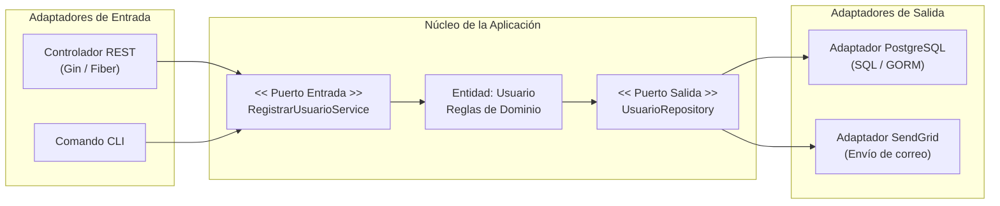

#architecture #design-patterns #hexagonal #ports-and-adapters #clean-code #go

# Patrón Arquitectónico: Hexagonal (Puertos y Adaptadores)

La **Arquitectura Hexagonal**, también conocida como el patrón de **Puertos y Adaptadores (*Ports and Adapters*)**, es un patrón arquitectónico concebido por **Alistair Cockburn** en 2005. Su propósito fundamental es **aislar el núcleo de la lógica de negocio de los detalles técnicos externos** (bases de datos, interfaces gráficas, frameworks web, brokers de mensajería y servicios de terceros).

La metáfora del *hexágono* ilustra que una aplicación puede tener múltiples lados a través de los cuales interactúa con el mundo exterior mediante interfaces bien definidas (puertos).

---

## Índice

- [[Diseño y Arquitectura/Diseño y Arquitectura.md|<- Volver a Diseño y Arquitectura]]
- [[Diseño y Arquitectura/Patrones de Arquitectura/Patrón Arquitectónico - Clean Architecture.md|Ver Clean Architecture]]
- [[Diseño y Arquitectura/Patrones de Arquitectura/Patrón Arquitectónico - Por Capas.md|Ver Arquitectura por Capas]]

---

## Conceptos Centrales

```
                   ADAPTADORES PRIMARIOS (Conducen la app)
                   [Controlador HTTP / REST / CLI / Tests]
                                     │
                                     ▼
                   ┌─────────────────────────────────────┐
                   │    PUERTO PRIMARIO (Entrada / API)  │
                   ├─────────────────────────────────────┤
                   │                                     │
                   │           DOMINIO CENTRAL           │
                   │     (Entidades + Casos de Uso)      │
                   │      Lógica de negocio pura         │
                   │                                     │
                   ├─────────────────────────────────────┤
                   │   PUERTO SECUNDARIO (Salida / SPI)  │
                   └─────────────────────────────────────┘
                                     ▲
                                     │
                  ADAPTADORES SECUNDARIOS (Conducidos por la app)
                  [PostgreSQL / MongoDB / Stripe / RabbitMQ / AWS]
```

### 1. El Dominio (Inside)
- Es el centro del hexágono. Contiene las **entidades de negocio** y los **casos de uso**.
- **No importa ningún paquete de base de datos, framework HTTP ni dependencias externas**.
- Es 100% agnóstico a la tecnología de infraestructura.

### 2. Puertos (Ports)
- Son **interfaces** que definen contratos de comunicación entre el dominio y el exterior.
- **Puerto de Entrada / Primario (*Driver Port*)**: Define qué puede hacer el mundo exterior sobre la aplicación (ej. `CrearPedidoUseCase`).
- **Puerto de Salida / Secundario (*Driven Port*)**: Define qué necesita la aplicación del mundo exterior (ej. `PedidoRepository`, `PasarelaPago`).

### 3. Adaptadores (Adapters - Outside)
- Conectan el mundo exterior a los puertos de la aplicación.
- **Adaptadores de Entrada**: Traducen peticiones externas a llamadas al puerto primario (ej. un controlador HTTP de Gin/Echo en Go, un comando de terminal CLI).
- **Adaptadores de Salida**: Implementan los puertos secundarios comunicándose con tecnologías concretas (ej. un repositorio que ejecuta SQL en PostgreSQL, un cliente HTTP de Stripe).

---

## Diagrama de Flujo en Arquitectura Hexagonal



---

## Ejemplo Práctico en Go

### 1. Dominio y Puertos (Sin dependencias externas)
```go
package domain

// Entidad pura
type Producto struct {
    ID     string
    Nombre string
    Precio float64
}

// Puerto Secundario (Salida): Lo que el dominio necesita para persistir
type ProductoRepository interface {
    Guardar(p *Producto) error
    BuscarPorID(id string) (*Producto, error)
}

// Puerto Primario (Entrada): El caso de uso que expone la aplicación
type CrearProductoUseCase interface {
    Ejecutar(nombre string, precio float64) (*Producto, error)
}

// Implementación del caso de uso (Lógica de negocio pura)
type ProductoService struct {
    repo ProductoRepository // Inversión de dependencias (DIP)
}

func NuevoProductoService(repo ProductoRepository) *ProductoService {
    return &ProductoService{repo: repo}
}

func (s *ProductoService) Ejecutar(nombre string, precio float64) (*Producto, error) {
    if precio <= 0 {
        return nil, errors.New("el precio debe ser mayor a cero")
    }
    prod := &Producto{ID: "prod_1", Nombre: nombre, Precio: precio}
    err := s.repo.Guardar(prod)
    return prod, err
}
```

### 2. Adaptador de Salida (Infraestructura / PostgreSQL)
```go
package postgres

type PostgresProductoRepository struct {
    db *sql.DB
}

func (r *PostgresProductoRepository) Guardar(p *domain.Producto) error {
    _, err := r.db.Exec("INSERT INTO productos (id, nombre, precio) VALUES ($1, $2, $3)", p.ID, p.Nombre, p.Precio)
    return err
}
```

### 3. Adaptador de Entrada (Controlador HTTP)
```go
package http

type ProductoHandler struct {
    service domain.CrearProductoUseCase
}

func (h *ProductoHandler) Crear(c *gin.Context) {
    var req struct { Nombre string; Precio float64 }
    c.BindJSON(&req)
    prod, err := h.service.Ejecutar(req.Nombre, req.Precio)
    if err != nil {
        c.JSON(400, gin.H{"error": err.Error()})
        return
    }
    c.JSON(201, prod)
}
```

---

## Ventajas y Desventajas

| Ventajas | Desventajas |
| :--- | :--- |
| **Alta Testabilidad**: El dominio se prueba al 100% con tests unitarios creando adaptadores en memoria (*Mocks* / *Fakes*) sin levantar bases de datos. | **Mayor Boilerplate**: Requiere definir interfaces para cada puerto y adaptadores independientes. |
| **Independencia Tecnológica**: Puedes migrar de PostgreSQL a MongoDB o de REST a gRPC sin alterar una sola línea del dominio de negocio. | **Sobrecosto para CRUDs Simples**: Para aplicaciones pequeñas sin lógica de negocio, la separación puede resultar excesiva. |
| **Aplicación Estricta de DIP**: Aplica el principio de Inversión de Dependencias (las abstracciones no dependen de detalles). | |

---

## Referencias y Enlaces

- [[Diseño y Arquitectura/Diseño y Arquitectura.md|Índice de Diseño y Arquitectura]]
- [[Diseño y Arquitectura/Patrones de Arquitectura/Patrón Arquitectónico - Clean Architecture.md|Clean Architecture]]
- [[Diseño y Arquitectura/Patrones de Arquitectura/Patrón Arquitectónico - Por Capas.md|Arquitectura por Capas]]
- Alistair Cockburn: *Hexagonal Architecture (Ports and Adapters), 2005.*
