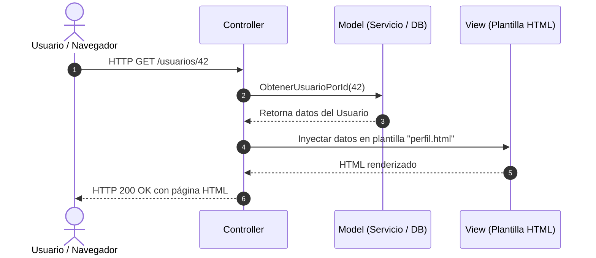

#architecture #design-patterns #mvc #software-architecture

# Arquitectura MVC (Model - View - Controller)

El patrón de arquitectura **MVC (Modelo - Vista - Controlador)** es uno de los primeros y más influyentes modelos en el diseño de interfaces de usuario y sistemas de software. Su objetivo central es la **separación de responsabilidades** (*Separation of Concerns*), desacoplando los datos de la interfaz visual y la lógica que procesa las acciones del usuario.

Fue formulado originalmente por **Trygve Reenskaug** en 1979 mientras trabajaba en el entorno Smalltalk-79 en Xerox PARC, y posteriormente adaptado a la web como pilar fundamental de la arquitectura cliente-servidor.

---

## Índice

- [[Diseño y Arquitectura/Diseño y Arquitectura.md|<- Volver a Diseño y Arquitectura]]
- [[Diseño y Arquitectura/Patrones de Arquitectura/Patrón Arquitectónico - MVVM.md|Ver Patrón Arquitectónico: MVVM]]
- [[Diseño y Arquitectura/Diseño y Arquitectura.md|Ver Arquitectura de Software]]

---

## Los Tres Componentes

```
                  ┌──────────────┐
       ┌─────────►│  Controller  │◄─────────┐
       │          └──────┬───────┘          │
       │                 │ Actualiza        │ Envía eventos
       │ Selecciona      ▼                  │ de usuario
┌──────┴──────┐   ┌──────────────┐   ┌──────┴──────┐
│    View     │   │    Model     │   │   Usuario   │
│   (Vista)   │   │   (Modelo)   │   │  (Cliente)  │
└──────▲──────┘   └──────┬───────┘   └─────────────┘
       │                 │
       └─────────────────┘
          Notifica / Lee
```

### 1. Model (Modelo)
- Contiene los **datos**, el **estado de la aplicación** y las **reglas de negocio**.
- Implementa la persistencia, validaciones y lógica de dominio (acceso a bases de datos, APIs externas, cálculos).
- **Es completamente agnóstico de la interfaz de usuario**: no sabe cómo se mostrarán los datos ni tiene referencias a vistas ni a controladores.

### 2. View (Vista)
- Es la **representación visual** del modelo (HTML, plantillas de renderizado, pantallas gráficas).
- Presenta la información al usuario y recoge sus interacciones (clicks, envíos de formulario).
- En el enfoque clásico observa al modelo para redibujarse; en el enfoque web moderno recibe el modelo preparado por el controlador.

### 3. Controller (Controlador)
- Actúa como **intermediario y orquestador**.
- Escucha y procesa las peticiones o eventos originados por el usuario (clicks, comandos o requests HTTP).
- Traduce las acciones del usuario en cambios sobre el **Modelo** y selecciona qué **Vista** debe renderizarse o mostrarse como respuesta.

---

## Variantes: MVC Clásico (Desktop) vs. MVC Web Server-Side

> [!NOTE] Diferencia Fundamental de Entorno
> - **MVC Clásico (Desktop / Smalltalk)**: La Vista observa directamente al Modelo mediante el patrón *Observer*. Cuando el Modelo cambia, emite una notificación y la Vista se redibuja en tiempo real.
> - **MVC Web del Lado del Servidor (Spring MVC, Django, Ruby on Rails, Laravel, ASP.NET MVC)**: El ciclo es estrictamente lineal basado en el protocolo HTTP (**Request - Response**).

### Flujo de Ejecución en MVC Web



---

## Ejemplo Conceptual en Código (Go)

```go
// --- 1. MODEL (Datos y Reglas de Negocio) ---
type Usuario struct {
    ID     string
    Nombre string
    Email  string
}

type UsuarioRepository interface {
    BuscarPorID(id string) (*Usuario, error)
}

// --- 2. CONTROLLER (Orquestador de peticiones) ---
type UsuarioController struct {
    repo UsuarioRepository
}

func (c *UsuarioController) MostrarPerfil(userID string) (string, error) {
    usuario, err := c.repo.BuscarPorID(userID)
    if err != nil {
        return "", err
    }
    // Selecciona la vista y le pasa los datos
    return c.renderizarVistaPerfil(usuario), nil
}

func (c *UsuarioController) renderizarVistaPerfil(u *Usuario) string {
    // --- 3. VIEW (Presentación) ---
    return fmt.Sprintf("<h1>Perfil de %s</h1><p>Email: %s</p>", u.Nombre, u.Email)
}
```

---

## Ventajas y Desventajas

| Ventajas | Desventajas |
| :--- | :--- |
| **Separación Clara**: Aísla la lógica de negocio del diseño gráfico. | **Massive View Controller (Fat Controller)**: Los controladores tienden a inflarse con lógica de formateo, navegación y validaciones, volviéndose difíciles de mantener. |
| **Ampliamente Adoptado**: Es la base conceptual de la mayoría de frameworks web tradicionales (Django, Rails, Laravel, Spring). | **Acoplamiento Vista-Controlador**: En aplicaciones de interfaz rica, la vista y el controlador suelen estar fuertemente ligados. |
| **Múltiples Vistas para un Mismo Modelo**: Un mismo modelo puede presentarse como página HTML, API JSON o exportación PDF. | **Complejidad para UI Reactiva**: Poco eficiente para interfaces modernas con interacción en tiempo real y componentes asíncronos. |

---

## ¿Cuándo Utilizar MVC?

1. **Aplicaciones Web Renderizadas en Servidor (SSR)**: Portales, CMS, paneles de administración tradicionales donde cada acción del usuario es una petición HTTP completa.
2. **Frameworks Web Estructurados**: Proyectos construidos sobre Spring Boot (Spring MVC), Django, Ruby on Rails, Laravel o ASP.NET Core MVC.
3. **Equipos con Roles Diferenciados**: Diseñadores/maquetadores encargados de las vistas (HTML/CSS) y desarrolladores de backend a cargo de modelos y controladores.

---

## Referencias y Enlaces

- [[Diseño y Arquitectura/Diseño y Arquitectura.md|Índice de Diseño y Arquitectura]]
- [[Diseño y Arquitectura/Patrones de Arquitectura/Patrón Arquitectónico - MVVM.md|Patrón Arquitectónico: MVVM (Model - View - ViewModel)]]
- [[Diseño y Arquitectura/Diseño y Arquitectura.md|Arquitectura de Software]]
- Paper Original: *Trygve Reenskaug, "Models-Views-Controllers", Xerox PARC, 1979.*
