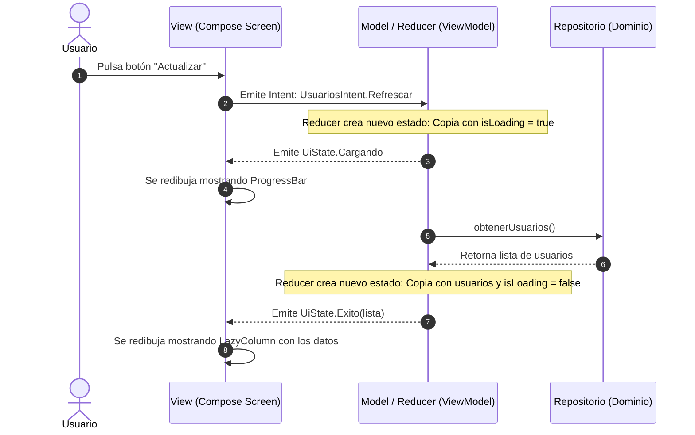

#architecture #design-patterns #mvi #ui-architecture #reactive #kotlin #android

# Arquitectura MVI (Model - View - Intent)

El patrón de arquitectura **MVI (Modelo - Vista - Intención)** es un modelo de presentación reactivo basado en el **Flujo Unidireccional de Datos (*Unidirectional Data Flow / UDF*)** y el principio de **Estado Único Inmutable**. 

Fue popularizado en el ecosistema móvil por **Hannes Dorfmann** en 2015, inspirándose fuertemente en la arquitectura de **Elm**, **Cycle.js** y los principios de **Redux**. Actualmente es el estándar arquitectónico más avanzado para frameworks de interfaz declarativa moderna como **Jetpack Compose (Android)**, **SwiftUI (iOS)**, **Flutter** y **React**.

---

## Índice

- [[Diseño y Arquitectura/Diseño y Arquitectura.md|<- Volver a Diseño y Arquitectura]]
- [[Diseño y Arquitectura/Patrones de Arquitectura/Patrón Arquitectónico - MVVM.md|Ver Patrón Arquitectónico: MVVM]]
- [[Diseño y Arquitectura/Patrones de Arquitectura/Patrón Arquitectónico - MVC.md|Ver Patrón Arquitectónico: MVC]]
- [[Diseño y Arquitectura/Patrones de Arquitectura/Patrón Arquitectónico - Signals.md|Ver Signals (Reactividad de Grano Fino)]]
- [[Desarrollo de Software/Plataformas/Android/Jetpack Compose.md|Ver Jetpack Compose]]

---

## El Problema que Resuelve MVI (Limitación de MVVM)

En [[Diseño y Arquitectura/Patrones de Arquitectura/Patrón Arquitectónico - MVVM.md|MVVM]], un ViewModel suele exponer múltiples propiedades observables independientes:
```kotlin
// MVVM tradicional con múltiples flujos dispersos
val isLoading: StateFlow<Boolean>
val usuarios: StateFlow<List<Usuario>>
val error: StateFlow<String?>
```
Cuando la lógica de negocio se vuelve compleja y concurrente, estos flujos pueden actualizarse a destiempo, provocando **estados inconsistentes de la UI** (por ejemplo: `isLoading = true` pero simultáneamente `error != null` y la lista anterior aún mostrándose).

> [!IMPORTANT] La Premisa de MVI: Máquina de Estados Finita
> En MVI, **la pantalla solo puede estar en un único estado a la vez**. La interfaz gráfica es una **función matemática pura** del estado actual:
> $$\text{View} = f(\text{State})$$

---

## El Ciclo UDF (Unidirectional Data Flow)

```
        ┌──────────────────────────────────────────────────────────┐
        │                                                          │
        ▼                                                          │
  ┌───────────┐         ┌───────────┐         ┌───────────┐        │
  │   User    │ ──────► │   View    │ ──────► │  Intent   │        │
  │ (Usuario) │ Interac │  (Render) │ Dispara │ (Acción)  │        │
  └───────────┘         └─────▲─────┘         └─────┬─────┘        │
                              │                     │              │
                              │ Emite nuevo         │ Procesa      │
                              │ Estado Inmutable    ▼              │
                        ┌─────────────────────────────────┐        │
                        │      Model / Reducer / Store     │        │
                        │ (Lógica de Dominio / Repositorio)│ ───────┘
                        └─────────────────────────────────┘
```

1. **Intent (Intención)**:
   - Representa la intención del usuario o un evento del sistema (ej: `Intent.CargarUsuarios`, `Intent.Buscar("query")`, `Intent.Reintentar`).
   - No confundir con el `android.content.Intent` de Android; en MVI un *Intent* es simplemente una intención de cambio de estado.
2. **Model (Modelo / Store / Reducer)**:
   - Es una máquina de estados determinista. Recibe el *Intent* y el *Estado Actual*, ejecuta la lógica de negocio y genera un **Nuevo Estado Inmutable**.
3. **View (Vista)**:
   - Recibe el nuevo estado inmutable y se redibuja de forma reactiva. La vista no puede modificar el estado directamente.
4. **Side Effects (Efectos Secundarios / Canales de un solo uso)**:
   - Acciones que no forman parte del estado persistente de la pantalla pero deben ocurrir una sola vez (mostrar un *Snackbar*, navegar a otra pantalla, reproducir un sonido).

---

## Diagrama de Secuencia MVI



---

## Ejemplo Completo en Kotlin y Jetpack Compose

### 1. Definición del Contrato (State, Intent, Effect)
```kotlin
// 1. ESTADO ÚNICO INMUTABLE
data class UsuariosUiState(
    val isLoading: Boolean = false,
    val usuarios: List<Usuario> = emptyList(),
    val error: String? = null
)

// 2. INTENCIONES (Acciones del usuario)
sealed interface UsuariosIntent {
    object Cargar : UsuariosIntent
    data class Eliminar(val id: String) : UsuariosIntent
}

// 3. EFECTOS SECUNDARIOS (Eventos de un solo disparo)
sealed interface UsuariosEffect {
    data class MostrarMensaje(val mensaje: String) : UsuariosEffect
    data class NavegarADetalle(val id: String) : UsuariosEffect
}
```

### 2. ViewModel como Reducer
```kotlin
class UsuariosViewModel(
    private val repository: UserRepository
) : ViewModel() {

    // Fuente única de verdad del estado
    private val _state = MutableStateFlow(UsuariosUiState())
    val state: StateFlow<UsuariosUiState> = _state.asStateFlow()

    // Canal para efectos secundarios que solo se consumen una vez
    private val _effect = Channel<UsuariosEffect>()
    val effect = _effect.receiveAsFlow()

    // Único punto de entrada para todas las acciones
    fun processIntent(intent: UsuariosIntent) {
        when (intent) {
            is UsuariosIntent.Cargar -> cargarUsuarios()
            is UsuariosIntent.Eliminar -> eliminarUsuario(intent.id)
        }
    }

    private fun cargarUsuarios() {
        viewModelScope.launch {
            _state.update { it.copy(isLoading = true, error = null) }
            try {
                val lista = repository.getUsuarios()
                _state.update { it.copy(isLoading = false, usuarios = lista) }
            } catch (e: Exception) {
                _state.update { it.copy(isLoading = false, error = e.message) }
                _effect.send(UsuariosEffect.MostrarMensaje("Error al sincronizar"))
            }
        }
    }

    private fun eliminarUsuario(id: String) {
        viewModelScope.launch {
            repository.deleteUsuario(id)
            _state.update { actual -> 
                actual.copy(usuarios = actual.usuarios.filterNot { it.id == id }) 
            }
            _effect.send(UsuariosEffect.MostrarMensaje("Usuario eliminado"))
        }
    }
}
```

### 3. Vista en Jetpack Compose
```kotlin
@Composable
fun UsuariosScreen(viewModel: UsuariosViewModel) {
    val state by viewModel.state.collectAsState()
    val snackbarHostState = remember { SnackbarHostState() }

    // Escucha de efectos secundarios
    LaunchedEffect(Unit) {
        viewModel.effect.collect { effect ->
            when (effect) {
                is UsuariosEffect.MostrarMensaje -> snackbarHostState.showSnackbar(effect.mensaje)
                is UsuariosEffect.NavegarADetalle -> { /* Navegación */ }
            }
        }
    }

    Scaffold(snackbarHost = { SnackbarHost(snackbarHostState) }) { padding ->
        Box(modifier = Modifier.padding(padding).fillMaxSize()) {
            when {
                state.isLoading -> CircularProgressIndicator(Modifier.align(Alignment.Center))
                state.error != null -> Text("Error: ${state.error}", color = Color.Red)
                else -> LazyColumn {
                    items(state.usuarios) { usuario ->
                        UsuarioItem(
                            usuario = usuario,
                            onDelete = { viewModel.processIntent(UsuariosIntent.Eliminar(usuario.id)) }
                        )
                    }
                }
            }
        }
    }
}
```

---

## Comparativa: MVVM vs. MVI

| Característica | MVVM | MVI |
| :--- | :--- | :--- |
| **Manejo del Estado** | Múltiples flujos de estado mutables dispersos. | **Estado Único Inmutable** (*Single State Object*). |
| **Flujo de Datos** | Bidireccional o reactivo fragmentado. | **Estrictamente Unidireccional (UDF)** y circular. |
| **Reproducibilidad de Bugs**| Media: difícil de recrear condiciones de carrera en estados independientes. | **Absoluta**: Cada estado se puede serializar y registrar (*Time-Travel Debugging*). |
| **Efectos Secundarios** | Mezclados dentro de la vista o en `LiveData/StateFlow`. | Separados explícitamente como `Effects/Channels` de un solo consumo. |
| **Complejidad y Código** | Menor código inicial (*Boilerplate*). | Mayor *boilerplate* (requiere definir *Intents*, *States* y *Reducers*). |
| **Alineación con Declarativo** | Buena. | **Nativa**: Se acopla de manera óptima con Compose, SwiftUI y React. |

---

## ¿Cuándo Utilizar MVI?

1. **Interfaces Declarativas Modernas**: Proyectos en Jetpack Compose, SwiftUI, React o Flutter.
2. **Pantallas Críticas con Estados Complejos**: Flujos de pago (checkout), asistentes paso a paso (*wizards*), o pantallas con múltiples fuentes asíncronas de datos.
3. **Equipos que Exigen Alta Mantenibilidad**: Donde la depuración determinista y la facilidad de registrar analítica por cada *Intent* justifican el código estructurado adicional.

---

## Referencias y Enlaces

- [[Diseño y Arquitectura/Diseño y Arquitectura.md|Índice de Diseño y Arquitectura]]
- [[Diseño y Arquitectura/Patrones de Arquitectura/Patrón Arquitectónico - MVVM.md|Patrón Arquitectónico: MVVM]]
- [[Diseño y Arquitectura/Patrones de Arquitectura/Patrón Arquitectónico - MVC.md|Patrón Arquitectónico: MVC]]
- [[Diseño y Arquitectura/Patrones de Arquitectura/Patrón Arquitectónico - Signals.md|Signals y Reactividad de Grano Fino]]
- Hannes Dorfmann: *Model-View-Intent (MVI) Architecture on Android.*
- Martin Fowler: *Passive View and Presentation Patterns.*
