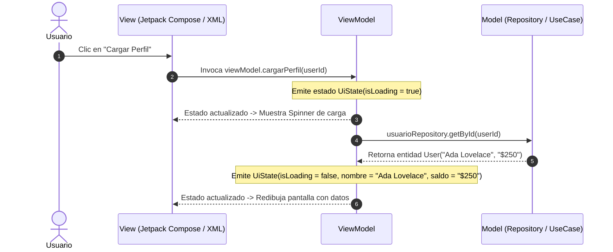

#architecture #design-patterns #mvvm #android #ui-architecture #reactive

# Arquitectura MVVM (Model - View - ViewModel)

El patrón de arquitectura **MVVM (Modelo - Vista - Modelo de Vista)** es un modelo de diseño de interfaces de usuario orientado a la **programación reactiva** y al **enlace de datos (*Data Binding*)**. Su propósito principal es desacoplar por completo la lógica de presentación de la interfaz visual gráfica, permitiendo que la interfaz reaccione automáticamente a los cambios de estado sin manipulación imperativa.

Fue introducido originalmente por **John Gossman** y **Ken Cooper** en Microsoft en 2005 para WPF y Silverlight. Actualmente es el **estándar oficial de arquitectura recomendado por Google para Android**, así como una referencia fundamental en **iOS (SwiftUI / Combine)** y frameworks web reactivos (**Vue.js**).

---

## Índice

- [[Diseño y Arquitectura/Diseño y Arquitectura.md|<- Volver a Diseño y Arquitectura]]
- [[Diseño y Arquitectura/Patrones de Arquitectura/Patrón Arquitectónico - MVC.md|Ver Patrón Arquitectónico: MVC]]
- [[Diseño y Arquitectura/Patrones de Arquitectura/Patrón Arquitectónico - MVI.md|Ver Patrón Arquitectónico: MVI]]
- [[Diseño y Arquitectura/Patrones de Arquitectura/Patrón Arquitectónico - Signals.md|Ver Signals (Data Binding Moderno)]]
- [[Desarrollo de Software/Plataformas/Android/ViewModel.md|Ver ViewModel en Android]]
- [[Diseño y Arquitectura/Patrones de Arquitectura/Patrón Arquitectónico - Clean Architecture.md|Ver Clean Architecture]]

---

## Los Tres Componentes

```
┌──────────────┐      Data Binding / StateFlow      ┌──────────────┐      Llamadas a Casos de Uso      ┌──────────────┐
│     View     │ ◄────────────────────────────────► │  ViewModel   │ ─────────────────────────────────► │    Model     │
│   (Vista)    │      (Observa estado reactivo)     │ (Lógica UI)  │ ◄───────────────────────────────── │   (Dominio)  │
└──────────────┘                                    └──────────────┘           Retorna Datos            └──────────────┘
```

### 1. Model (Modelo)
- Representa el **dominio**, las **fuentes de datos** y la **lógica de negocio**.
- Comprende entidades, repositorios, bases de datos locales (Room, SQLite), clientes de red (Retrofit, gRPC) y casos de uso.
- Es completamente independiente tanto del ViewModel como de la Vista.

### 2. View (Vista)
- Es la **interfaz gráfica** que ve e interactúa el usuario (layouts XML, componentes de Jetpack Compose, vistas de SwiftUI o HTML/CSS).
- **Es completamente pasiva**: no contiene lógica de negocio ni manipulación algorítmica de datos.
- **Observa** los flujos de estado expuestos por el ViewModel y le envía eventos de usuario (ej. *"usuario pulsó el botón pagar"*).

### 3. ViewModel (Modelo de Vista)
- Es el intermediario reactivo entre el Modelo y la Vista.
- **Mantiene y expone el estado de la UI** necesario para que la pantalla se dibuje (pantalla de carga, datos listados, mensajes de error).
- Transforma los datos brutos del Modelo en formatos listos para ser consumidos por la Vista.
- **Regla de Oro Fundamental**:
  > [!IMPORTANT] Independencia Absoluta de la Vista
  > **El ViewModel NUNCA debe contener referencias directas a elementos de la Vista ni a clases del framework de UI** (por ejemplo, nunca almacenar `android.view.View`, `Activity`, `Context` o referencias directas a widgets). Esto permite que el ViewModel sea **$100\%$ testeable mediante pruebas unitarias rápidas sin emuladores**.

---

## Ciclo de Vida y Flujo Reactivo



---

## Ejemplo Práctico en Código (Kotlin / Android)

### 1. Estado de UI Inmutable
```kotlin
data class PerfilUiState(
    val isLoading: Boolean = false,
    val nombre: String = "",
    val saldo: String = "",
    val error: String? = null
)
```

### 2. ViewModel (Totalmente Desacoplado y Testeable)
```kotlin
class PerfilViewModel(
    private val userRepository: UserRepository
) : ViewModel() {

    // Flujo privado mutable y flujo público inmutable (Encapsulación)
    private val _uiState = MutableStateFlow(PerfilUiState())
    val uiState: StateFlow<PerfilUiState> = _uiState.asStateFlow()

    fun cargarPerfil(userId: String) {
        viewModelScope.launch {
            _uiState.update { it.copy(isLoading = true, error = null) }
            try {
                val user = userRepository.obtenerUsuario(userId)
                _uiState.update { 
                    it.copy(
                        isLoading = false,
                        nombre = user.nombre,
                        saldo = "$ ${user.balance}"
                    ) 
                }
            } catch (e: Exception) {
                _uiState.update { 
                    it.copy(isLoading = false, error = e.localizedMessage) 
                }
            }
        }
    }
}
```

### 3. Vista Declarativa (Jetpack Compose)
```kotlin
@Composable
fun PerfilScreen(viewModel: PerfilViewModel) {
    // La vista se suscribe de manera reactiva al estado
    val state by viewModel.uiState.collectAsState()

    when {
        state.isLoading -> CircularProgressIndicator()
        state.error != null -> Text("Error: ${state.error}", color = Color.Red)
        else -> Column(modifier = Modifier.padding(16.dp)) {
            Text(text = "Usuario: ${state.nombre}", style = MaterialTheme.typography.h6)
            Text(text = "Saldo: ${state.saldo}")
            Button(onClick = { viewModel.cargarPerfil("user_42") }) {
                Text("Actualizar Saldo")
            }
        }
    }
}
```

---

## Ventajas y Desventajas

| Ventajas | Desventajas |
| :--- | :--- |
| **Alta Testabilidad**: La lógica de presentación en el ViewModel se prueba con pruebas unitarias instantáneas sin necesidad de mocks de UI ni emuladores. | **Curva de Aprendizaje**: Requiere dominar conceptos de programación reactiva (`Flow`, `LiveData`, `RxJava`, `Combine`). |
| **Desacoplamiento Total**: La vista puede rediseñarse por completo (o sustituirse de XML a Compose) sin tocar una sola línea de lógica del ViewModel. | **Complejidad Inicial (*Boilerplate*)**: Para pantallas muy simples (ej. vista estática informativa), puede resultar una sobre-ingeniería innecesaria. |
| **Persistencia ante Cambios de Configuración**: En plataformas como Android, el ViewModel sobrevive a rotaciones de pantalla o cambios de configuración del sistema. | **Depuración Reactiva**: Rastrear bugs en flujos de datos asíncronos complejos puede ser más desafiante que en código puramente imperativo. |

---

## ¿Cuándo Utilizar MVVM?

1. **Aplicaciones Móviles Nativas (Android / iOS)**: Especialmente donde la pantalla atraviesa cambios de configuración (rotación, cambio de idioma, modo oscuro).
2. **Interfaces Reactivas y Declarativas**: Cuando se utilizan frameworks modernos como Jetpack Compose, SwiftUI, Flutter o Vue.js.
3. **Pantallas con Estados Dinámicos Múltiples**: Formularios complejos con validaciones en tiempo real, pantallas con paginación, filtros interactivos y actualizaciones en segundo plano.

---

## Referencias y Enlaces

- [[Diseño y Arquitectura/Diseño y Arquitectura.md|Índice de Diseño y Arquitectura]]
- [[Diseño y Arquitectura/Patrones de Arquitectura/Patrón Arquitectónico - MVC.md|Patrón Arquitectónico: MVC (Model - View - Controller)]]
- [[Diseño y Arquitectura/Patrones de Arquitectura/Patrón Arquitectónico - MVI.md|Patrón Arquitectónico: MVI (Model - View - Intent)]]
- [[Diseño y Arquitectura/Patrones de Arquitectura/Patrón Arquitectónico - Signals.md|Signals y Reactividad de Grano Fino]]
- [[Desarrollo de Software/Plataformas/Android/ViewModel.md|ViewModel en Android]]
- [[Diseño y Arquitectura/Patrones de Arquitectura/Patrón Arquitectónico - Clean Architecture.md|Clean Architecture]]
- Documentación Oficial de Android: *Guía de Arquitectura de apps (UI Layer & ViewModel).*
