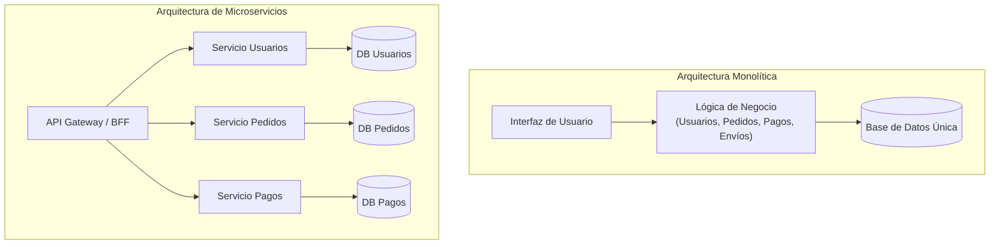

#architecture #system-design #microservices #distributed-systems #devops

# Patrón Arquitectónico: Microservicios

La arquitectura de **Microservicios** es un estilo arquitectónico que estructura una aplicación como una **colección de servicios pequeños, autónomos e independientes**, cada uno enfocado en una capacidad de negocio específica (*Bounded Context* de Domain-Driven Design).

Cada microservicio se ejecuta en su propio proceso, posee su propio almacenamiento de datos (*Database-per-Service*) y se comunica con los demás a través de mecanismos ligeros basados en red (APIs REST, gRPC o mensajería asíncrona).

---

## Índice

- [[Diseño y Arquitectura/Diseño y Arquitectura.md|<- Volver a Diseño y Arquitectura]]
- [[Diseño y Arquitectura/Patrones de Arquitectura/Patrón Arquitectónico - Saga.md|Ver Patrón Saga]]
- [[Diseño y Arquitectura/Patrones de Arquitectura/Patrón Arquitectónico - Circuit Breaker.md|Ver Circuit Breaker]]
- [[Diseño y Arquitectura/Patrones de Arquitectura/Patrón Arquitectónico - BFF.md|Ver Arquitectura BFF]]
- [[Diseño y Arquitectura/Sistemas Distribuidos/Teorema CAP.md|Ver Teorema CAP]]

---

## Monolito vs. Microservicios

---

## Principios Fundamentales

1. **Autonomía y Despliegue Independiente**:
   - Un equipo puede modificar, probar y desplegar a producción el `Servicio de Pagos` sin necesidad de coordinar el despliegue de los demás servicios.
2. **Base de Datos por Servicio (*Database-per-Service*)**:
   - Cada servicio es el **dueño absoluto de sus datos**. Ningún servicio externo puede consultar directamente la base de datos de otro; cualquier interacción debe hacerse a través de sus APIs públicas o eventos.
3. **Descentralización Tecnológica (*Polyglot Architecture*)**:
   - Cada microservicio puede utilizar la tecnología más adecuada para su problema (ej. Go para servicios de alto rendimiento de red, Python para analítica/ML, Kotlin/Spring para lógica empresarial compleja).
4. **Resiliencia ante Fallos**:
   - El fallo en un microservicio no crítico (ej. recomendaciones) no debe tumbar la aplicación completa gracias a patrones como [[Diseño y Arquitectura/Patrones de Arquitectura/Patrón Arquitectónico - Circuit Breaker.md|Circuit Breaker]].

---

## Ecosistema de Patrones para Microservicios

| Necesidad | Patrón Recomendado |
| :--- | :--- |
| **Transacciones entre servicios** | [[Diseño y Arquitectura/Patrones de Arquitectura/Patrón Arquitectónico - Saga.md|Patrón Saga (Coreografía u Orquestación)]] |
| **Tolerancia a fallos en cascada** | [[Diseño y Arquitectura/Patrones de Arquitectura/Patrón Arquitectónico - Circuit Breaker.md|Patrón Circuit Breaker]] |
| **Control de saturación y cuotas** | [[Diseño y Arquitectura/Sistemas Distribuidos/Rate Limit.md|Rate Limiting]] |
| **Adaptación de APIs para clientes** | [[Diseño y Arquitectura/Patrones de Arquitectura/Patrón Arquitectónico - BFF.md|Backend for Frontend (BFF)]] |
| **Historial inmutable y auditoría** | [[Diseño y Arquitectura/Patrones de Arquitectura/Patrón Arquitectónico - Event Sourcing.md|Event Sourcing y CQRS]] |

---

## Ventajas y Desventajas

| Ventajas | Desventajas |
| :--- | :--- |
| **Escalabilidad Granular**: Se puede escalar horizontalmente solo el servicio que tiene cuello de botella (ej. solo el servicio de búsquedas en Black Friday). | **Complejidad Operacional**: Requiere orquestadores de contenedores (Kubernetes), Service Mesh (Istio), CI/CD automatizado y monitoreo robusto. |
| **Autonomía Organizacional**: Permite aplicar la **Ley de Conway** dividiendo la empresa en equipos autónomos pequeños (*Two-Pizza Teams*). | **Consistencia de Datos (CAP/PACELC)**: No hay transacciones ACID globales; requiere consistencia eventual y manejo de compensaciones. |
| **Aislamiento de Errores**: Un error de memoria en un servicio no colapsa el resto del sistema. | **Latencia de Red y Tracing**: Cada llamada de red introduce latencia adicional y dificulta la depuración sin tracing distribuido (OpenTelemetry). |

---

## ¿Cuándo Utilizar Microservicios?

- **Recomendado**: Sistemas grandes con múltiples equipos multidisciplinarios independientes, dominios de negocio complejos con diferentes ritmos de cambio y necesidades de escalabilidad heterogéneas.
- **No recomendado**: Proyectos nuevos (*startups* en etapa temprana donde los límites de dominio aún no están claros), equipos pequeños de menos de 10 desarrolladores o aplicaciones con modelos de datos fuertemente acoplados. En estos casos, un **Monolito Modular** suele ser mucho más eficiente.

---

## Referencias y Enlaces

- [[Diseño y Arquitectura/Diseño y Arquitectura.md|Índice de Diseño y Arquitectura]]
- [[Diseño y Arquitectura/Patrones de Arquitectura/Patrón Arquitectónico - Saga.md|Patrón Saga]]
- [[Diseño y Arquitectura/Patrones de Arquitectura/Patrón Arquitectónico - BFF.md|Arquitectura BFF]]
- [[Diseño y Arquitectura/Sistemas Distribuidos/Teorema CAP.md|Teorema CAP]]
- Sam Newman: *Building Microservices (2nd Edition, 2021).*
- Martin Fowler: *Microservices Resource Guide.*
