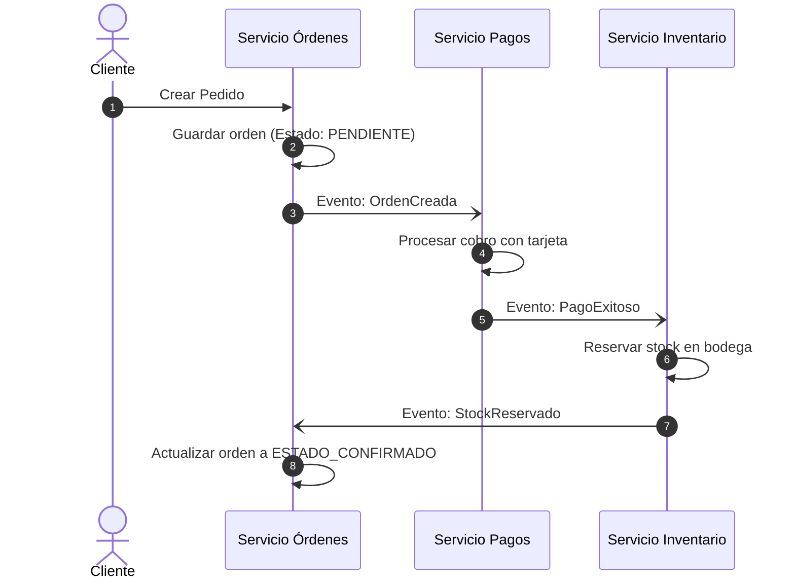
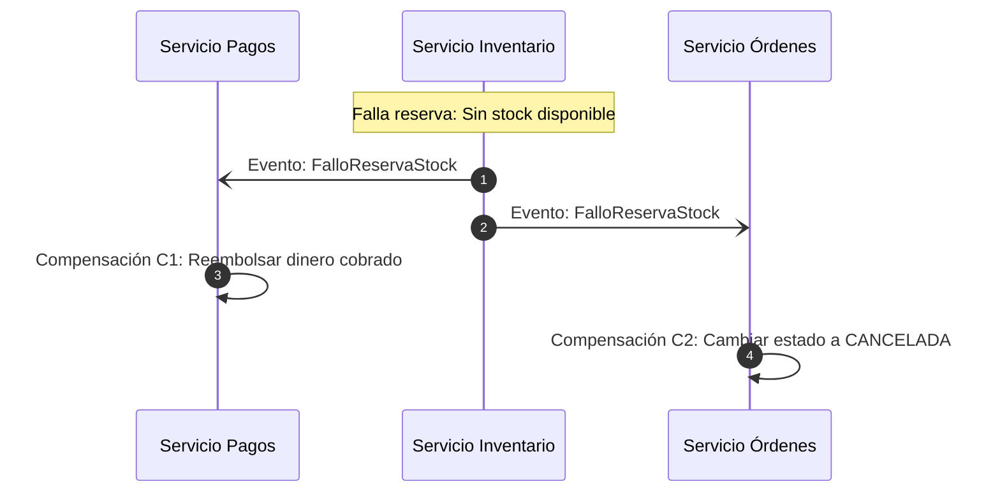
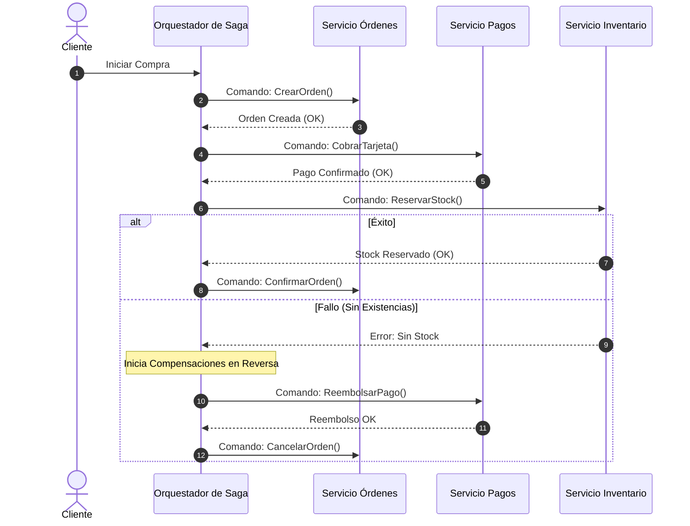

#architecture #system-design #distributed-systems #microservices #saga #patterns

# Patrón Saga (Transacciones Distribuidas)

El **Patrón Saga** es un patrón de diseño arquitectónico utilizado para garantizar la consistencia de datos en **arquitecturas de microservicios** y sistemas distribuidos mediante una secuencia de transacciones locales coordinadas, sin recurrir a bloqueos distribuidos de dos fases (*Two-Phase Commit / 2PC*).

Fue propuesto originalmente por **Hector Garcia-Molina y Kenneth Salem** en la Universidad de Princeton en 1987 para gestionar transacciones de larga duración (*Long-Lived Transactions*). En la era moderna de microservicios (con el principio de *Base de Datos por Servicio*), el patrón Saga se convirtió en el estándar de facto para operaciones comerciales que abarcan múltiples servicios independientes.

---

## Índice

- [[Diseño y Arquitectura/Diseño y Arquitectura.md|<- Volver a Diseño y Arquitectura]]
- [[Diseño y Arquitectura/Sistemas Distribuidos/Teorema CAP.md|Ver Teorema CAP]]
- [[Diseño y Arquitectura/Sistemas Distribuidos/Teorema PACELC.md|Ver Teorema PACELC]]
- [[Diseño y Arquitectura/Diseño y Arquitectura.md|Ver Patrones Arquitectónicos]]

---

## El Problema: El Fin de las Transacciones ACID Locales

En una arquitectura monolítica con una única base de datos relacional, garantizar la consistencia es sencillo mediante transacciones **ACID**:
```sql
BEGIN TRANSACTION;
UPDATE inventario SET stock = stock - 1 WHERE id = 42;
INSERT INTO pagos (cliente_id, total) VALUES (10, 150.00);
INSERT INTO ordenes (cliente_id, estado) VALUES (10, 'CONFIRMADA');
COMMIT; -- Todo se guarda atómicamente o todo se revierte
```

En microservicios, cada servicio es dueño exclusivo de su propia base de datos:

```
┌───────────────────────┐   ┌───────────────────────┐   ┌───────────────────────┐
│   Servicio Órdenes    │   │    Servicio Pagos     │   │  Servicio Inventario  │
└──────────┬────────────┘   └──────────┬────────────┘   └──────────┬────────────┘
           │                           │                           │
    [(  DB Órdenes  )]          [(   DB Pagos   )]          [(  DB Inventario  )]
```

- No es viable utilizar `2PC (Two-Phase Commit)` a escala de microservicios: es un protocolo síncrono, bloqueante, con alta latencia y susceptible a caídas de red que violan el [[Diseño y Arquitectura/Sistemas Distribuidos/Teorema CAP.md|Teorema CAP]] (sacrifica disponibilidad y escalabilidad).

---

## ¿Cómo Funciona una Saga?

Una **Saga** descompone una gran transacción distribuida en una **secuencia de transacciones locales**:

$$T_1 \longrightarrow T_2 \longrightarrow T_3 \longrightarrow \dots \longrightarrow T_n$$

1. Cada servicio ejecuta su transacción local y persiste cambios en su propia base de datos de manera atómica.
2. Al terminar con éxito, publica un mensaje o evento que activa el siguiente paso de la saga.
3. Si en algún paso intermedio ($T_k$) una transacción falla (ej. *fondos insuficientes* o *sin stock*), la saga ejecuta una serie de **Transacciones de Compensación ($C$)** en orden inverso:

$$C_{k-1} \longrightarrow \dots \longrightarrow C_2 \longrightarrow C_1$$

> [!IMPORTANT] Transacción de Compensación vs. Rollback Tradicional
> En una base de datos relacional, un rollback descarta las operaciones en memoria no confirmadas. En una Saga, las transacciones locales **ya fueron confirmadas físicamente**. Una **transacción de compensación** es una nueva operación de negocio que revierte semánticamente el efecto anterior (por ejemplo: si la transacción fue *cobrar $100*, la compensación es *emitir un reembolso de $100*).

---

## Las Dos Formas de Implementar una Saga

Existen dos enfoques principales para coordinar una saga: **Coreografía** y **Orquestación**.

---

### 1. Coreografía (Choreography - Basada en Eventos)
En la coreografía **no existe un coordinador central**. Cada microservicio escucha eventos de dominio publicados por otros servicios y reacciona de forma autónoma.



#### Flujo de Compensación en Coreografía (Fallo en Inventario)



- **Ventajas**: Simple y natural para flujos pequeños (2 a 4 pasos), sin punto único de fallo o cuello de botella central.
- **Desventajas**: Difícil de rastrear y entender a medida que crecen los pasos; riesgo de dependencias circulares de eventos; alta complejidad para monitorear el estado global de una transacción.

---

### 2. Orquestación (Orchestration - Coordinador Central)
En la orquestación, un servicio especial llamado **Orquestador de Saga** (*Saga Orchestrator*) actúa como director de orquesta. Utiliza comandos explícitos de tipo solicitud/respuesta para indicar a cada servicio exactamente qué acción ejecutar y cuándo.



- **Ventajas**:
  - **Visibilidad Centralizada**: Fácil de monitorear y auditar el estado exacto de cualquier transacción en una interfaz visual.
  - **Flujo Claro**: Evita acoplamientos circulares entre servicios; los servicios de negocio no necesitan conocer a los demás.
  - **Manejo de Reintentos**: Permite gestionar pausas, tiempos límite (*timeouts*) y reintentos automáticos fácilmente.
- **Desventajas**: Requiere infraestructura adicional para el orquestador (p. ej., **Temporal.io**, **AWS Step Functions**, **Camunda**, **Zeebe** o **MassTransit** en .NET).

---

## Comparativa: Coreografía vs. Orquestación

| Criterio | Coreografía | Orquestación |
| :--- | :--- | :--- |
| **Punto Central de Control** | Ninguno (Descentralizado). | Orquestador / Máquina de Estados central. |
| **Mecanismo de Comunicación** | Eventos asíncronos (*Pub/Sub*, Kafka, RabbitMQ). | Comandos dirigidos (gRPC, REST o Colas de Comandos). |
| **Complejidad del Flujo** | Óptimo para flujos simples (2 a 4 pasos). | Indispensable para flujos complejos (> 4 pasos). |
| **Visibilidad y Monitoreo** | Compleja: requiere tracing distribuido (OpenTelemetry). | Directa: el estado de cada transacción está en el orquestador. |
| **Acoplamiento** | Servicios acoplados a contratos de eventos externos. | Servicios solo acoplados a sus propios comandos de entrada. |

---

## Requisitos Críticos de Diseño en una Saga

1. **Idempotencia Absoluta**:
   - Debido a fallos transitorios de red, los mensajes y comandos pueden entregarse más de una vez (*At-least-once delivery*).
   - Tanto las transacciones locales como las transacciones de compensación **deben ser idempotentes** (procesar el mismo mensaje dos veces debe generar el mismo resultado exacto sin cobrar dos veces).
2. **Falta de Aislamiento (La "I" de ACID)**:
   - Las Sagas garantizan **Consistencia Eventual**, pero **no aislamiento**.
   - Si un usuario lee el estado intermedio entre el paso $T_1$ y el fallo en $T_2$, verá datos que luego serán compensados (*lectura sucia*).
   - **Solución**: Diseñar estados intermedios explícitos en el modelo de negocio (ej. `SaldoRetenido`, `PedidoPendienteDePago` en lugar de cambiar directamente el saldo final).

---

## Referencias y Enlaces

- [[Diseño y Arquitectura/Diseño y Arquitectura.md|Índice de Diseño y Arquitectura]]
- [[Diseño y Arquitectura/Sistemas Distribuidos/Teorema CAP.md|Teorema CAP (Fundamentos de Consistencia Distribuida)]]
- [[Diseño y Arquitectura/Sistemas Distribuidos/Teorema PACELC.md|Teorema PACELC]]
- [[Diseño y Arquitectura/Diseño y Arquitectura.md|Patrones Arquitectónicos en Ingeniería]]
- Paper Original: *Hector Garcia-Molina and Kenneth Salem, "Sagas", ACM SIGMOD, 1987.*
- Chris Richardson: *Microservices Patterns (Chapter 4: Managing transactions with sagas).*
