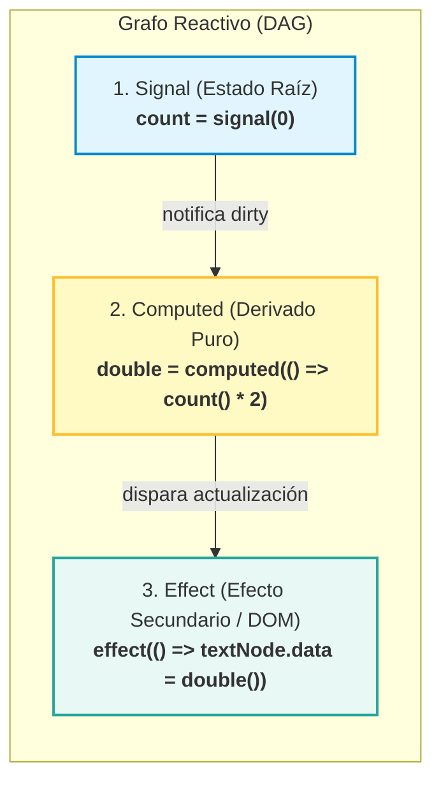
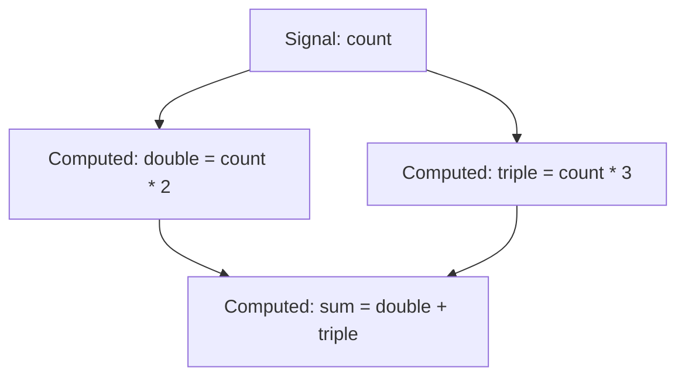

#architecture #reactivity #signals #fine-grained-reactivity #frontend #angular #react #solidjs #tc39 #observer #interview-prep

# Patrón Arquitectónico: Signals (Reactividad de Grano Fino)

El patrón de **Signals (Señales)** es una arquitectura de gestión de estado y reactividad de **grano fino (*Fine-Grained Reactivity*)** para interfaces de usuario. Modela el estado reactivo como un **Grafo Acíclico Dirigido (DAG)** de dependencias con rastreo automático en tiempo de ejecución.

Adoptado formalmente por **Angular (v16+)**, **SolidJS**, **Vue 3 (Composition API)**, **Preact**, **Qwik**, **Svelte 5 (Runes)** y en proceso de estandarización nativa en JavaScript mediante la **propuesta TC39**, Signals representa el cambio de paradigma más relevante en el desarrollo frontend desde la popularización del Virtual DOM.

---

## Índice

- [[Diseño y Arquitectura/Diseño y Arquitectura.md|<- Volver a Diseño y Arquitectura]]
- [[Diseño y Arquitectura/Patrones de Arquitectura/Patrón Arquitectónico - MVVM.md|Ver MVVM (Data Binding)]]
- [[Diseño y Arquitectura/Patrones de Arquitectura/Patrón Arquitectónico - MVI.md|Ver MVI (Flujo Unidireccional)]]
- [[Diseño y Arquitectura/Patrones de Diseño/Patrón de Diseño - Observer.md|Ver Patrón Observer]]

---

## La Metáfora Mental: La Hoja de Cálculo

La mejor forma de comprender un Signal es pensar en una celda de **Microsoft Excel**:
- En la celda `A1` escribes `10`.
- En la celda `B1` escribes la fórmula `=A1 * 2` (muestra `20`).
- Si cambias `A1` a `50`, la celda `B1` se actualiza automáticamente a `100`.

Excel **no recalcula las millones de celdas de la hoja**, ni destruye y reconstruye la pantalla: sabe con exactitud atómica que `B1` depende de `A1`, por lo que solo actualiza el valor dependiente. Un Signal aplica exactamente este principio a la relación entre el estado y el DOM del navegador.

---

## Las Tres Primitivas Universales

Cualquier sistema de Signals se fundamenta en tres piezas elementales:



1. **Signal (Fuente / Estado Raíz)**: Contenedor reactivo mutable que almacena un valor. Permite lectura (`count()`) y escritura (`count.set(5)` o `count.update(n => n + 1)`).
2. **Computed / Derived (Valores Calculados)**: Expresiones derivadas de solo lectura que dependen de uno o más Signals. Son **perezosas (*lazy*)** y se memorizan automáticamente: solo se recalculan si alguna de sus señales fuente ha mutado.
3. **Effect (Efectos Secundarios / Sinks)**: Operaciones que observan señales y se ejecutan cuando estas cambian. Es el puente entre el mundo reactivo puro y el mundo exterior (actualizar un nodo de texto en el DOM, sincronizar con `localStorage`, registrar analíticas).

---

## Evolución de los Modelos de Reactividad en UI

| Característica | 1. Dirty Checking (AngularJS / Zone.js) | 2. Virtual DOM Diffing (React tradicional) | 3. Fine-Grained Signals (Solid, Angular 17+, Preact) |
| :--- | :--- | :--- | :--- |
| **Unidad de Re-renderizado** | Árbol completo de componentes. | Función del componente completa y sus hijos. | **Nodo atómico del DOM** (ej. solo el texto dentro de un `<span>`). |
| **Detección de Cambios** | Intercepta eventos asíncronos (`Zone.js`) y recorre todo el árbol buscando diferencias. | Compara árboles en memoria (*Virtual DOM diffing*) y reconcilia con el DOM real. | **Suscripción directa**: La señal notifica directamente al nodo del DOM que la consume. |
| **Rastreo de Dependencias** | Manual / Imperativo. | Manual mediante listas de dependencias (`[dep1, dep2]`). Riesgo de *stale closures*. | **100% Automático** en tiempo de ejecución al invocar el getter de la señal. |
| **Costo en CPU** | Alto (recorridos innecesarios del árbol). | Medio-Alto (creación de objetos VDOM y recolección de basura). | **Mínimo** (actualizaciones quirúrgicas directas O(1)). |

---

## Mecánica Interna: ¿Cómo funciona por dentro?

El secreto de los Signals radica en dos algoritmos: **Auto-tracking** y **Push-Pull Glitch-Free Reactivity**.

### 1. Rastreo Automático de Dependencias (Auto-Tracking)
A diferencia de React, donde debes declarar `[depA, depB]`, los Signals detectan dependencias mediante una pila de contexto global (`activeConsumer`):

```javascript
// Pseudocódigo simplificado del motor interno de un Signal
let activeConsumer = null;

function createSignal(initialValue) {
    let value = initialValue;
    const subscribers = new Set();

    return {
        get() {
            // Si alguien está leyendo este signal durante su ejecución, lo registramos
            if (activeConsumer) {
                subscribers.add(activeConsumer);
            }
            return value;
        },
        set(newValue) {
            value = newValue;
            // Notificamos a los suscriptores
            for (const sub of subscribers) {
                sub.notify();
            }
        }
    };
}
```

Al ejecutarse `computed(() => signalA() + signalB())`:
1. `computed` se establece a sí mismo como el `activeConsumer`.
2. Al evaluar `signalA()`, este añade a `computed` a su lista de suscriptores.
3. Al evaluar `signalB()`, ocurre lo mismo.
4. `activeConsumer` se limpia. Las dependencias quedaron registradas sin escribir un solo array manual.

### 2. Algoritmo Push-Pull y Prevención de "Glitches"
Un **glitch** es un estado temporal incoherente donde un valor derivado se calcula dos veces o lee valores desincronizados:


Si `count` cambia de 1 a 2, un sistema reactivo ingenuo (*Push puro*) actualizaría `B`, recalcularía `D` (obteniendo un valor intermedio erróneo), luego actualizaría `C`, y volvería a recalcular `D`.

Los Signals modernos resuelven esto con **Push-Pull**:
- **Fase Push**: Al mutar `A`, solo empuja una bandera de invalidación (*"dirty"*) a `B`, `C` y `D` (sin recalcular valores).
- **Fase Pull**: Cuando la UI o un efecto necesita leer `D`, este solicita el valor a `B` y `C`, calculando la nueva suma **una única vez y en el orden topológico correcto**.

---

## Implementaciones en el Ecosistema

### 1. Angular Moderno (v16 / 17 / 18 Zoneless)
Angular introdujo Signals para prescindir progresivamente de `Zone.js`, logrando un rendimiento superior y arranque instantáneo:

```typescript
import { Component, signal, computed, effect } from '@angular/core';

@Component({
  selector: 'app-carrito',
  standalone: true,
  template: `
    <h2>Carrito de Compras</h2>
    <p>Precio Unitario: ${{ precio() }}</p>
    <p>Cantidad: {{ cantidad() }}</p>
    <hr>
    <!-- Solo este nodo se actualiza quirúrgicamente en el DOM -->
    <p><strong>Total: ${{ total() }}</strong></p>
    
    <button (click)="agregar()">Agregar Uno</button>
  `
})
export class CarritoComponent {
  precio = signal(25.0);
  cantidad = signal(1);

  // Derivado: solo se recalcula si precio o cantidad mutan
  total = computed(() => this.precio() * this.cantidad());

  constructor() {
    // Efecto de auditoría o sincronización
    effect(() => {
      console.log(`El carrito cambió. Nuevo total a pagar: $${this.total()}`);
    });
  }

  agregar() {
    this.cantidad.update(c => c + 1);
  }
}
```

### 2. SolidJS (El Pionero Sin Virtual DOM)
En SolidJS, el componente **se ejecuta una sola vez en toda la vida de la aplicación**:
```javascript
import { createSignal, createMemo, createEffect } from "solid-js";

function Contador() {
  const [count, setCount] = createSignal(0);
  const doble = createMemo(() => count() * 2);

  createEffect(() => {
    console.log("Count actual:", count());
  });

  // Contador() NUNCA vuelve a ejecutarse. 
  // Solo la expresión {count()} se conecta directamente al nodo de texto del DOM.
  return <button onClick={() => setCount(count() + 1)}>Valor: {count()} (Doble: {doble()})</button>;
}
```

### 3. La Postura de React: React Compiler vs. Preact Signals
- **React Core**: El equipo de React no adoptó Signals porque alteraría el modelo mental puramente funcional de componentes que se re-renderizan (`UI = f(state)`). En su lugar, desarrollaron el **React Compiler (Forget)**, que analiza el código JSX y memoiza automáticamente llamadas en tiempo de compilación.
- **Preact Signals (`@preact/signals-react`)**: Permite usar Signals dentro de React saltándose completamente el Virtual DOM: al pasar un Signal a JSX (`<span>{count}</span>`), Preact actualiza el nodo del DOM sin disparar el ciclo de vida del componente React.

### 4. Propuesta TC39: Signals Estándar en JavaScript
Actualmente existe una propuesta formal en **TC39 (Stage 1)** impulsada conjuntamente por ingenieros de Google (Angular), Bloomberg, Vue y Preact para estandarizar Signals en el lenguaje:

```javascript
// Sintaxis de la propuesta TC39
const counter = new Signal.State(0);
const isEven = new Signal.Computed(() => (counter.get() % 2) === 0);

counter.set(1);
console.log(isEven.get()); // false
```
El objetivo es que los navegadores incorporen el motor de grafos DAG en C++ nativo, permitiendo la máxima interoperabilidad entre frameworks.

---

## Tabla Comparativa: Signals vs. Observables (RxJS)

En Angular y arquitecturas reactivas, una duda recurrente es cuándo usar **Signals** y cuándo **Observables (RxJS)**:

| Criterio | Signals | Observables (RxJS) |
| :--- | :--- | :--- |
| **Naturaleza** | **Estado sincrónico** (siempre tiene un valor actual inmediatamente disponible). | **Flujo asíncrono de eventos** (streams a lo largo del tiempo: 0, 1 o infinitos valores). |
| **Modelo de lectura** | Pull / Push híbrido (`signal()`). | Push puro (`subscribe(observer)`). |
| **Manejo de memoria** | Desuscripción y limpieza automática por grafo. | Requiere desuscripción manual o pipes (`takeUntilDestroyed`). |
| **Operadores temporales** | No posee (no hace debounce, throttle ni retry). | Enorme catálogo de operadores (`debounceTime`, `switchMap`, `mergeMap`). |
| **Caso de uso ideal** | **Estado de UI**, formularios reactivos, datos en pantalla y componentes visuales. | **Comunicaciones asíncronas**, WebSockets, reintentos HTTP, ráfagas de teclado con debounce. |

---

## Preguntas Frecuentes en Entrevistas Técnicas

### 1. ¿Por qué los Signals eliminan el problema de las "Stale Closures" de React?
En React, si un `useEffect` o callback captura una variable de un render anterior y no se declara en el array de dependencias, la closure retiene el valor viejo en memoria (*stale*). En Signals, las funciones no capturan un valor estático por snapshot, sino un **contenedor (puntero/getter)**. Al invocar `count()`, siempre se consulta el valor actual en memoria en tiempo real, erradicando las stale closures por diseño.

### 2. ¿Cuándo es un antipatrón utilizar un `effect()`?
Un `effect()` **nunca debe usarse para calcular y escribir en otro Signal**.
- *Antipatrón*: `effect(() => { total.set(precio() * cantidad()); })` (genera ciclos de renderizado adicionales, bucles infinitos o condiciones de carrera).
- *Correcto*: Utilizar un `computed()`: `total = computed(() => precio() * cantidad())`.
- Los `effects` deben reservarse exclusivamente para **efectos colaterales con el exterior** (DOM manual, Canvas, WebGL, APIs de terceros, `console.log`).

### 3. ¿Cómo se relaciona Signals con el patrón GoF Observer?
Signals es la **evolución de grano fino del patrón Observer**:
- En el Observer clásico, los observadores se registran y desregistran manualmente (`subject.attach(this)`), y el sujeto notifica a todos sin saber qué parte exacta del estado les interesa.
- En Signals, la suscripción es **automática por intercepción de lectura** (*dependency injection en el stack de llamadas*) y la granularidad es de campo individual, no de objeto completo.

---

## Referencias y Enlaces

- [[Diseño y Arquitectura/Diseño y Arquitectura.md|Índice de Diseño y Arquitectura]]
- [[Diseño y Arquitectura/Patrones de Arquitectura/Patrón Arquitectónico - MVVM.md|Patrón MVVM]]
- [[Diseño y Arquitectura/Patrones de Arquitectura/Patrón Arquitectónico - MVI.md|Patrón MVI]]
- [[Diseño y Arquitectura/Patrones de Diseño/Patrón de Diseño - Observer.md|Patrón de Diseño - Observer]]
- Angular Documentation: *Signals in Angular (angular.dev/guide/signals).*
- SolidJS Documentation: *Fine-Grained Reactivity (solidjs.com).*
- TC39 Proposal: *JavaScript Signals Standard Proposal (github.com/tc39/proposal-signals).*
