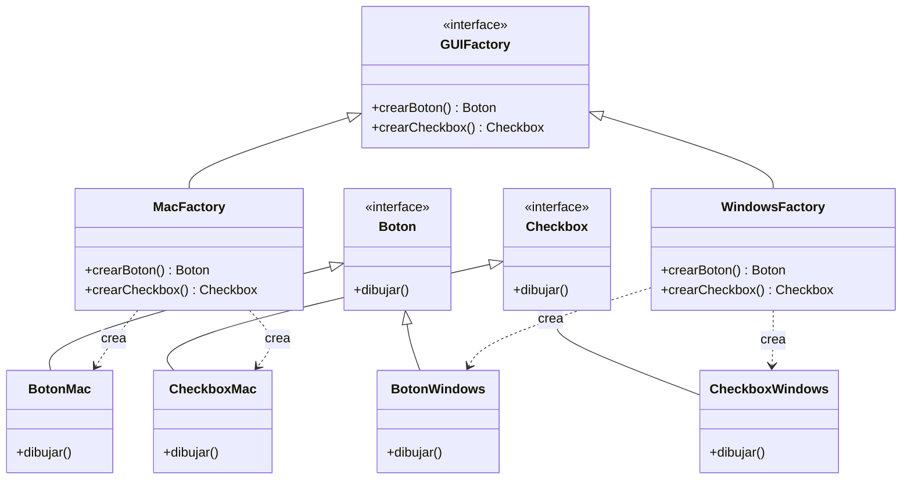

#architecture #design-patterns #gof #creational #abstract-factory #interview-prep #go #kotlin

# Patrón de Diseño: Abstract Factory (Fábrica Abstracta)

El patrón **Abstract Factory (Fábrica Abstracta)** es un patrón de diseño **creacional** del catálogo *Gang of Four (GoF)*. Proporciona una interfaz para crear **familias completas de objetos relacionados o dependientes** sin especificar sus clases concretas.

Es una de las preguntas de comparación más habituales en entrevistas técnicas de arquitectura: *"¿Cuándo usar Factory Method vs. Abstract Factory?"*.

---

## Índice

- [[Diseño y Arquitectura/Diseño y Arquitectura.md|<- Volver a Diseño y Arquitectura]]
- [[Diseño y Arquitectura/Patrones de Diseño/Patrón de Diseño - Factory Method.md|Ver Factory Method]]
- [[Diseño y Arquitectura/Patrones de Diseño/Patrón de Diseño - Builder.md|Ver Builder]]
- [[Diseño y Arquitectura/Patrones de Diseño/Patrones de Diseño - Catálogo GoF.md|Ver Catálogo GoF]]

---

## El Problema: Familias de Productos Incompatibles

Imaginemos un kit de componentes gráficos (UI Toolkit) que debe funcionar en múltiples sistemas operativos: **macOS**, **Windows** y **Linux**:
- Cada sistema operativo requiere una familia completa de componentes:
  - Familia macOS: `BotonMac`, `CheckboxMac`, `VentanaMac`.
  - Familia Windows: `BotonWindows`, `CheckboxWindows`, `VentanaWindows`.
- **El peligro**: No queremos que el código cliente mezcle por error un `BotonMac` con una `VentanaWindows` creando inconsistencias visuales y errores en tiempo de ejecución.

> [!IMPORTANT] Clave de Entrevista: Garantía de Coherencia
> Abstract Factory **garantiza que los productos creados siempre pertenezcan a la misma familia compatible**. El cliente solo interactúa con la fábrica abstracta y las interfaces abstractas de los productos.

---

## Estructura del Patrón



---

## Implementación en Kotlin

```kotlin
// 1. Interfaces de la familia de productos
interface Boton { fun renderizar() }
interface Checkbox { fun marcar() }

// 2. Familia Concreta 1: Estilo Dark Theme
class BotonOscuro : Boton {
    override fun renderizar() = println("Botón negro con texto blanco")
}
class CheckboxOscuro : Checkbox {
    override fun marcar() = println("Checkbox estilo Dark Mode activado")
}

// 3. Familia Concreta 2: Estilo Light Theme
class BotonClaro : Boton {
    override fun renderizar() = println("Botón blanco con sombra suave")
}
class CheckboxClaro : Checkbox {
    override fun marcar() = println("Checkbox estilo Light Mode activado")
}

// 4. Abstract Factory (Interfaz de creación de la familia)
interface TemaUIFactory {
    fun crearBoton(): Boton
    fun crearCheckbox(): Checkbox
}

// 5. Fábricas Concretas
class DarkThemeFactory : TemaUIFactory {
    override fun crearBoton(): Boton = BotonOscuro()
    override fun crearCheckbox(): Checkbox = CheckboxOscuro()
}

class LightThemeFactory : TemaUIFactory {
    override fun crearBoton(): Boton = BotonClaro()
    override fun crearCheckbox(): Checkbox = CheckboxClaro()
}

// 6. Código Cliente: Completamente agnóstico de las clases concretas
class Aplicacion(private val factory: TemaUIFactory) {
    fun inicializarUI() {
        val boton = factory.crearBoton()
        val checkbox = factory.crearCheckbox()
        boton.renderizar()
        checkbox.marcar()
    }
}

fun main() {
    // Cambiar de tema consiste en inyectar otra fábrica sin alterar la aplicación
    val app = Aplicacion(DarkThemeFactory())
    app.inicializarUI()
}
```

---

## Implementación en Go

```go
package main

import "fmt"

// 1. Productos
type ConectorDB interface { Conectar() string }
type GestorCache interface { Guardar(clave, valor string) }

// 2. Familia AWS
type DynamoDBConector struct{}
func (d *DynamoDBConector) Conectar() string { return "Conectado a AWS DynamoDB" }

type ElastiCacheGestor struct{}
func (e *ElastiCacheGestor) Guardar(k, v string) { fmt.Printf("AWS ElastiCache: %s = %s\n", k, v) }

// 3. Familia GCP
type CloudSpannerConector struct{}
func (c *CloudSpannerConector) Conectar() string { return "Conectado a Google Cloud Spanner" }

type MemorystoreGestor struct{}
func (m *MemorystoreGestor) Guardar(k, v string) { fmt.Printf("GCP Memorystore: %s = %s\n", k, v) }

// 4. Abstract Factory
type CloudProviderFactory interface {
    CrearDB() ConectorDB
    CrearCache() GestorCache
}

// 5. Fábricas Concretas
type AWSFactory struct{}
func (a *AWSFactory) CrearDB() ConectorDB { return &DynamoDBConector{} }
func (a *AWSFactory) CrearCache() GestorCache { return &ElastiCacheGestor{} }

type GCPFactory struct{}
func (g *GCPFactory) CrearDB() ConectorDB { return &CloudSpannerConector{} }
func (g *GCPFactory) CrearCache() GestorCache { return &MemorystoreGestor{} }

func main() {
    var factory CloudProviderFactory = &AWSFactory{}
    
    db := factory.CrearDB()
    cache := factory.CrearCache()

    fmt.Println(db.Conectar())
    cache.Guardar("sesion_token", "xyz_123")
}
```

---

## Comparativa Clave de Entrevista: Factory Method vs. Abstract Factory

| Criterio | Factory Method | Abstract Factory |
| :--- | :--- | :--- |
| **Número de Productos** | **Un solo producto** por método. | **Toda una familia** de múltiples productos relacionados. |
| **Mecanismo Central** | Herencia o función constructora individual. | **Composición de objetos** (el cliente recibe una fábrica completa). |
| **Nivel de Abstracción** | Más simple y directo. | Mayor nivel de abstracción (*Fábrica de fábricas*). |
| **Complejidad de Extensión**| Fácil agregar nuevos métodos concretos. | Si se agrega un nuevo producto a la familia (ej. `crearInputText()`), hay que modificar la interfaz y todas las fábricas concretas (viola OCP al alterar la familia). |

---

## Referencias y Enlaces

- [[Diseño y Arquitectura/Diseño y Arquitectura.md|Índice de Diseño y Arquitectura]]
- [[Diseño y Arquitectura/Patrones de Diseño/Patrón de Diseño - Factory Method.md|Factory Method]]
- [[Diseño y Arquitectura/Patrones de Diseño/Patrón de Diseño - Builder.md|Builder]]
- [[Diseño y Arquitectura/Patrones de Diseño/Patrones de Diseño - Catálogo GoF.md|Catálogo GoF]]
- GoF: *Design Patterns: Elements of Reusable Object-Oriented Software.*
