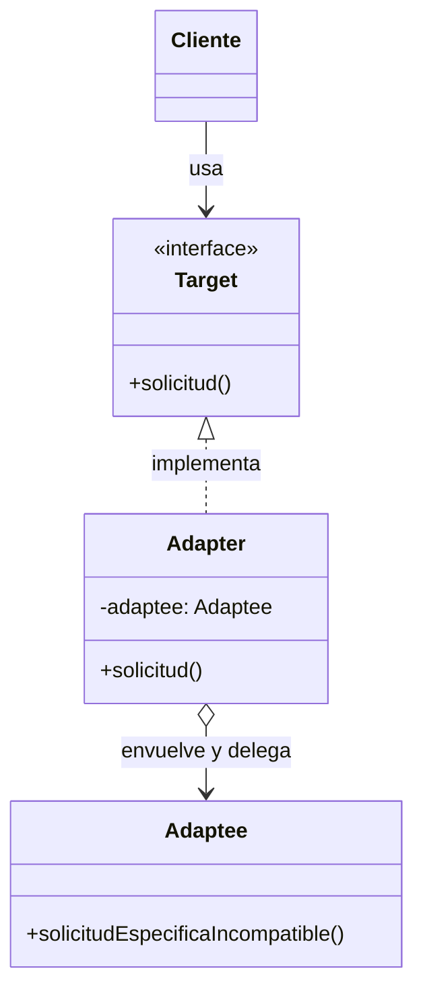

#architecture #design-patterns #gof #structural #adapter #wrapper #interview-prep #go #kotlin

# Patrón de Diseño: Adapter (Adaptador / Wrapper)

El patrón **Adapter (Adaptador)**, también conocido como **Wrapper**, es un patrón de diseño **estructural** del catálogo *Gang of Four (GoF)*. Su objetivo principal es **permitir que clases u objetos con interfaces incompatibles puedan colaborar entre sí**, traduciendo las llamadas de una interfaz hacia la otra.

Es uno de los patrones más comunes en la práctica real para integrar librerías de terceros, SDKs externos o código heredado (*Legacy*) sin alterar su código fuente.

---

## Índice

- [[Diseño y Arquitectura/Diseño y Arquitectura.md|<- Volver a Diseño y Arquitectura]]
- [[Diseño y Arquitectura/Patrones de Diseño/Patrón de Diseño - Facade.md|Ver Facade]]
- [[Diseño y Arquitectura/Patrones de Diseño/Patrón de Diseño - Decorator.md|Ver Decorator]]
- [[Diseño y Arquitectura/Patrones de Diseño/Patrones de Diseño - Catálogo GoF.md|Ver Catálogo GoF]]

---

## Metáfora del Mundo Real

Imaginemos que viajas de América a Europa con un ordenador portátil:
- La toma de corriente de la pared es europea (redonda, 230V).
- El conector de tu cargador es americano (plano, 110V).
- No vas a romper la pared de la habitación ni vas a cortar el cable de tu cargador: **utilizas un adaptador de corriente intermedio**.

En software, el patrón Adapter realiza exactamente esa función: envuelve una clase existente incompatible (*Adaptee*) para que cumpla la interfaz esperada por el cliente (*Target*).

---

## Estructura del Patrón (Adaptador de Objetos)



1. **Cliente**: Contiene la lógica del negocio que consume la interfaz esperada (`Target`).
2. **Target (Interfaz Objetivo)**: Define el contrato estándar que el cliente comprende.
3. **Adaptee (Adaptable / Clase Incompatible)**: La clase legacy o librería externa que hace el trabajo pero con nombres de métodos, parámetros o formatos diferentes.
4. **Adapter (Adaptador)**: Implementa la interfaz `Target` y mantiene una referencia al `Adaptee`, traduciendo los datos y llamadas de uno a otro.

---

## Ejemplo Práctico en Go

Supongamos que nuestro sistema procesa métricas mediante formato JSON, pero contratamos un servicio de telemetría analítica legacy de terceros que solo entiende XML:

```go
package main

import "fmt"

// 1. TARGET: Interfaz esperada por nuestra aplicación
type AnalizadorJSON interface {
    ProcesarJSON(datos string)
}

// 2. ADAPTEE: Servicio externo o legacy incompatible (espera XML)
type ServicioAnaliticaXML struct{}

func (s *ServicioAnaliticaXML) ProcesarXML(datosXML string) {
    fmt.Printf("Servicio Legacy procesando XML: %s\n", datosXML)
}

// 3. ADAPTER: Envuelve el servicio XML y cumple la interfaz JSON
type AdaptadorJSONaXML struct {
    servicioXML *ServicioAnaliticaXML
}

func (a *AdaptadorJSONaXML) ProcesarJSON(datosJSON string) {
    // Traduce de JSON a XML
    datosConvertidosXML := fmt.Sprintf("<datos>%s</datos>", datosJSON)
    // Delega la ejecución en el Adaptee
    a.servicioXML.ProcesarXML(datosConvertidosXML)
}

func main() {
    // El cliente solo interactúa con la interfaz AnalizadorJSON
    legacyService := &ServicioAnaliticaXML{}
    var analizador AnalizadorJSON = &AdaptadorJSONaXML{servicioXML: legacyService}

    analizador.ProcesarJSON("{\"usuario\": \"Joshua\", \"evento\": \"login\"}")
}
```

---

## Ejemplo Práctico en Kotlin

```kotlin
// 1. Target
interface ProcesadorPago {
    fun pagar(montoCentavos: Int)
}

// 2. Adaptee (Librería de PayPal de terceros incompatible con floats en dólares)
class PayPalSDKLegacy {
    fun sendPaymentInDollars(amountDollars: Double) {
        println("Pago enviado vía PayPal Legacy: $$amountDollars USD")
    }
}

// 3. Adapter
class PayPalAdapter(private val payPalSDK: PayPalSDKLegacy) : ProcesadorPago {
    override fun pagar(montoCentavos: Int) {
        // Convierte centavos enteros a dólares con decimales
        val montoDolares = montoCentavos / 100.0
        payPalSDK.sendPaymentInDollars(montoDolares)
    }
}

fun main() {
    val sdk = PayPalSDKLegacy()
    val procesador: ProcesadorPago = PayPalAdapter(sdk)

    procesador.pagar(2500) // $25.00 USD
}
```

---

## Pregunta Clásica de Entrevista: Adapter vs. Facade vs. Decorator

Esta es una de las preguntas conceptuales más recurrentes en entrevistas de arquitectura:

| Patrón | Intención Principal | ¿Modifica la interfaz? | ¿Añade nuevo comportamiento? |
| :--- | :--- | :--- | :--- |
| **Adapter** | **Compatibilidad**: Hacer que dos interfaces incompatibles funcionen juntas. | **Sí**: Convierte una interfaz en otra. | No. Solo traduce llamadas. |
| [[Diseño y Arquitectura/Patrones de Diseño/Patrón de Diseño - Facade.md\|Facade]] | **Simplicidad**: Proporcionar una interfaz única fácil a un subsistema complejo de muchas clases. | **Sí**: Crea una nueva interfaz simplificada de alto nivel. | No suele añadir comportamiento nuevo, solo orquesta. |
| [[Diseño y Arquitectura/Patrones de Diseño/Patrón de Diseño - Decorator.md\|Decorator]] | **Extensión dinámica**: Añadir responsabilidades extras a un objeto sin usar herencia. | **No**: Mantiene la misma interfaz exacta del objeto envuelto. | **Sí**: Añade funcionalidad antes o después de delegar. |

---

## Referencias y Enlaces

- [[Diseño y Arquitectura/Diseño y Arquitectura.md|Índice de Diseño y Arquitectura]]
- [[Diseño y Arquitectura/Patrones de Diseño/Patrón de Diseño - Facade.md|Facade]]
- [[Diseño y Arquitectura/Patrones de Diseño/Patrón de Diseño - Decorator.md|Decorator]]
- [[Diseño y Arquitectura/Patrones de Diseño/Patrones de Diseño - Catálogo GoF.md|Catálogo GoF]]
- GoF: *Design Patterns: Elements of Reusable Object-Oriented Software.*
