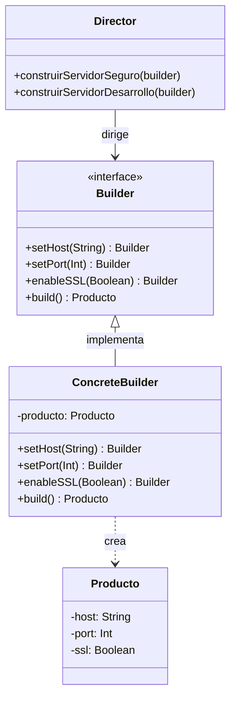

#architecture #design-patterns #gof #creational #builder #interview-prep #go #kotlin

# Patrón de Diseño: Builder (Constructor)

El patrón **Builder (Constructor)** es un patrón de diseño **creacional** del catálogo *Gang of Four (GoF)*. Permite construir objetos complejos paso a paso, separando la construcción del objeto de su representación final, de modo que el mismo proceso de construcción pueda crear diferentes representaciones o configuraciones.

Es **uno de los patrones más preguntados en entrevistas técnicas** debido a que resuelve de forma elegante el antipatrón del *Constructor Telescópico* y facilita la creación de **objetos inmutables**.

---

## Índice

- [[Diseño y Arquitectura/Diseño y Arquitectura.md|<- Volver a Diseño y Arquitectura]]
- [[Diseño y Arquitectura/Patrones de Diseño/Patrón de Diseño - Factory Method.md|Ver Factory Method]]
- [[Diseño y Arquitectura/Patrones de Diseño/Patrón de Diseño - Abstract Factory.md|Ver Abstract Factory]]
- [[Diseño y Arquitectura/Patrones de Diseño/Patrones de Diseño - Catálogo GoF.md|Ver Catálogo GoF]]

---

## El Problema: El Antipatrón del Constructor Telescópico

Imaginemos una clase `ServidorHTTP` o `Usuario` con muchos atributos opcionales (timeout, maxConexiones, ssl, puerto, proxy, logs, reintentos).

Sin el patrón Builder, caemos en el **Constructor Telescópico**:
```kotlin
// ❌ Código frágil y confuso (¿cuál parámetro booleano es cuál?)
val server = ServidorHTTP("localhost", 8080, true, 30, false, null, 5000, true)
```

O usamos métodos *Setters*, perdiendo la **inmutabilidad** y dejando el objeto en un estado transitorio inconsistente (*incompletamente construido*) antes de estar listo.

> [!IMPORTANT] Clave de Entrevista: ¿Por qué usar Builder?
> 1. **Inmutabilidad**: El objeto final no tiene *setters*; una vez construido con `.build()`, sus propiedades son de solo lectura (`val` en Kotlin, sin mutación en Go).
> 2. **Legibilidad**: Código auto-documentado con llamadas fluidas encadenadas (*Method Chaining / Fluent Interface*).
> 3. **Validación Atómica**: Las validaciones de consistencia de los campos se ejecutan de golpe dentro de `.build()`.

---

## Estructura del Patrón



---

## Implementación en Kotlin (Fluent Interface)

```kotlin
// 1. Objeto Inmutable (Producto)
class ConfiguracionServidor private constructor(
    val host: String,
    val puerto: Int,
    val sslHabilitado: Boolean,
    val maxConexiones: Int,
    val timeoutMs: Long
) {
    // 2. Builder dentro de la clase
    class Builder(private val host: String) { // Parámetro obligatorio
        private var puerto: Int = 8080        // Valores por defecto
        private var sslHabilitado: Boolean = false
        private var maxConexiones: Int = 100
        private var timeoutMs: Long = 5000

        fun conPuerto(puerto: Int) = apply { this.puerto = puerto }
        fun conSSL(habilitado: Boolean) = apply { this.sslHabilitado = habilitado }
        fun conMaxConexiones(max: Int) = apply { this.maxConexiones = max }
        fun conTimeout(timeoutMs: Long) = apply { this.timeoutMs = timeoutMs }

        fun build(): ConfiguracionServidor {
            // Validaciones de negocio antes de instanciar
            require(puerto in 1..65535) { "Puerto inválido: $puerto" }
            require(maxConexiones > 0) { "Debe permitir al menos 1 conexión" }
            return ConfiguracionServidor(host, puerto, sslHabilitado, maxConexiones, timeoutMs)
        }
    }
}

// Uso limpio y legible:
fun main() {
    val config = ConfiguracionServidor.Builder("api.midominio.com")
        .conPuerto(443)
        .conSSL(true)
        .conTimeout(10000)
        .build()

    println("Servidor configurado en ${config.host}:${config.puerto} (SSL: ${config.sslHabilitado})")
}
```

---

## Implementación en Go: El Patrón "Functional Options"

En Go no existen constructores clásicos de POO. La forma idiomática y estándar en la industria (usada en Google, Uber y Docker) para aplicar el concepto de Builder es el **Functional Options Pattern**:

```go
package main

import (
    "fmt"
    "time"
)

// 1. Producto Inmutable
type Servidor struct {
    Host      string
    Puerto    int
    Timeout   time.Duration
    ConexionTLS bool
}

// 2. Tipo Función de Opción
type ServidorOpcion func(*Servidor)

// 3. Funciones constructoras de opciones
func ConPuerto(puerto int) ServidorOpcion {
    return func(s *Servidor) {
        s.Puerto = puerto
    }
}

func ConTimeout(timeout time.Duration) ServidorOpcion {
    return func(s *Servidor) {
        s.Timeout = timeout
    }
}

func ConTLS(habilitado bool) ServidorOpcion {
    return func(s *Servidor) {
        s.ConexionTLS = habilitado
    }
}

// 4. Constructor que aplica las opciones
func NuevoServidor(host string, opciones ...ServidorOpcion) *Servidor {
    // Valores por defecto
    srv := &Servidor{
        Host:      host,
        Puerto:    8080,
        Timeout:   30 * time.Second,
        ConexionTLS: false,
    }

    for _, opcion := range opciones {
        opcion(srv)
    }
    return srv
}

func main() {
    // Uso idiomático en Go:
    server := NuevoServidor(
        "api.empresa.com",
        ConPuerto(443),
        ConTLS(true),
    )
    fmt.Printf("Servidor iniciado en %s:%d (TLS=%t, Timeout=%s)\n",
        server.Host, server.Puerto, server.ConexionTLS, server.Timeout)
}
```

---

## Preguntas Frecuentes en Entrevistas Técnicas

### 1. ¿Cuál es la diferencia entre Builder y Factory Method?
- **Factory Method**: Se enfoca en la **polimorfia de creación** de una sola llamada (`crearNotificador() -> Notificador`). No sabe ni le importa cuántos pasos tiene la creación; su meta es ocultar la clase concreta que se instancia.
- **Builder**: Se enfoca en la **construcción paso a paso** de un objeto complejo que tiene muchos parámetros o configuraciones opcionales, permitiendo producir objetos inmutables con sintaxis fluida.

### 2. ¿Qué es el "Director" en el patrón Builder clásico?
- Es una clase opcional que define el orden en que se deben invocar los pasos del Builder para ensamblar configuraciones recurrentes (ej. `Director.crearServidorProduccion(builder)` vs `Director.crearServidorTesting(builder)`).

---

## Referencias y Enlaces

- [[Diseño y Arquitectura/Diseño y Arquitectura.md|Índice de Diseño y Arquitectura]]
- [[Diseño y Arquitectura/Patrones de Diseño/Patrón de Diseño - Factory Method.md|Factory Method]]
- [[Diseño y Arquitectura/Patrones de Diseño/Patrón de Diseño - Abstract Factory.md|Abstract Factory]]
- [[Diseño y Arquitectura/Patrones de Diseño/Patrones de Diseño - Catálogo GoF.md|Catálogo GoF]]
- Joshua Bloch: *Effective Java (Item 2: Consider a builder when faced with many constructor parameters).*
