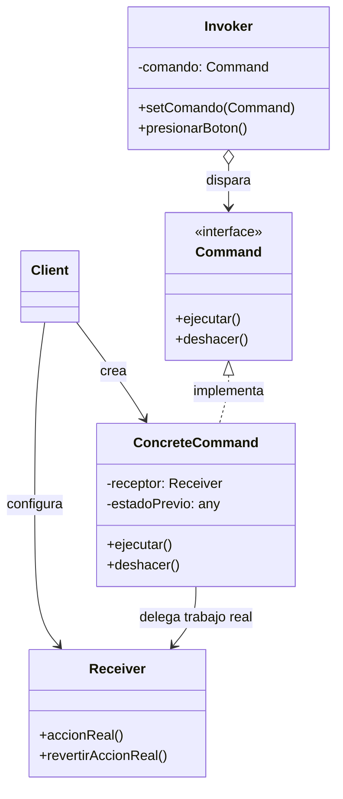

#architecture #design-patterns #gof #behavioral #command #undo-redo #cqrs #queue #interview-prep #go #kotlin

# Patrón de Diseño: Command (Comando / Acción)

El patrón **Command (Comando)** es un patrón de diseño **de comportamiento** (*Behavioral*) del catálogo *Gang of Four (GoF)*. Convierte una **solicitud o petición en un objeto independiente** que contiene toda la información necesaria para ejecutar dicha acción.

Esta encapsulación permite:
1. Parametrizar métodos con diferentes acciones.
2. Encolar o retrasar la ejecución de solicitudes (*Job Queues / Task Scheduling*).
3. Soportar operaciones reversibles de **Deshacer y Rehacer** (*Undo / Redo*).
4. Guardar un historial de auditoría o registro transaccional (*Event Logging*).

---

## Índice

- [[Diseño y Arquitectura/Diseño y Arquitectura.md|<- Volver a Diseño y Arquitectura]]
- [[Diseño y Arquitectura/Patrones de Diseño/Patrón de Diseño - Strategy.md|Ver Strategy]]
- [[Diseño y Arquitectura/Patrones de Diseño/Patrón de Diseño - State.md|Ver State]]
- [[Diseño y Arquitectura/Patrones de Diseño/Patrón de Diseño - Observer.md|Ver Observer]]
- [[Diseño y Arquitectura/Patrones de Diseño/Patrones de Diseño - Catálogo GoF.md|Ver Catálogo GoF]]

---

## Metáfora del Mundo Real

Imagina ordenar comida en un restaurante tradicional:
1. Tú (el cliente) le dices al camarero lo que deseas.
2. El camarero escribe tu pedido en una **comanda de papel** (el objeto *Command*).
3. Esa comanda contiene todos los detalles: mesa, platos y especificaciones.
4. El camarero lleva la comanda a la barra de la cocina (cola de tareas).
5. El cocinero (el *Receiver*) toma la comanda cuando tiene un fogón libre y prepara la comida.
6. Si cambias de opinión a tiempo, la comanda puede ser cancelada o anulada (*Undo*).

El camarero no necesita saber cocinar; solo sostiene y transporta comandos hacia la cola.

---

## Estructura del Patrón



1. **Command (Interfaz)**: Declara el método `ejecutar()` y opcionalmente `deshacer()`.
2. **ConcreteCommand**: Define el enlace entre el objeto receptor y una acción concreta. Almacena los parámetros necesarios para ejecutar y revertir la acción.
3. **Receiver (Receptor)**: La clase que contiene la lógica de negocio real. Sabe cómo realizar las operaciones.
4. **Invoker (Invocador)**: Responsable de iniciar las solicitudes (e.g., un botón de UI, un planificador de tareas o un historial de comandos).
5. **Client**: Ensambla el receptor con el comando y se lo entrega al invocador.

---

## Ejemplo Práctico en Go: Transacciones con Undo

```go
package main

import "fmt"

// 1. RECEIVER: La cuenta bancaria que realiza la lógica real
type CuentaBancaria struct {
    Titular string
    Saldo   float64
}

func (c *CuentaBancaria) Depositar(monto float64) {
    c.Saldo += monto
    fmt.Printf("[Cuenta %s] Depósito de $%.2f. Nuevo saldo: $%.2f\n", c.Titular, monto, c.Saldo)
}

func (c *CuentaBancaria) Retirar(monto float64) bool {
    if c.Saldo >= monto {
        c.Saldo -= monto
        fmt.Printf("[Cuenta %s] Retiro de $%.2f. Nuevo saldo: $%.2f\n", c.Titular, monto, c.Saldo)
        return true
    }
    fmt.Printf("[Cuenta %s] Fondos insuficientes para retirar $%.2f\n", c.Titular, monto)
    return false
}

// 2. COMMAND INTERFACE
type ComandoTransaccion interface {
    Ejecutar() bool
    Deshacer()
}

// 3. CONCRETE COMMAND: Depósito
type ComandoDeposito struct {
    cuenta *CuentaBancaria
    monto  float64
}

func (cd *ComandoDeposito) Ejecutar() bool {
    cd.cuenta.Depositar(cd.monto)
    return true
}

func (cd *ComandoDeposito) Deshacer() {
    fmt.Printf("-> Deshaciendo depósito en cuenta de %s...\n", cd.cuenta.Titular)
    cd.cuenta.Retirar(cd.monto)
}

// 4. INVOKER: Gestor transaccional con pila de Undo
type GestorTransacciones struct {
    historial []ComandoTransaccion
}

func (g *GestorTransacciones) Ejecutar(cmd ComandoTransaccion) {
    if cmd.Ejecutar() {
        g.historial = append(g.historial, cmd)
    }
}

func (g *GestorTransacciones) DeshacerUltimo() {
    if len(g.historial) == 0 {
        fmt.Println("No hay transacciones para revertir.")
        return
    }
    ultimo := g.historial[len(g.historial)-1]
    ultimo.Deshacer()
    g.historial = g.historial[:len(g.historial)-1] // Pop
}

func main() {
    cuenta := &CuentaBancaria{Titular: "Joshua", Saldo: 500.0}
    gestor := &GestorTransacciones{}

    // Ejecutar transacciones
    dep1 := &ComandoDeposito{cuenta: cuenta, monto: 200.0}
    dep2 := &ComandoDeposito{cuenta: cuenta, monto: 300.0}

    gestor.Ejecutar(dep1)
    gestor.Ejecutar(dep2)

    // Revertir última transacción (Undo)
    gestor.DeshacerUltimo()
}
```

---

## Ejemplo Práctico en Kotlin: Editor de Texto con Undo/Redo

```kotlin
// 1. Receiver
class EditorTexto {
    var contenido: String = ""

    fun imprimir() = println("Contenido actual: \"$contenido\"")
}

// 2. Command
interface Command {
    fun execute()
    fun undo()
}

// 3. Concrete Command
class EscribirCommand(
    private val editor: EditorTexto,
    private val textoNuevo: String
) : Command {
    private var textoPrevio: String = ""

    override fun execute() {
        textoPrevio = editor.contenido
        editor.contenido += textoNuevo
    }

    override fun undo() {
        editor.contenido = textoPrevio
    }
}

// 4. Invoker con soporte Undo / Redo
class EditorInvoker {
    private val undoStack = ArrayDeque<Command>()
    private val redoStack = ArrayDeque<Command>()

    fun executeCommand(cmd: Command) {
        cmd.execute()
        undoStack.addLast(cmd)
        redoStack.clear()
    }

    fun undo() {
        if (undoStack.isNotEmpty()) {
            val cmd = undoStack.removeLast()
            cmd.undo()
            redoStack.addLast(cmd)
            println("-> [Acción Deshecha]")
        }
    }

    fun redo() {
        if (redoStack.isNotEmpty()) {
            val cmd = redoStack.removeLast()
            cmd.execute()
            undoStack.addLast(cmd)
            println("-> [Acción Rehecha]")
        }
    }
}

fun main() {
    val editor = EditorTexto()
    val invoker = EditorInvoker()

    invoker.executeCommand(EscribirCommand(editor, "Hola mundo "))
    invoker.executeCommand(EscribirCommand(editor, "desde Kotlin!"))
    editor.imprimir()

    invoker.undo()
    editor.imprimir()

    invoker.redo()
    editor.imprimir()
}
```

---

## Preguntas Frecuentes en Entrevistas Técnicas

### 1. ¿Cuál es la diferencia entre Command y Strategy?
- **Command**: Encapsula **una intención concreta** ("Hacer X acción con los argumentos Y") para ser ejecutada, encolada o revertida. Suele retener estado y parámetros.
- **Strategy**: Describe **cómo hacer algo** (un algoritmo intercambiable, e.g. "comprimir con Zip o Tar", "ordenar con QuickSort o MergeSort"). Por lo general no retiene estado de transacciones previas.

### 2. ¿Cómo se relaciona el patrón Command con arquitecturas modernas?
- **CQRS (Command Query Responsibility Segregation)**: Separa las operaciones de escritura (Comandos: representan intenciones de modificar el estado, e.g., `CrearUsuarioCommand`) de las operaciones de lectura (Queries).
- **Event Sourcing**: Los comandos representan las intenciones que, al ser validadas y aplicadas, generan eventos inmutables en el log.
- **Saga Pattern en Microservicios**: Las transacciones distribuidas utilizan comandos de avance y comandos de compensación (*Compensating Commands / Undo*) para revertir cambios cuando un microservicio falla a mitad de un flujo.

### 3. ¿Cómo se implementa un Macro Command (Composite Command)?
Un *Macro Command* o comando compuesto agrupa una lista de subcomandos (`List<Command>`) e implementa la misma interfaz `Command`. Al invocar `execute()`, ejecuta iterativamente cada subcomando en secuencia, combinando el patrón Command con el patrón **Composite**.

---

## Referencias y Enlaces

- [[Diseño y Arquitectura/Diseño y Arquitectura.md|Índice de Diseño y Arquitectura]]
- [[Diseño y Arquitectura/Patrones de Diseño/Patrón de Diseño - Strategy.md|Strategy]]
- [[Diseño y Arquitectura/Patrones de Diseño/Patrón de Diseño - State.md|State]]
- [[Diseño y Arquitectura/Patrones de Diseño/Patrón de Diseño - Observer.md|Observer]]
- [[Diseño y Arquitectura/Patrones de Diseño/Patrones de Diseño - Catálogo GoF.md|Catálogo GoF]]
- GoF: *Design Patterns: Elements of Reusable Object-Oriented Software.*
