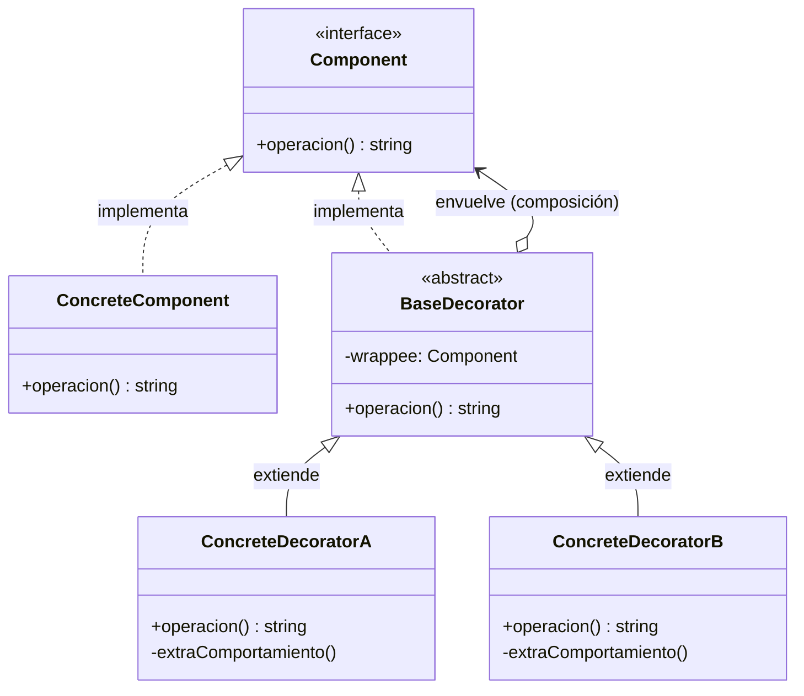

#architecture #design-patterns #gof #structural #decorator #wrapper #middleware #interview-prep #go #kotlin

# Patrón de Diseño: Decorator (Decorador / Wrapper)

El patrón **Decorator (Decorador)** es un patrón de diseño **estructural** del catálogo *Gang of Four (GoF)*. Permite **añadir dinámicamente nuevas responsabilidades y comportamientos a un objeto** sin alterar su estructura ni recurrir a la herencia estática de clases.

Sigue rigurosamente el **Principio de Abierto/Cerrado (OCP)** y la máxima de **favorecer la composición de objetos sobre la herencia de clases**.

---

## Índice

- [[Diseño y Arquitectura/Diseño y Arquitectura.md|<- Volver a Diseño y Arquitectura]]
- [[Diseño y Arquitectura/Patrones de Diseño/Patrón de Diseño - Adapter.md|Ver Adapter]]
- [[Diseño y Arquitectura/Patrones de Diseño/Patrón de Diseño - Proxy.md|Ver Proxy]]
- [[Diseño y Arquitectura/Patrones de Diseño/Patrones de Diseño - Catálogo GoF.md|Ver Catálogo GoF]]

---

## El Problema: La Explosión de Subclases

Imagina que tienes un servicio de notificaciones:
- Comienza enviando notificaciones por `Email`.
- Luego necesitas enviar por `SMS`.
- Luego por `Slack`.
- Si un usuario quiere `Email + SMS`, creas `EmailSMSNotifier`.
- Si quiere `Email + Slack`, creas `EmailSlackNotifier`.
- Si quiere `Email + SMS + Slack`, creas `EmailSMSSlackNotifier`.

Con $N$ tipos de notificaciones, ¡la herencia genera $2^N$ combinaciones de subclases! Decorator soluciona esto apilando envoltorios (*wrappers*) en tiempo de ejecución.

---

## Metáfora del Mundo Real

Piensa en vestirte para el invierno:
1. Sales con una **camiseta** (el componente base).
2. Si hace frío, te pones un **suéter** encima (primer decorador).
3. Si está lloviendo, te pones un **impermeable** encima del suéter (segundo decorador).

Tanto la camiseta como el suéter y el impermeable cumplen la misma función (vestirte), pero cada capa añade una capacidad adicional sin alterar las capas interiores.

---

## Estructura del Patrón



1. **Component**: Interfaz común que comparten tanto el objeto base como sus decoradores.
2. **ConcreteComponent**: El objeto de negocio original que ejecuta el comportamiento nuclear.
3. **BaseDecorator**: Envoltorio que mantiene la referencia al `Component` y delega la llamada.
4. **ConcreteDecorators**: Añaden responsabilidades adicionales antes o después de delegar la llamada al componente envuelto.

---

## Ejemplo Práctico en Go (Middlewares / Chaining)

En Go, el patrón Decorator es la base de los **middlewares HTTP** y de la biblioteca estándar (por ejemplo, envolver un `io.Reader` con `gzip.Reader` o `bufio.Reader`).

```go
package main

import "fmt"

// 1. Component
type Notificador interface {
    Enviar(mensaje string)
}

// 2. ConcreteComponent (Envío básico de Email)
type NotificadorEmail struct{}

func (n *NotificadorEmail) Enviar(mensaje string) {
    fmt.Printf("[Email] Enviado: %s\n", mensaje)
}

// 3. Decorator 1: SMS
type NotificadorSMS struct {
    envoltorio Notificador
}

func (s *NotificadorSMS) Enviar(mensaje string) {
    s.envoltorio.Enviar(mensaje) // Llama al anterior
    fmt.Printf("[SMS] Enviado: %s\n", mensaje)
}

// 4. Decorator 2: Slack
type NotificadorSlack struct {
    envoltorio Notificador
}

func (sl *NotificadorSlack) Enviar(mensaje string) {
    sl.envoltorio.Enviar(mensaje) // Llama al anterior
    fmt.Printf("[Slack] Enviado a canal #alertas: %s\n", mensaje)
}

func main() {
    // Componente base: solo Email
    var notificador Notificador = &NotificadorEmail{}

    // En tiempo de ejecución agregamos SMS y Slack en cadena:
    notificador = &NotificadorSMS{envoltorio: notificador}
    notificador = &NotificadorSlack{envoltorio: notificador}

    // Al invocar Enviar, se disparan en cadena: Email -> SMS -> Slack
    notificador.Enviar("Alerta: Servidor con alta latencia")
}
```

---

## Ejemplo Práctico en Kotlin (Delegación Nativa con `by`)

Kotlin soporta el patrón Decorator de forma nativa mediante la palabra clave `by` (Delegación de Interfaces):

```kotlin
// 1. Component
interface DataSource {
    fun writeData(data: String)
    fun readData(): String
}

// 2. Concrete Component
class FileDataSource(private val filename: String) : DataSource {
    private var memoryData = ""

    override fun writeData(data: String) {
        memoryData = data
        println("Escribiendo '$data' en archivo $filename")
    }

    override fun readData(): String = memoryData
}

// 3. Decorator de Encriptación usando delegación de Kotlin ('by')
class EncryptionDecorator(private val wrappee: DataSource) : DataSource by wrappee {
    override fun writeData(data: String) {
        val encrypted = "ENC(" + data.reversed() + ")"
        println("-> [Cifrado] Cifrando payload antes de escribir")
        wrappee.writeData(encrypted)
    }

    override fun readData(): String {
        val raw = wrappee.readData()
        println("-> [Descifrado] Descifrando payload leído")
        return raw.removeSurrounding("ENC(", ")").reversed()
    }
}

fun main() {
    val file = FileDataSource("datos_seguros.txt")
    val securedFile: DataSource = EncryptionDecorator(file)

    securedFile.writeData("ClaveSecreta123")
    println("Leído: " + securedFile.readData())
}
```

---

## Preguntas Frecuentes en Entrevistas Técnicas

### 1. ¿Cuál es la diferencia entre Decorator y Subclases (Herencia)?
- **Herencia**: Es estática (se define en tiempo de compilación). Afecta a todas las instancias de la clase y produce una explosión combinatorial si se requieren mezclas arbitrarias de funcionalidades.
- **Decorator**: Es dinámico (se decide en tiempo de ejecución para cada objeto individual). Puedes añadir o quitar capas envolventes cuando sea necesario sin alterar la clase original.

### 2. ¿Cómo se compara Decorator con Adapter y Proxy?
- **Decorator**: Mantiene la **misma interfaz** que el componente original. Añade responsabilidades adicionales.
- **Adapter**: Modifica o convierte la **interfaz** para hacer compatibles dos componentes distintos.
- **Proxy**: Mantiene la **misma interfaz**, pero no busca añadir nuevas características de negocio, sino **controlar el acceso** al objeto (lazy initialization, permisos, caché, logs).

### 3. ¿Qué desventajas o 'Code Smells' puede introducir?
- Hace que sea difícil rastrear qué decorador está fallando si se apilan decenas de capas (*call stack* muy profundo).
- La identidad del objeto cambia (`objeto != decorador(objeto)`), lo que puede romper código que dependa de verificación estricta de tipos (`instanceof` o comparaciones de punteros).

---

## Referencias y Enlaces

- [[Diseño y Arquitectura/Diseño y Arquitectura.md|Índice de Diseño y Arquitectura]]
- [[Diseño y Arquitectura/Patrones de Diseño/Patrón de Diseño - Adapter.md|Adapter]]
- [[Diseño y Arquitectura/Patrones de Diseño/Patrón de Diseño - Proxy.md|Proxy]]
- [[Diseño y Arquitectura/Patrones de Diseño/Patrones de Diseño - Catálogo GoF.md|Catálogo GoF]]
- GoF: *Design Patterns: Elements of Reusable Object-Oriented Software.*
