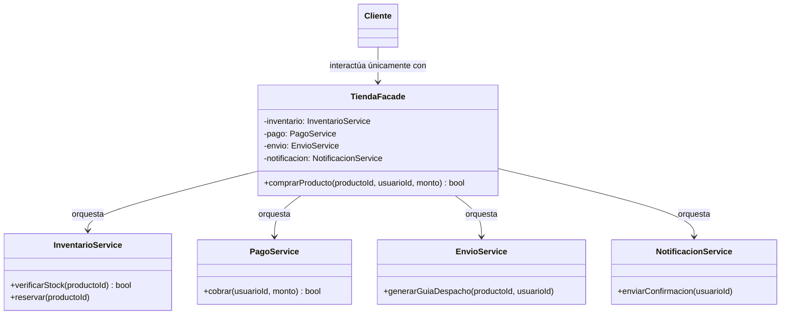

#architecture #design-patterns #gof #structural #facade #subsystem #api-design #interview-prep #go #kotlin

# Patrón de Diseño: Facade (Fachada)

El patrón **Facade (Fachada)** es un patrón de diseño **estructural** del catálogo *Gang of Four (GoF)*. Su propósito es **proporcionar una interfaz unificada y simplificada a un conjunto complejo de interfaces en un subsistema**.

Al definir una interfaz de alto nivel, Facade oculta la complejidad interna, los detalles de implementación y las dependencias cruzadas de múltiples subsistemas, reduciendo el acoplamiento entre los clientes y el sistema.

---

## Índice

- [[Diseño y Arquitectura/Diseño y Arquitectura.md|<- Volver a Diseño y Arquitectura]]
- [[Diseño y Arquitectura/Patrones de Diseño/Patrón de Diseño - Adapter.md|Ver Adapter]]
- [[Diseño y Arquitectura/Patrones de Diseño/Patrón de Diseño - Decorator.md|Ver Decorator]]
- [[Diseño y Arquitectura/Patrones de Diseño/Patrones de Diseño - Catálogo GoF.md|Ver Catálogo GoF]]

---

## Metáfora del Mundo Real

Imagina ordenar comida en un restaurante:
- No vas a la cocina a coordinar al carnicero, pedirle al chef que encienda la plancha, solicitar al sommelier la botella de vino y pedirle al cajero que emita la factura.
- Simplemente hablas con el **camarero** (el *Facade*).
- El camarero recibe tu orden y se encarga entre bastidores de orquestar a la cocina, la bodega y la caja registradora. Para ti, la interacción es directa, amigable y simple.

---

## Estructura del Patrón



1. **Facade**: Conoce qué clases del subsistema son responsables de qué solicitudes y coordina su ejecución en el orden correcto.
2. **Clases del Subsistema**: Implementan la funcionalidad real (lógica de bajo nivel, llamadas a BD, cálculos criptográficos, etc.). No tienen referencia directa a la Facade.
3. **Cliente**: Consume únicamente la Facade en lugar de lidiar con decenas de clases individuales.

---

## Ejemplo Práctico en Go

Orquestación de un flujo de compra de comercio electrónico:

```go
package main

import "fmt"

// --- SUBSISTEMA 1: Inventario ---
type ServicioInventario struct{}

func (s *ServicioInventario) VerificarStock(item string) bool {
    fmt.Printf("[Inventario] Stock disponible para '%s'\n", item)
    return true
}

// --- SUBSISTEMA 2: Pasarela de Pagos ---
type ServicioPago struct{}

func (s *ServicioPago) Cobrar(usuario string, monto float64) bool {
    fmt.Printf("[Pago] Cobrados $%.2f con éxito a %s\n", monto, usuario)
    return true
}

// --- SUBSISTEMA 3: Logística y Envíos ---
type ServicioEnvio struct{}

func (s *ServicioEnvio) Despachar(item, direccion string) {
    fmt.Printf("[Envío] Guía generada para '%s' hacia '%s'\n", item, direccion)
}

// --- FACHADA (FACADE) ---
type CompraFacade struct {
    inventario *ServicioInventario
    pago       *ServicioPago
    envio      *ServicioEnvio
}

func NuevaCompraFacade() *CompraFacade {
    return &CompraFacade{
        inventario: &ServicioInventario{},
        pago:       &ServicioPago{},
        envio:      &ServicioEnvio{},
    }
}

// Interfaz simple de alto nivel para el cliente
func (f *CompraFacade) RealizarCompra(usuario, item, direccion string, monto float64) bool {
    fmt.Println(">> Iniciando proceso de compra simplificado...")
    if !f.inventario.VerificarStock(item) {
        return false
    }
    if !f.pago.Cobrar(usuario, monto) {
        return false
    }
    f.envio.Despachar(item, direccion)
    fmt.Println(">> Compra completada exitosamente!")
    return true
}

func main() {
    // El cliente solo interactúa con la Fachada
    tienda := NuevaCompraFacade()
    tienda.RealizarCompra("Joshua", "Laptop M3", "Av. Principal 123", 1999.99)
}
```

---

## Ejemplo Práctico en Kotlin

```kotlin
// Subsistemas complejos de codificación multimedia
class VideoFile(val name: String)
class OggCompressionCodec { fun compress(file: VideoFile) = println("Comprimiendo video con códec OGG...") }
class AudioMixer { fun fixAudio(file: VideoFile) = println("Corrigiendo y mezclando pistas de audio...") }
class BitrateReader { fun buffer(file: VideoFile) = println("Cargando buffer de video en memoria...") }

// Fachada simplificada
class VideoConverterFacade {
    fun convertVideo(fileName: String, format: String) {
        println("== Facade: Iniciando conversión multimedia de $fileName a formato $format ==")
        val file = VideoFile(fileName)
        val reader = BitrateReader()
        val codec = OggCompressionCodec()
        val audio = AudioMixer()

        reader.buffer(file)
        codec.compress(file)
        audio.fixAudio(file)
        println("== Facade: Conversión terminada con éxito ==\n")
    }
}

fun main() {
    val converter = VideoConverterFacade()
    converter.convertVideo("entrevista_tecnica.mp4", "ogg")
}
```

---

## Preguntas Frecuentes en Entrevistas Técnicas

### 1. ¿Cuál es la diferencia entre Facade y Adapter?
- **Facade**: Define una **nueva interfaz** de nivel más alto para hacer más fácil el uso de un subsistema completo de muchas clases.
- **Adapter**: Intenta hacer compatible una **interfaz existente** con otra interfaz esperada por el cliente. Facade simplifica; Adapter adapta.

### 2. ¿Cuál es la diferencia entre Facade y Mediator?
- **Facade**: Unidireccional. La fachada coordina las llamadas del cliente hacia los componentes del subsistema, pero los componentes no se comunican de vuelta con la fachada ni entre sí a través de ella obligatoriamente.
- **Mediator**: Bidireccional. Los componentes de un subsistema (colegas) se comunican directamente a través del mediador para no tener dependencias directas entre sí.

### 3. ¿Puede un sistema tener múltiples Fachadas?
**Sí**. Si un subsistema es gigantesco, una sola fachada puede convertirse en un **God Object** o clase gigante violando el Principio de Responsabilidad Única (*SRP*). En tales casos, se crean múltiples fachadas especializadas por dominio funcional (e.g., `InventarioFacade`, `FacturacionFacade`).

---

## Referencias y Enlaces

- [[Diseño y Arquitectura/Diseño y Arquitectura.md|Índice de Diseño y Arquitectura]]
- [[Diseño y Arquitectura/Patrones de Diseño/Patrón de Diseño - Adapter.md|Adapter]]
- [[Diseño y Arquitectura/Patrones de Diseño/Patrón de Diseño - Decorator.md|Decorator]]
- [[Diseño y Arquitectura/Patrones de Diseño/Patrones de Diseño - Catálogo GoF.md|Catálogo GoF]]
- GoF: *Design Patterns: Elements of Reusable Object-Oriented Software.*
