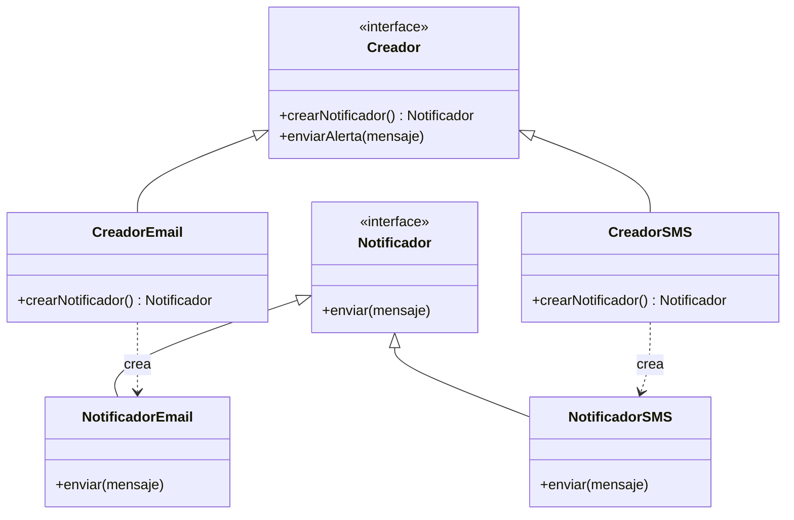

#architecture #design-patterns #gof #creational #factory-method #go #kotlin

# Patrón de Diseño: Factory Method (Método de Fábrica)

El patrón **Factory Method** es un patrón de diseño **creacional** del catálogo clásico *Gang of Four (GoF)*. Proporciona una interfaz para crear objetos en una superclase, permitiendo a las subclases o funciones especializadas alterar el tipo de objetos que se crearán sin acoplar el código cliente a clases concretas.

---

## Índice

- [[Diseño y Arquitectura/Diseño y Arquitectura.md|<- Volver a Diseño y Arquitectura]]
- [[Diseño y Arquitectura/Patrones de Diseño/Patrón de Diseño - Singleton.md|Ver Patrón Singleton]]
- [[Diseño y Arquitectura/Patrones de Diseño/Patrones de Diseño - Catálogo GoF.md|Ver Catálogo de Patrones de Diseño]]

---

## El Problema que Resuelve: Acoplamiento al Operador `new`

Imaginemos una aplicación de comercio electrónico que procesa pagos. Inicialmente solo soporta pagos con **Tarjeta de Crédito**. En el código cliente escribimos:

```kotlin
// Código fuertemente acoplado:
val procesador = TarjetaCreditoProcessor()
procesador.procesar(monto)
```

Si más tarde el negocio requiere agregar soporte para **PayPal**, **Criptomonedas** o **Apple Pay**, tendríamos que modificar múltiples partes del código llenándolo de bloques condicionales frágiles:

```kotlin
// Código que viola el principio Abierto/Cerrado (OCP):
val procesador = when (tipo) {
    "TARJETA" -> TarjetaCreditoProcessor()
    "PAYPAL" -> PayPalProcessor()
    "CRYPTO" -> CryptoProcessor()
    else -> throw IllegalArgumentException()
}
```

> [!IMPORTANT] Principio SOLID Aplicado: Open/Closed (OCP)
> Factory Method encapsula la creación del objeto detrás de una interfaz común. Cuando agregas un nuevo método de pago, **solo creas una nueva clase sin modificar el código cliente existente**.

---

## Estructura del Patrón



1. **Producto (Interface)**: Define el contrato común para todos los objetos que pueden ser creados por la fábrica (`Notificador`).
2. **Productos Concretos**: Implementaciones específicas del producto (`NotificadorEmail`, `NotificadorSMS`).
3. **Creador (Fábrica)**: Declara el método fábrica (`crearNotificador()`) que devuelve objetos de tipo Producto.
4. **Creadores Concretos**: Sobrescriben el método fábrica para devolver una instancia de un producto concreto específico.

---

## Ejemplo Práctico en Go

En Go, donde no hay herencia clásica de clases, el patrón se implementa de forma muy limpia y elegante utilizando interfaces y funciones constructoras:

```go
package main

import "fmt"

// 1. PRODUCTO (Interfaz común)
type PasarelaPago interface {
    Pagar(monto float64) string
}

// 2. PRODUCTOS CONCRETOS
type PagoStripe struct{}

func (s *PagoStripe) Pagar(monto float64) string {
    return fmt.Sprintf("Cobro de $%.2f procesado vía Stripe API", monto)
}

type PagoPayPal struct{}

func (p *PagoPayPal) Pagar(monto float64) string {
    return fmt.Sprintf("Cobro de $%.2f procesado vía PayPal Wallet", monto)
}

// 3. FACTORY METHOD
type TipoPago string

const (
    Stripe TipoPago = "STRIPE"
    PayPal TipoPago = "PAYPAL"
)

func NuevaPasarelaPago(tipo TipoPago) (PasarelaPago, error) {
    switch tipo {
    case Stripe:
        return &PagoStripe{}, nil
    case PayPal:
        return &PagoPayPal{}, nil
    default:
        return nil, fmt.Errorf("método de pago '%s' no soportado", tipo)
    }
}

func main() {
    // El cliente depende de la interfaz, no de la implementación concreta
    pasarela, _ := NuevaPasarelaPago(Stripe)
    fmt.Println(pasarela.Pagar(150.0))
}
```

---

## Ejemplo Práctico en Kotlin

```kotlin
// 1. PRODUCTO
interface Notificador {
    fun notificar(mensaje: String)
}

// 2. PRODUCTOS CONCRETOS
class NotificadorEmail : Notificador {
    override fun notificar(mensaje: String) = println("Enviando Email: $mensaje")
}

class NotificadorPush : Notificador {
    override fun notificar(mensaje: String) = println("Enviando Notificación Push: $mensaje")
}

// 3. CREADOR ABSTRACTO
abstract class NotificadorFactory {
    abstract fun crearNotificador(): Notificador

    // Lógica de negocio reutilizable
    fun procesarAlerta(mensaje: String) {
        val notificador = crearNotificador()
        notificador.notificar(mensaje)
    }
}

// 4. CREADORES CONCRETOS
class EmailFactory : NotificadorFactory() {
    override fun crearNotificador(): Notificador = NotificadorEmail()
}

class PushFactory : NotificadorFactory() {
    override fun crearNotificador(): Notificador = NotificadorPush()
}
```

---

## Ventajas y Desventajas

| Ventajas | Desventajas |
| :--- | :--- |
| **Bajo Acoplamiento**: Evita ligar el código cliente a clases concretas. | **Proliferación de Clases**: Puede requerir crear muchas subclases pequeñas para cada tipo de producto nuevo. |
| **Principio Open/Closed (OCP)**: Permite introducir nuevos productos sin romper el código existente. | **Complejidad Adicional**: Para casos muy simples donde solo existe un tipo de producto, introduce abstracciones innecesarias. |
| **Principio de Responsabilidad Única (SRP)**: Centraliza el código de creación en un solo lugar. | |

---

## Comparativa con Otros Patrones Creacionales

- **Factory Method vs. Abstract Factory**: Factory Method se enfoca en crear **un solo producto**, mientras que Abstract Factory se encarga de crear **familias completas de productos relacionados** (ej. botón, ventana y checkbox para Windows o MacOS).
- **Factory Method vs. Builder**: Factory Method crea objetos de un solo paso; Builder construye objetos complejos paso a paso con configuraciones personalizadas.

---

## Referencias y Enlaces

- [[Diseño y Arquitectura/Diseño y Arquitectura.md|Índice de Diseño y Arquitectura]]
- [[Diseño y Arquitectura/Patrones de Diseño/Patrón de Diseño - Singleton.md|Patrón Singleton]]
- [[Diseño y Arquitectura/Patrones de Diseño/Patrones de Diseño - Catálogo GoF.md|Catálogo General de Patrones de Diseño]]
- GoF: *Design Patterns: Elements of Reusable Object-Oriented Software (1994).*
