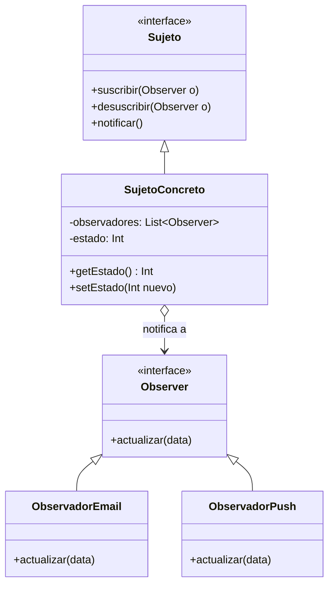

#architecture #design-patterns #gof #behavioral #observer #pubsub #kotlin #go

# Patrón de Diseño: Observer (Observador / Suscriptor)

El patrón **Observer (Observador)** es un patrón de diseño **de comportamiento** del catálogo clásico *Gang of Four (GoF)*. Define un mecanismo de suscripción para notificar a múltiples objetos sobre cualquier evento o cambio de estado que ocurra en el objeto que están observando, manteniendo una relación de dependencia **uno a muchos completamente desacoplada**.

Es el fundamento teórico e histórico sobre el que se construyen los paradigmas modernos de **Programación Reactiva** (RxJava, Kotlin `Flow`, `LiveData`, Observables de Angular y eventos de JavaScript).

---

## Índice

- [[Diseño y Arquitectura/Diseño y Arquitectura.md|<- Volver a Diseño y Arquitectura]]
- [[Diseño y Arquitectura/Patrones de Diseño/Patrones de Diseño - Catálogo GoF.md|Ver Catálogo de Patrones GoF]]
- [[Diseño y Arquitectura/Patrones de Diseño/Patrón de Diseño - Singleton.md|Ver Patrón Singleton]]
- [[Diseño y Arquitectura/Patrones de Arquitectura/Patrón Arquitectónico - MVVM.md|Ver MVVM (Uso de Observables)]]
- [[Diseño y Arquitectura/Patrones de Arquitectura/Patrón Arquitectónico - Signals.md|Ver Signals (Evolución de Grano Fino)]]

---

## El Problema que Resuelve: El Costoso Sondeo (*Polling*)

Imaginemos un cliente que desea saber cuándo un producto agotado vuelve a estar disponible en una tienda online:
- **Enfoque sin Observer (*Polling*)**: El cliente envía una petición cada 5 segundos al servidor preguntando *"¿ya hay stock?"*. Esto desperdicia CPU, ancho de banda y conexiones de base de datos.
- **Enfoque con Observer (*Push*)**: El cliente se suscribe a una lista de espera. Cuando el inventario se actualiza, la tienda envía una notificación directa a todos los clientes registrados automáticamente.

---

## Estructura del Patrón



1. **Sujeto (*Subject / Publisher*)**: Conoce a sus observadores y provee métodos para suscribirlos y desuscribirlos.
2. **Observador (*Observer / Subscriber*)**: Define la interfaz con el método de actualización (`actualizar()`).
3. **Observadores Concretos**: Implementan la reacción al ser notificados.

---

## Ejemplo Práctico en Kotlin

```kotlin
// 1. Interfaz Observador
interface ObservadorStock {
    fun alCambiarStock(producto: String, cantidad: Int)
}

// 2. Sujeto (Publisher)
class NotificadorStock(val nombreProducto: String) {
    private val suscriptores = mutableListOf<ObservadorStock>()
    private var stock: Int = 0

    fun suscribir(o: ObservadorStock) = suscriptores.add(o)
    fun desuscribir(o: ObservadorStock) = suscriptores.remove(o)

    fun actualizarStock(nuevoStock: Int) {
        this.stock = nuevoStock
        notificarTodos()
    }

    private fun notificarTodos() {
        suscriptores.forEach { it.alCambiarStock(nombreProducto, stock) }
    }
}

// 3. Suscriptores Concretos
class AlertaEmail : ObservadorStock {
    override fun alCambiarStock(producto: String, cantidad: Int) {
        println("📧 Email enviado: El producto '$producto' ahora tiene $cantidad unidades.")
    }
}

class AlertaPush : ObservadorStock {
    override fun alCambiarStock(producto: String, cantidad: Int) {
        println("📱 Notificación Push: ¡$producto disponible! Quedan $cantidad.")
    }
}

fun main() {
    val consola = NotificadorStock("PlayStation 5")
    val emailUser = AlertaEmail()
    val pushUser = AlertaPush()

    consola.suscribir(emailUser)
    consola.suscribir(pushUser)

    // Cuando cambia el estado, todos son notificados automáticamente
    consola.actualizarStock(15)
}
```

---

## Ejemplo Práctico en Go (Uso de Canales y Goroutines)

```go
package main

import "fmt"

type Observador interface {
    Actualizar(mensaje string)
}

type Emisor struct {
    observadores []Observador
}

func (e *Emisor) Registrar(o Observador) {
    e.observadores = append(e.observadores, o)
}

func (e *Emisor) Notificar(msg string) {
    for _, o := range e.observadores {
        o.Actualizar(msg)
    }
}

type UsuarioNotificacion struct {
    Nombre string
}

func (u *UsuarioNotificacion) Actualizar(msg string) {
    fmt.Printf("[%s] Notificación recibida: %s\n", u.Nombre, msg)
}

func main() {
    emisor := &Emisor{}
    emisor.Registrar(&UsuarioNotificacion{Nombre: "Joshua"})
    emisor.Registrar(&UsuarioNotificacion{Nombre: "Elena"})

    emisor.Notificar("Nuevo artículo publicado en el repositorio")
}
```

---

## Ventajas y Desventajas

| Ventajas | Desventajas |
| :--- | :--- |
| **Principio Open/Closed (OCP)**: Puedes añadir nuevos observadores sin modificar el código del sujeto. | **Fugas de Memoria (*Lapsed Listener Problem*)**: Si un observador no se desuscribe al destruirse la pantalla, el sujeto retiene la referencia en memoria impidiendo la recolección de basura. |
| **Bajo Acoplamiento**: El sujeto solo conoce la interfaz genérica `Observer`. | **Orden Indeterminado**: Las notificaciones se despachan a los suscriptores en orden aleatorio o no garantizado. |

---

## Referencias y Enlaces

- [[Diseño y Arquitectura/Diseño y Arquitectura.md|Índice de Diseño y Arquitectura]]
- [[Diseño y Arquitectura/Patrones de Diseño/Patrones de Diseño - Catálogo GoF.md|Catálogo General de Patrones GoF]]
- [[Diseño y Arquitectura/Patrones de Arquitectura/Patrón Arquitectónico - MVVM.md|MVVM y Data Binding]]
- [[Diseño y Arquitectura/Patrones de Arquitectura/Patrón Arquitectónico - Signals.md|Signals y Reactividad de Grano Fino]]
- GoF: *Design Patterns: Elements of Reusable Object-Oriented Software (1994).*
