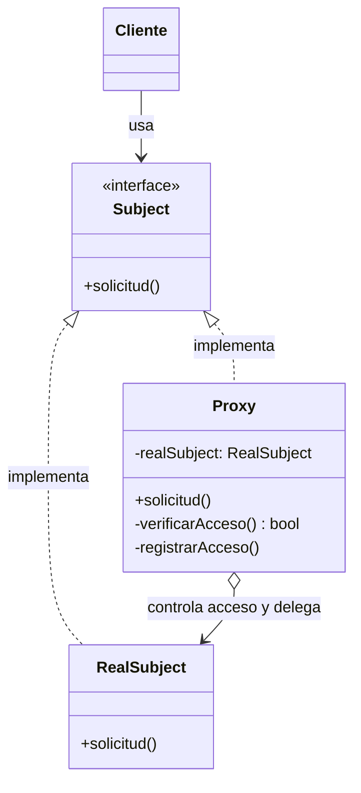

#architecture #design-patterns #gof #structural #proxy #virtual-proxy #caching #security #interview-prep #go #kotlin

# Patrón de Diseño: Proxy (Apoderado / Intermediario)

El patrón **Proxy (Apoderado / Intermediario)** es un patrón de diseño **estructural** del catálogo *Gang of Four (GoF)*. Proporciona un **objeto sustituto o marcador de posición para otro objeto real, con el fin de controlar el acceso a este**.

El Proxy implementa la misma interfaz que el objeto de servicio original, permitiendo ejecutar acciones accesorias (como control de permisos, caché, inicialización perezosa o auditoría) antes o después de delegar la petición al objeto real.

---

## Índice

- [[Diseño y Arquitectura/Diseño y Arquitectura.md|<- Volver a Diseño y Arquitectura]]
- [[Diseño y Arquitectura/Patrones de Diseño/Patrón de Diseño - Decorator.md|Ver Decorator]]
- [[Diseño y Arquitectura/Patrones de Diseño/Patrón de Diseño - Adapter.md|Ver Adapter]]
- [[Diseño y Arquitectura/Patrones de Diseño/Patrones de Diseño - Catálogo GoF.md|Ver Catálogo GoF]]

---

## Tipos de Proxies Más Comunes

1. **Virtual Proxy (Lazy Loading)**: Retrasa la creación costosa de un objeto pesado (e.g., cargar un video gigante o conexión de BD) hasta el momento exacto en que se invoca por primera vez.
2. **Protection Proxy (Control de Acceso / Seguridad)**: Valida si el cliente tiene los permisos o roles adecuados antes de permitir invocar el método.
3. **Caching Proxy (Caché)**: Almacena en memoria las respuestas de operaciones lentas y las retorna inmediatamente en llamadas subsecuentes con los mismos parámetros.
4. **Remote Proxy (RPC / Stubs)**: Representa un objeto que reside en otra máquina o red (e.g., stubs de gRPC o clientes REST).
5. **Logging / Audit Proxy**: Registra métricas de latencia, trazas de auditoría o errores sin alterar la lógica de negocio.

---

## Metáfora del Mundo Real

Una **tarjeta de crédito** o de débito es un proxy de tu cuenta bancaria:
- Es un sustituto físico de los billetes de efectivo.
- Implementa la misma función: pagar una compra.
- Pero añade control de acceso (requiere PIN/CVV), validación de fondos y registro de auditoría antes de autorizar el débito real del dinero.

---

## Estructura del Patrón



---

## Ejemplo Práctico en Go: Caching & Virtual Proxy

Un proxy que evita consultas repetidas y costosas a una base de datos o API de terceros almacenando los datos en caché:

```go
package main

import (
    "fmt"
    "time"
)

// 1. Subject (Interfaz común)
type RepositorioVideo interface {
    ObtenerVideo(id string) string
}

// 2. RealSubject (Servicio pesado real)
type ServicioVideoNube struct{}

func (s *ServicioVideoNube) ObtenerVideo(id string) string {
    // Simula alta latencia de descarga de red
    fmt.Printf("[RealSubject] Descargando video pesado '%s' desde la nube remota...\n", id)
    time.Sleep(100 * time.Millisecond)
    return fmt.Sprintf("Contenido binario del video [%s]", id)
}

// 3. Proxy (Caching Proxy)
type ProxyVideoCache struct {
    servicioReal *ServicioVideoNube
    cache        map[string]string
}

func NuevoProxyVideoCache() *ProxyVideoCache {
    return &ProxyVideoCache{
        servicioReal: &ServicioVideoNube{},
        cache:        make(map[string]string),
    }
}

func (p *ProxyVideoCache) ObtenerVideo(id string) string {
    if video, ok := p.cache[id]; ok {
        fmt.Printf("[Proxy Cache] HIT! Retornando video '%s' instantáneamente desde memoria\n", id)
        return video
    }

    fmt.Printf("[Proxy Cache] MISS! Solicitando a RealSubject...\n")
    video := p.servicioReal.ObtenerVideo(id)
    p.cache[id] = video
    return video
}

func main() {
    var repo RepositorioVideo = NuevoProxyVideoCache()

    // Primera llamada: Cache MISS (descarga real)
    repo.ObtenerVideo("gof-patterns-1080p.mp4")

    // Segunda llamada: Cache HIT (inmediato)
    repo.ObtenerVideo("gof-patterns-1080p.mp4")
}
```

---

## Ejemplo Práctico en Kotlin: Protection Proxy (Seguridad)

Un proxy que valida los privilegios del usuario antes de permitir la eliminación de datos críticos:

```kotlin
// 1. Subject
interface UserService {
    fun deleteUser(userId: String)
}

// 2. RealSubject
class RealUserService : UserService {
    override fun deleteUser(userId: String) {
        println("-> [BD] Usuario $userId eliminado permanentemente de la base de datos.")
    }
}

// Contexto de seguridad
enum class Role { USER, ADMIN }
data class UserSession(val username: String, val role: Role)

// 3. Protection Proxy
class SecurityUserProxy(
    private val realService: UserService,
    private val session: UserSession
) : UserService {

    override fun deleteUser(userId: String) {
        if (session.role != Role.ADMIN) {
            println("[Seguridad Denegada] El usuario ${session.username} no tiene permisos de ADMIN para eliminar cuentas.")
            return
        }
        println("[Seguridad Aprobada] Auditoría: ${session.username} autorizó la eliminación de $userId.")
        realService.deleteUser(userId)
    }
}

fun main() {
    val realService = RealUserService()

    val sesionUsuario = UserSession("pedro_regular", Role.USER)
    val proxySeguro1 = SecurityUserProxy(realService, sesionUsuario)
    proxySeguro1.deleteUser("usr-999") // Bloqueado

    val sesionAdmin = UserSession("joshua_admin", Role.ADMIN)
    val proxySeguro2 = SecurityUserProxy(realService, sesionAdmin)
    proxySeguro2.deleteUser("usr-999") // Permitido
}
```

---

## Preguntas Frecuentes en Entrevistas Técnicas

### 1. ¿Cuál es la diferencia fundamental entre Proxy y Decorator?
Ambos patrones tienen estructuras UML casi idénticas (implementan la misma interfaz y envuelven a otra instancia). La diferencia radica en la **intención**:
- **Decorator**: El cliente crea el objeto base y lo envuelve conscientemente para **añadir nuevas responsabilidades o funcionalidades**. Los decoradores se pueden apilar recursivamente de formas arbitrarias.
- **Proxy**: El proxy suele **gestionar por sí mismo el ciclo de vida del objeto real** (lo crea perezosamente, lo protege o lo cachea). Su meta no es sumar características de negocio, sino **controlar el acceso** al objeto subyacente.

### 2. ¿Cómo se utiliza el patrón Proxy en los frameworks modernos?
- **Spring Framework / CDI**: Las anotaciones `@Transactional`, `@Async` y `@Cacheable` funcionan generando proxies dinámicos (vía JDK Dynamic Proxies o CGLIB) que interceptan la llamada, inician la transacción o revisan la caché antes de ejecutar tu método real.
- **Hibernate / JPA**: La carga perezosa (*Lazy Loading*) devuelve un objeto Proxy que contiene solo la clave primaria (`ID`). Al invocar un getter de los campos, el proxy dispara la consulta SQL a la base de datos.
- **gRPC y Microservicios**: Los *Stubs* de cliente son Remote Proxies que serializan el mensaje en Protocol Buffers y gestionan la llamada de red HTTP/2 de forma transparente como si fuera un método local.

---

## Referencias y Enlaces

- [[Diseño y Arquitectura/Diseño y Arquitectura.md|Índice de Diseño y Arquitectura]]
- [[Diseño y Arquitectura/Patrones de Diseño/Patrón de Diseño - Decorator.md|Decorator]]
- [[Diseño y Arquitectura/Patrones de Diseño/Patrón de Diseño - Adapter.md|Adapter]]
- [[Diseño y Arquitectura/Patrones de Diseño/Patrones de Diseño - Catálogo GoF.md|Catálogo GoF]]
- GoF: *Design Patterns: Elements of Reusable Object-Oriented Software.*
