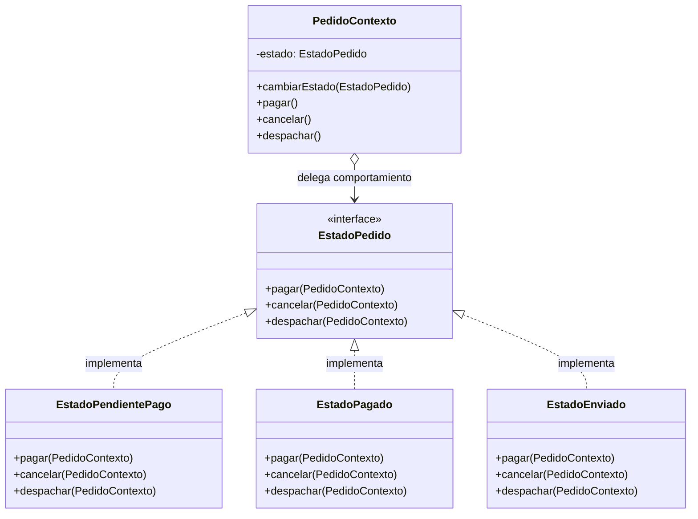

#architecture #design-patterns #gof #behavioral #state #fsm #state-machine #interview-prep #go #kotlin

# Patrón de Diseño: State (Estado)

El patrón **State (Estado)** es un patrón de diseño **de comportamiento** (*Behavioral*) del catálogo *Gang of Four (GoF)*. Permite que un **objeto altere completamente su comportamiento cuando cambia su estado interno**, dando la impresión de que el objeto ha cambiado de clase en tiempo de ejecución.

Es la materialización limpia y orientada a objetos del concepto clásico de **Máquina de Estados Finita (FSM - *Finite State Machine*)**, erradicando los extensos bloques de condicionales anidados (`if-else` o `switch-case`) que evalúan banderas de estado en cada método.

---

## Índice

- [[Diseño y Arquitectura/Diseño y Arquitectura.md|<- Volver a Diseño y Arquitectura]]
- [[Diseño y Arquitectura/Patrones de Diseño/Patrón de Diseño - Strategy.md|Ver Strategy]]
- [[Diseño y Arquitectura/Patrones de Diseño/Patrón de Diseño - Command.md|Ver Command]]
- [[Diseño y Arquitectura/Patrones de Diseño/Patrón de Diseño - Observer.md|Ver Observer]]
- [[Diseño y Arquitectura/Patrones de Diseño/Patrones de Diseño - Catálogo GoF.md|Ver Catálogo GoF]]

---

## El Problema: Explosión de Condicionales de Estado

Imagina una clase `Pedido`:
- Métodos: `pagar()`, `cancelar()`, `despachar()`, `devolver()`.
- Estados: *Borrador*, *Pagado*, *Enviado*, *Entregado*, *Cancelado*.

Sin el patrón State, cada método se convierte en un laberinto inmanejable:
```kotlin
// ANTIPATRÓN: Código frágil y propenso a errores
fun pagar() {
    if (estado == BORRADOR) { /* pagar */ }
    else if (estado == PAGADO) { throw Error("Ya está pagado") }
    else if (estado == CANCELADO) { throw Error("No se puede pagar orden cancelada") }
    // ...
}
```
Cualquier nuevo estado implica modificar **todos los métodos** de la clase, violando directamente el Principio de Abierto/Cerrado (*OCP*).

---

## Metáfora del Mundo Real

Piensa en los botones físicos de tu **Smartphone**:
- Si el teléfono está **Desbloqueado**: Presionar la pantalla interactúa con las aplicaciones.
- Si el teléfono está **Bloqueado**: Tocar la pantalla solo enciende la pantalla para mostrar la hora y notificaciones.
- Si el teléfono está **Apagado / Sin Batería**: Tocar la pantalla no hace nada; mantener presionado el botón de encendido muestra el icono de batería baja.

El mismo estímulo externo genera comportamientos radicalmente distintos según el **estado actual** del dispositivo.

---

## Estructura del Patrón



---

## Ejemplo Práctico en Go: Ciclo de Vida de un Pedido

```go
package main

import "fmt"

// 1. Contexto
type Pedido struct {
    estado EstadoPedido
}

func NuevoPedido() *Pedido {
    p := &Pedido{}
    p.estado = &EstadoPendientePago{pedido: p}
    return p
}

func (p *Pedido) CambiarEstado(nuevo EstadoPedido) {
    p.estado = nuevo
}

func (p *Pedido) Pagar()     { p.estado.Pagar() }
func (p *Pedido) Despachar() { p.estado.Despachar() }
func (p *Pedido) Cancelar()  { p.estado.Cancelar() }

// 2. Interfaz del Estado
type EstadoPedido interface {
    Pagar()
    Despachar()
    Cancelar()
}

// 3. Estado Concreto: Pendiente de Pago
type EstadoPendientePago struct {
    pedido *Pedido
}

func (e *EstadoPendientePago) Pagar() {
    fmt.Println("[Pendiente] Pago recibido con éxito.")
    e.pedido.CambiarEstado(&EstadoPagado{pedido: e.pedido})
}

func (e *EstadoPendientePago) Despachar() {
    fmt.Println("[Error] No se puede despachar un pedido sin pagar.")
}

func (e *EstadoPendientePago) Cancelar() {
    fmt.Println("[Pendiente] Pedido cancelado exitosamente.")
    e.pedido.CambiarEstado(&EstadoCancelado{})
}

// 4. Estado Concreto: Pagado
type EstadoPagado struct {
    pedido *Pedido
}

func (e *EstadoPagado) Pagar() {
    fmt.Println("[Error] El pedido ya fue pagado previamente.")
}

func (e *EstadoPagado) Despachar() {
    fmt.Println("[Pagado] Pedido embalado y entregado al servicio de mensajería.")
    e.pedido.CambiarEstado(&EstadoEnviado{})
}

func (e *EstadoPagado) Cancelar() {
    fmt.Println("[Pagado] Cancelando y procesando reembolso de dinero...")
    e.pedido.CambiarEstado(&EstadoCancelado{})
}

// 5. Estados Finales: Enviado y Cancelado
type EstadoEnviado struct{}
func (e *EstadoEnviado) Pagar()     { fmt.Println("[Error] Ya pagado y enviado.") }
func (e *EstadoEnviado) Despachar() { fmt.Println("[Error] Ya en tránsito.") }
func (e *EstadoEnviado) Cancelar()  { fmt.Println("[Error] No se puede cancelar: el paquete ya viaja hacia el destino.") }

type EstadoCancelado struct{}
func (e *EstadoCancelado) Pagar()     { fmt.Println("[Error] Pedido cerrado y cancelado.") }
func (e *EstadoCancelado) Despachar() { fmt.Println("[Error] Pedido cerrado y cancelado.") }
func (e *EstadoCancelado) Cancelar()  { fmt.Println("[Error] Ya está cancelado.") }

func main() {
    pedido := NuevoPedido()

    pedido.Despachar() // Intento inválido: da error
    pedido.Pagar()     // Pasa a EstadoPagado
    pedido.Despachar() // Pasa a EstadoEnviado
    pedido.Cancelar()  // Intento inválido: ya está en tránsito
}
```

---

## Ejemplo Práctico en Kotlin: Reproductor de Audio

```kotlin
// 1. Interfaz State
interface ReproductorState {
    fun play(reproductor: ReproductorAudio)
    fun pause(reproductor: ReproductorAudio)
    fun stop(reproductor: ReproductorAudio)
}

// 2. Contexto
class ReproductorAudio {
    var state: ReproductorState = StoppedState()

    fun play() = state.play(this)
    fun pause() = state.pause(this)
    fun stop() = state.stop(this)
}

// 3. Estados Concretos
class StoppedState : ReproductorState {
    override fun play(reproductor: ReproductorAudio) {
        println("-> Iniciando reproducción desde el principio...")
        reproductor.state = PlayingState()
    }
    override fun pause(reproductor: ReproductorAudio) = println("-> No se puede pausar: la pista está detenida.")
    override fun stop(reproductor: ReproductorAudio) = println("-> Ya está detenido.")
}

class PlayingState : ReproductorState {
    override fun play(reproductor: ReproductorAudio) = println("-> Ya se está reproduciendo.")
    override fun pause(reproductor: ReproductorAudio) {
        println("-> Pista pausada en el minuto actual.")
        reproductor.state = PausedState()
    }
    override fun stop(reproductor: ReproductorAudio) {
        println("-> Deteniendo reproducción.")
        reproductor.state = StoppedState()
    }
}

class PausedState : ReproductorState {
    override fun play(reproductor: ReproductorAudio) {
        println("-> Reanudando reproducción...")
        reproductor.state = PlayingState()
    }
    override fun pause(reproductor: ReproductorAudio) = println("-> Ya está pausado.")
    override fun stop(reproductor: ReproductorAudio) {
        println("-> Deteniendo pista pausada.")
        reproductor.state = StoppedState()
    }
}

fun main() {
    val reproductor = ReproductorAudio()
    reproductor.pause() // Inválido
    reproductor.play()  // Pasa a Playing
    reproductor.pause() // Pasa a Paused
    reproductor.play()  // Pasa a Playing
    reproductor.stop()  // Pasa a Stopped
}
```

---

## Preguntas Frecuentes en Entrevistas Técnicas

### 1. ¿Cuál es la diferencia entre State y Strategy?
Aunque ambos patrones comparten diagramas UML prácticamente idénticos (un Contexto delegando en una interfaz polimórfica), su **intención y dinámica** son radicalmente distintas:
- **Strategy**: Las estrategias son algoritmos independientes. El cliente suele elegir y configurar la estrategia desde afuera. Las estrategias no conocen a otras estrategias ni provocan transiciones entre sí.
- **State**: Modela una máquina de estados finita. El contexto cambia su propio estado en respuesta a eventos. Los estados concretos suelen conocer las transiciones hacia otros estados para orquestar el ciclo de vida del objeto.

### 2. ¿Dónde deben residir las transiciones de estado?
Hay dos escuelas principales:
1. **Dentro de las clases de estado concretas**: (Como en los ejemplos de arriba). Facilita ver a qué estado conduce cada acción, pero acopla los estados entre sí (`EstadoA` necesita instanciar o conocer `EstadoB`).
2. **Dentro de la clase Contexto**: El contexto evalúa el resultado de la acción del estado y decide el próximo estado. Desacopla los estados concretos entre sí, pero puede hacer crecer la complejidad del contexto si hay muchas ramas de decisión.

### 3. ¿Cuándo NO usar el patrón State?
Si tu entidad solo tiene 2 o 3 estados con lógica trivial (por ejemplo, una bandera booleana `activo/inactivo` o un enum simple) y las transiciones no conllevan comportamiento complejo, usar el patrón State añadirá sobreingeniería innecesaria (*Overengineering*). Un `when` o `switch` simple en un enum es suficiente.

---

## Referencias y Enlaces

- [[Diseño y Arquitectura/Diseño y Arquitectura.md|Índice de Diseño y Arquitectura]]
- [[Diseño y Arquitectura/Patrones de Diseño/Patrón de Diseño - Strategy.md|Strategy]]
- [[Diseño y Arquitectura/Patrones de Diseño/Patrón de Diseño - Command.md|Command]]
- [[Diseño y Arquitectura/Patrones de Diseño/Patrón de Diseño - Observer.md|Observer]]
- [[Diseño y Arquitectura/Patrones de Diseño/Patrones de Diseño - Catálogo GoF.md|Catálogo GoF]]
- GoF: *Design Patterns: Elements of Reusable Object-Oriented Software.*
