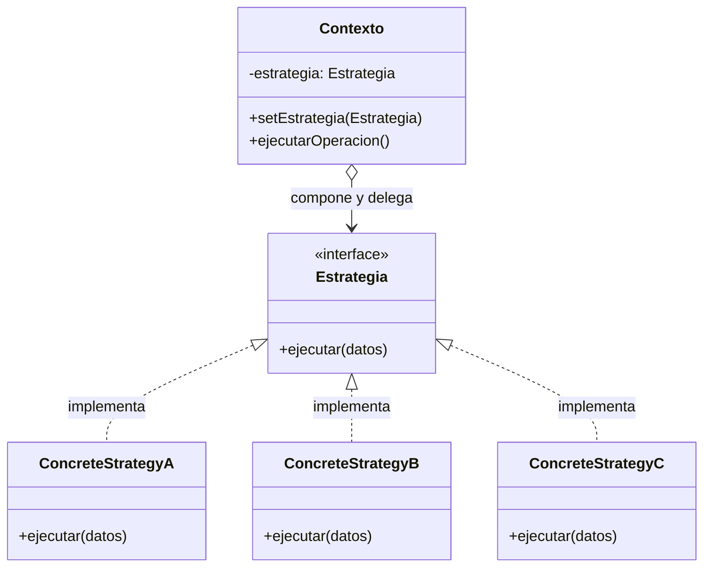

#architecture #design-patterns #gof #behavioral #strategy #polymorphism #open-closed #interview-prep #go #kotlin

# Patrón de Diseño: Strategy (Estrategia)

El patrón **Strategy (Estrategia)** es un patrón de diseño **de comportamiento** (*Behavioral*) del catálogo *Gang of Four (GoF)*. Define una **familia de algoritmos, encapsula cada uno de ellos en una clase independiente y los hace intercambiables en tiempo de ejecución**.

Permite que el algoritmo varíe de forma completamente independiente de los clientes que lo utilizan, siendo el antídoto por excelencia contra los bloques masivos de condicionales anidados (`if-else` o `switch-case`) y un pilar del **Principio de Abierto/Cerrado (OCP)**.

---

## Índice

- [[Diseño y Arquitectura/Diseño y Arquitectura.md|<- Volver a Diseño y Arquitectura]]
- [[Diseño y Arquitectura/Patrones de Diseño/Patrón de Diseño - State.md|Ver State]]
- [[Diseño y Arquitectura/Patrones de Diseño/Patrón de Diseño - Command.md|Ver Command]]
- [[Diseño y Arquitectura/Patrones de Diseño/Patrón de Diseño - Observer.md|Ver Observer]]
- [[Diseño y Arquitectura/Patrones de Diseño/Patrones de Diseño - Catálogo GoF.md|Ver Catálogo GoF]]

---

## Metáfora del Mundo Real

Imagina que necesitas desplazarte al **aeropuerto**:
- Puedes ir en **bicicleta** (económico, pero lento y no para llevar maletas).
- Puedes tomar el **autobús** (precio moderado, horario fijo).
- Puedes pedir un **taxi** o Uber (el más rápido y cómodo, pero el más costoso).

Todas son estrategias intercambiables para resolver el mismo problema (*llegar al aeropuerto*). Tú (el *Contexto*) eliges la estrategia en función de tu presupuesto, tiempo disponible o condiciones climáticas, y puedes cambiarla en cualquier momento sin cambiar tu destino.

---

## Estructura del Patrón



1. **Contexto**: Mantiene una referencia a una instancia concreta de `Estrategia` y se comunica con ella a través de la interfaz.
2. **Estrategia (Interfaz)**: Declara la firma del método común que implementan todos los algoritmos.
3. **Estrategias Concretas**: Implementan variantes específicas del algoritmo.

---

## Ejemplo Práctico en Go

Cálculo dinámico de descuentos en un carrito de compras:

```go
package main

import "fmt"

// 1. Estrategia (Interfaz)
type EstrategiaDescuento interface {
    Calcular(monto float64) float64
}

// 2. Estrategias Concretas
type DescuentoRegular struct{}
func (d *DescuentoRegular) Calcular(monto float64) float64 {
    return monto // Sin descuento
}

type DescuentoBlackFriday struct{}
func (d *DescuentoBlackFriday) Calcular(monto float64) float64 {
    return monto * 0.70 // 30% de descuento
}

type DescuentoClienteVIP struct{}
func (d *DescuentoClienteVIP) Calcular(monto float64) float64 {
    return monto * 0.85 // 15% de descuento
}

// 3. Contexto: Carrito de Compras
type Carrito struct {
    total              float64
    estrategiaDescuento EstrategiaDescuento
}

func NuevoCarrito(total float64, estrategia EstrategiaDescuento) *Carrito {
    return &Carrito{total: total, estrategiaDescuento: estrategia}
}

func (c *Carrito) SetEstrategia(estrategia EstrategiaDescuento) {
    c.estrategiaDescuento = estrategia
}

func (c *Carrito) ObtenerTotalConDescuento() float64 {
    return c.estrategiaDescuento.Calcular(c.total)
}

func main() {
    carrito := NuevoCarrito(100.0, &DescuentoRegular{})
    fmt.Printf("Total Normal: $%.2f\n", carrito.ObtenerTotalConDescuento())

    // Cambiamos la estrategia dinámicamente en Black Friday
    carrito.SetEstrategia(&DescuentoBlackFriday{})
    fmt.Printf("Total Black Friday: $%.2f\n", carrito.ObtenerTotalConDescuento())

    // Cambiamos a cliente VIP
    carrito.SetEstrategia(&DescuentoClienteVIP{})
    fmt.Printf("Total Cliente VIP: $%.2f\n", carrito.ObtenerTotalConDescuento())
}
```

---

## Ejemplo Práctico en Kotlin (Aprovechando First-Class Functions)

En Kotlin, gracias a que las funciones son ciudadanos de primer orden y a las interfaces funcionales (`fun interface`), el patrón Strategy se puede implementar de manera extremadamente concisa:

```kotlin
// 1. Interfaz funcional SAM (Single Abstract Method)
fun interface RutaStrategy {
    fun calcularRuta(origen: String, destino: String): String
}

// 2. Estrategias concretas
val rutaRapida = RutaStrategy { origen, destino -> 
    "Ruta más rápida por Autopista de peaje entre $origen y $destino (35 mins)" 
}

val rutaSinPeajes = RutaStrategy { origen, destino -> 
    "Ruta económica sin peajes por calles secundarias entre $origen y $destino (55 mins)" 
}

val rutaBicicleta = RutaStrategy { origen, destino -> 
    "Ruta ciclovía ecológica entre $origen y $destino (1h 15 mins)" 
}

// 3. Contexto
class NavegadorGPS(var estrategia: RutaStrategy) {
    fun navegar(origen: String, destino: String) {
        println(estrategia.calcularRuta(origen, destino))
    }
}

fun main() {
    val gps = NavegadorGPS(rutaRapida)
    gps.navegar("Centro", "Aeropuerto")

    // Cambio de estrategia en caliente
    gps.estrategia = rutaSinPeajes
    gps.navegar("Centro", "Aeropuerto")
}
```

---

## Preguntas Frecuentes en Entrevistas Técnicas

### 1. ¿Cuál es la diferencia entre Strategy y State?
Esta es una de las preguntas de comparación más frecuentes:
- **Strategy**: Las estrategias suelen ser **independientes entre sí** y no se conocen unas a otras. El cliente (o quien configura el contexto) elige la estrategia adecuada. El contexto rara vez cambia su propia estrategia sin intervención externa.
- **State**: Los estados suelen **conocer las transiciones hacia otros estados**. El contexto pasa de un estado a otro de manera automática según los eventos que ocurren (actuando como una máquina de estados finita).

### 2. ¿Cómo Strategy reemplaza los `switch` o `if-else` masivos?
Cuando tienes un `switch (tipoDeEnvio)` que se repite en múltiples métodos de tu aplicación, cada vez que agregas un nuevo tipo de envío debes modificar todos esos `switch`. Con Strategy:
1. Creas una interfaz común `TipoEnvio`.
2. Creas una clase por cada tipo (`EnvioAereo`, `EnvioMaritimo`, `EnvioTerrestre`).
3. Para añadir un nuevo tipo, creas una nueva clase sin tocar ninguna línea de código existente (**Open/Closed Principle**).

### 3. En lenguajes modernos, ¿es necesario crear clases para cada estrategia?
No. En lenguajes con funciones de orden superior o lambdas (Kotlin, Go, Python, TypeScript, Java 8+), muchas veces una estrategia es simplemente una **función o lambda** pasada como parámetro o almacenada en un mapa/diccionario (`map[string]EstrategiaFunc`), simplificando drásticamente el código sin perder los beneficios de desacoplamiento del patrón.

---

## Referencias y Enlaces

- [[Diseño y Arquitectura/Diseño y Arquitectura.md|Índice de Diseño y Arquitectura]]
- [[Diseño y Arquitectura/Patrones de Diseño/Patrón de Diseño - State.md|State]]
- [[Diseño y Arquitectura/Patrones de Diseño/Patrón de Diseño - Command.md|Command]]
- [[Diseño y Arquitectura/Patrones de Diseño/Patrón de Diseño - Observer.md|Observer]]
- [[Diseño y Arquitectura/Patrones de Diseño/Patrones de Diseño - Catálogo GoF.md|Catálogo GoF]]
- GoF: *Design Patterns: Elements of Reusable Object-Oriented Software.*
