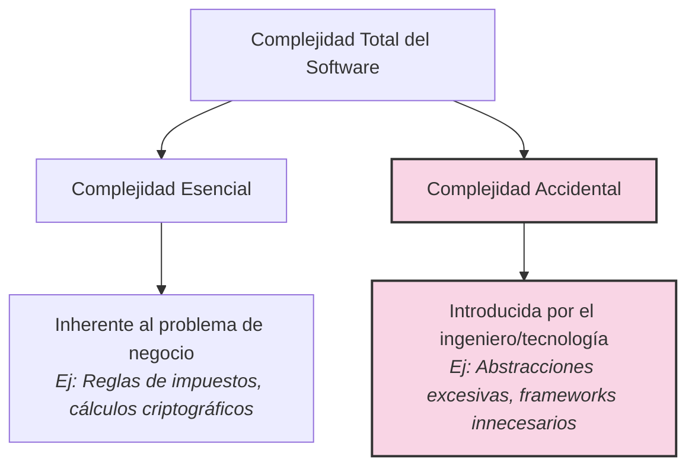

#architecture #design-principles #kiss #simplicity #clean-code #yagni #interview-prep #go #kotlin

# Principio de Diseño: KISS (Keep It Simple, Stupid)

El principio **KISS (Keep It Simple, Stupid)** fue acuñado originalmente por **Kelly Johnson**, ingeniero jefe del legendario laboratorio *Lockheed Skunk Works* (creadores del avión espía SR-71 Blackbird). Su directriz de diseño dictaba que el avión debía ser reparable en combate por mecánicos ordinarios con herramientas estándar y bajo condiciones extremas.

En la ingeniería de software, KISS establece que **los sistemas funcionan mejor si se mantienen simples en lugar de complicados**. La simplicidad debe ser un objetivo primordial de diseño y la complejidad innecesaria debe evitarse a toda costa.

---

## Índice

- [[Diseño y Arquitectura/Diseño y Arquitectura.md|<- Volver a Diseño y Arquitectura]]
- [[Diseño y Arquitectura/Principios de Diseño/Principios de Diseño.md|<- Hub de Principios de Diseño]]
- [[Diseño y Arquitectura/Principios de Diseño/Principio de Diseño - SOLID.md|Ver SOLID]]
- [[Diseño y Arquitectura/Principios de Diseño/Principio de Diseño - DRY.md|Ver DRY]]
- [[Diseño y Arquitectura/Principios de Diseño/Principio de Diseño - YAGNI.md|Ver YAGNI]]

---

## Complejidad Esencial vs. Complejidad Accidental

Para aplicar KISS con rigor, es crucial entender la distinción formal formulada por **Fred Brooks** en su clásico ensayo *No Silver Bullet* (1986):



1. **Complejidad Esencial**: Aquella que no se puede eliminar porque forma parte directa del problema que el software debe resolver (ejemplo: un motor de cálculo actuarial de seguros).
2. **Complejidad Accidental**: Aquella introducida innecesariamente por nuestras decisiones de arquitectura, capas redundantes, patrones forzados o librerías desproporcionadas.

> **KISS combate la Complejidad Accidental**. El mejor ingeniero no es el que utiliza el algoritmo más críptico o el diseño más enrevesado, sino el que hace que un problema difícil parezca trivial y evidente para quien lea el código 6 meses después.

---

## "Simple" vs. "Fácil" (La Filosofía de Rich Hickey)

En su célebre conferencia *Simple Made Easy*, **Rich Hickey** (creador de Clojure) clarificó una confusión habitual en la industria:

| Concepto | Origen Etimológico | Significado Real |
| :--- | :--- | :--- |
| **Simple** | *Simplex* (un solo pliegue / un solo hilo) | Lo que **no está entrelazado ni enredado**. Módulos independientes que hacen una cosa concreta sin acoplarse con otras. Tiene que ver con la **naturaleza intrínseca del diseño**. |
| **Fácil (Easy)** | *Facilis* (a la mano / accesible) | Lo que resulta **familiar y cercano a nuestras habilidades actuales**. Copiar una librería externa pesada de 50 MB para formatear una fecha es "fácil" en el minuto 1, pero distorsiona y hace "complejo" el sistema en el largo plazo. |

---

## Síntomas Clásicos de Violación de KISS

1. **Sobreingeniería (*Overengineering*)**: Construir un sistema distribuido de microservicios con Kafka, Kubernetes y Event Sourcing para una aplicación interna con 15 usuarios concurrentes.
2. **Patternitis**: Forzar patrones del catálogo GoF (*"Aquí meteré un Abstract Factory combinado con Decorator y Visitor"*) cuando una simple función pura de 10 líneas resolvía el problema.
3. **Optimización Prematura**:
   > *"Premature optimization is the root of all evil (or at least most of it) in programming."* — Donald Knuth.
   Escribir código críptico a bajo nivel o algoritmos sin locks antes de que las métricas de rendimiento (*profiling*) demuestren un cuello de botella real.
4. **Jerarquías de herencia profundas**: Clases con 6 niveles de herencia donde rastrear un método requiere saltar entre 5 archivos base abstractos.

---

## Ejemplo Práctico: Go como Lenguaje Centrado en KISS

El lenguaje **Go** fue concebido explícitamente sobre el principio KISS: eliminó deliberadamente la herencia de clases, las macros, la sobrecarga de operadores y las excepciones mágicas en favor de un diseño limpio, directo y explícito.

### Enfoque Complejo vs. Enfoque KISS en Go

```go
package main

import (
    "fmt"
    "strings"
)

// --- ENFOQUE SOBREINGENIERIL (Violando KISS) ---
// Crear interfaces, constructores y adaptadores para una búsqueda de texto elemental
type EvaluadorFiltro interface {
    Evaluar(criterio string, valor string) bool
}

type EvaluadorContiene struct{}
func (e *EvaluadorContiene) Evaluar(criterio, valor string) bool {
    return strings.Contains(strings.ToLower(valor), strings.ToLower(criterio))
}

type MotorBusquedaComplejo struct {
    evaluador EvaluadorFiltro
}

// --- ENFOQUE KISS IDIOMÁTICO EN GO ---
// Una función pura, comprensible y directa que cualquiera puede probar en segundos:
func FiltrarNombres(nombres []string, filtro string) []string {
    filtroLower := strings.ToLower(filtro)
    var resultado []string
    for _, n := range nombres {
        if strings.Contains(strings.ToLower(n), filtroLower) {
            resultado = append(resultado, n)
        }
    }
    return resultado
}

func main() {
    nombres := []string{"Joshua", "Johandry", "Pedro", "Maria"}
    // KISS: Directo, sin indirecciones artificiales
    coincidencias := FiltrarNombres(nombres, "jo")
    fmt.Printf("Coincidencias: %v\n", coincidencias)
}
```

---

## Ejemplo Práctico en Kotlin: Expresividad y Simplicidad

En Kotlin, aplicar KISS significa aprovechar las funciones idiomáticas de la biblioteca estándar en lugar de reinventar estructuras complejas:

```kotlin
data class Producto(val nombre: String, val precio: Double, val enStock: Boolean)

// ENFOQUE NO-KISS: Bucles imperativos anidados, banderas mutables y acumuladores manuales
fun obtenerTotalEnStockComplejo(productos: List<Producto>): Double {
    var total = 0.0
    for (i in 0 until productos.size) {
        val p = productos[i]
        if (p.enStock) {
            total += p.precio
        }
    }
    return total
}

// ENFOQUE KISS EN KOTLIN: Declarativo, legible de izquierda a derecha, sin estado mutable
fun obtenerTotalEnStockKISS(productos: List<Producto>): Double =
    productos.filter { it.enStock }.sumOf { it.precio }
```

---

## Preguntas Frecuentes en Entrevistas Técnicas

### 1. ¿KISS significa que el código debe ser simplón o descuidado?
**No**. La simplicidad no es mediocridad ni ignorancia técnica. Escribir código simple requiere un conocimiento profundo del dominio para destilar lo esencial sin trampas ni trucos innecesarios. Como decía Antoine de Saint-Exupéry: *"La perfección no se alcanza cuando no hay nada más que añadir, sino cuando no hay nada más que quitar"*.

### 2. ¿Cómo equilibrar KISS con la escalabilidad y extensibilidad futura?
Diseñar simple no significa acoplar el código. Si usas interfaces claras en las fronteras de tu sistema y separas responsabilidades (SRP), el código se mantendrá simple hoy y será fácil de extender mañana **sin tener que construir las características futuras por adelantado**. La extensibilidad se logra manteniendo el código fácil de cambiar, no llenándolo de capas especulativas.

### 3. ¿Cómo reaccionar en una sesión de diseño de arquitectura si un colega propone sobreingeniería?
Aplica el principio de preguntas socráticas:
- *"¿Qué problema concreto de nuestro SLA o volumen actual resuelve esta tecnología hoy?"*
- *"¿Cuál es el costo operativo, de observabilidad y de despliegue de añadir estas 3 capas?"*
- *"¿Podemos comenzar con la solución más simple que cumpla las métricas y refactorizar cuando los datos empíricos lo justifiquen?"*

---

## Referencias y Enlaces

- [[Diseño y Arquitectura/Diseño y Arquitectura.md|Índice de Diseño y Arquitectura]]
- [[Diseño y Arquitectura/Principios de Diseño/Principios de Diseño.md|Hub de Principios de Diseño]]
- [[Diseño y Arquitectura/Principios de Diseño/Principio de Diseño - SOLID.md|Principio SOLID]]
- [[Diseño y Arquitectura/Principios de Diseño/Principio de Diseño - DRY.md|Principio DRY]]
- [[Diseño y Arquitectura/Principios de Diseño/Principio de Diseño - YAGNI.md|Principio YAGNI]]
- Brooks, Frederick P. *The Mythical Man-Month: Essays on Software Engineering.* Addison-Wesley, 1975.
- Hickey, Rich. *Simple Made Easy.* Strange Loop Conference, 2011.
