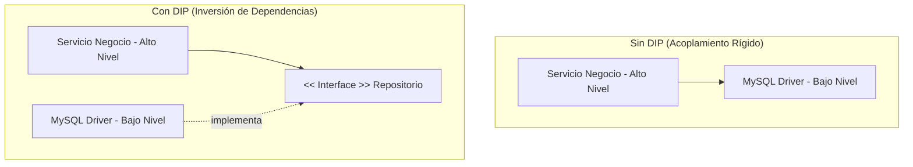

#architecture #design-principles #solid #srp #ocp #lsp #isp #dip #clean-code #interview-prep #go #kotlin

# Principios de Diseño: SOLID

Los principios **SOLID** son un conjunto de cinco principios fundamentales de diseño de software orientado a objetos y modular, recopilados y formalizados por **Robert C. Martin ("Uncle Bob")** a principios de los años 2000 (el acrónimo fue introducido por Michael Feathers).

Su objetivo primordial es crear código **mantenible, flexible, comprensible y fácil de extender**, evitando los tres grandes síntomas del software degradado:
1. **Rigidez**: Cada cambio provoca una cascada de cambios en partes no relacionadas.
2. **Fragilidad**: El software se rompe en lugares inesperados al introducir una modificación.
3. **Inmovilidad**: Imposibilidad de reutilizar módulos en otros proyectos debido al excesivo acoplamiento.

---

## Índice

- [[Diseño y Arquitectura/Diseño y Arquitectura.md|<- Volver a Diseño y Arquitectura]]
- [[Diseño y Arquitectura/Principios de Diseño/Principios de Diseño.md|<- Hub de Principios de Diseño]]
- [[Diseño y Arquitectura/Principios de Diseño/Principio de Diseño - DRY.md|Ver DRY]]
- [[Diseño y Arquitectura/Principios de Diseño/Principio de Diseño - KISS.md|Ver KISS]]
- [[Diseño y Arquitectura/Principios de Diseño/Principio de Diseño - YAGNI.md|Ver YAGNI]]

---

## Resumen del Acrónimo

| Letra | Principio | Enunciado Central |
| :---: | :--- | :--- |
| **S** | **Single Responsibility Principle (SRP)** | Una clase o módulo debe tener una, y solo una, razón para cambiar. |
| **O** | **Open/Closed Principle (OCP)** | Las entidades de software deben estar abiertas a extensión, pero cerradas a modificación. |
| **L** | **Liskov Substitution Principle (LSP)** | Los subtipos deben ser sustituibles por sus tipos base sin alterar la corrección del programa. |
| **I** | **Interface Segregation Principle (ISP)** | Los clientes no deben ser forzados a depender de interfaces o métodos que no utilizan. |
| **D** | **Dependency Inversion Principle (DIP)** | Los módulos de alto nivel no deben depender de módulos de bajo nivel; ambos deben depender de abstracciones. |

---

## 1. S - Single Responsibility Principle (SRP)

> *"A class should have one, and only one, reason to change."* — Robert C. Martin

Una **razón para cambiar** equivale a un **actor o rol de negocio** (*stakeholder*) que solicita el cambio. Si una clase responde a las demandas tanto del Departamento de Finanzas (cálculo de nómina) como del Departamento de IT (guardar en base de datos) y del de Recursos Humanos (reportes de horas), cualquier modificación de un actor pone en riesgo a los demás.

### Antipatrón (Violación de SRP)
```go
// ANTIPATRÓN: Maneja datos, formato y envío de correo a la vez
type UsuarioManager struct{}

func (u *UsuarioManager) GuardarEnBD(usuario Usuario) { /* ... */ }
func (u *UsuarioManager) GenerarReportePDF(usuario Usuario) []byte { /* ... */ }
func (u *UsuarioManager) EnviarCorreoBienvenida(email string) { /* ... */ }
```

### Solución Refactorizada (Aplicando SRP)
```go
// Responsabilidad 1: Persistencia
type RepositorioUsuario interface {
    Guardar(u Usuario) error
}

// Responsabilidad 2: Notificaciones
type ServicioEmail interface {
    EnviarBienvenida(destinatario string) error
}

// Responsabilidad 3: Generación de Reportes
type GeneradorReporteUsuario struct{}
func (g *GeneradorReporteUsuario) AFormatoPDF(u Usuario) []byte { /* ... */ }
```

En Kotlin:
```kotlin
// Responsabilidad única mediante separación por componentes
class UserRepository {
    fun save(user: User) { /* interacción con BD */ }
}

class UserEmailNotificationService {
    fun sendWelcomeEmail(email: String) { /* envío SMTP/Sendgrid */ }
}

class UserReportGenerator {
    fun generatePdf(user: User): ByteArray = /* renderizado PDF */
}
```

---

## 2. O - Open/Closed Principle (OCP)

> *"Software entities (classes, modules, functions, etc.) should be open for extension, but closed for modification."* — Bertrand Meyer (1988)

El sistema debe permitir añadir nuevas funcionalidades **escribiendo código nuevo, no modificando código existente que ya funciona y está probado**. Se logra principalmente mediante **polimorfismo, interfaces y patrones como Strategy o Factory Method**.

### Antipatrón (Violación de OCP)
Cada vez que agregamos un nuevo medio de pago o descuento, tenemos que abrir y modificar la función existente:
```kotlin
// ANTIPATRÓN: Cada nuevo método de pago obliga a alterar esta función
fun procesarPago(tipo: String, monto: Double) {
    when (tipo) {
        "TARJETA" -> println("Cobrando con Tarjeta: $monto")
        "PAYPAL" -> println("Cobrando con PayPal: $monto")
        "CRYPTO" -> println("Cobrando con Bitcoin: $monto") // ¡Modificación arriesgada!
    }
}
```

### Solución Refactorizada (Aplicando OCP)
```kotlin
// Abierto a extensión: creamos una abstracción
interface ProcesadorPago {
    fun procesar(monto: Double)
}

// Implementaciones concretas
class TarjetaPago : ProcesadorPago {
    override fun procesar(monto: Double) = println("Cobrando con Tarjeta: $monto")
}

class PayPalPago : ProcesadorPago {
    override fun procesar(monto: Double) = println("Cobrando con PayPal: $monto")
}

// Nuevo método: Se añade creando una clase nueva, sin tocar las existentes
class CriptoPago : ProcesadorPago {
    override fun procesar(monto: Double) = println("Cobrando con Bitcoin: $monto")
}

// El servicio consumidor está CERRADO a modificación:
class ServicioCheckout(private val procesador: ProcesadorPago) {
    fun finalizarCompra(total: Double) {
        procesador.procesar(total)
    }
}
```

---

## 3. L - Liskov Substitution Principle (LSP)

> *"If for each object $o_1$ of type $S$ there is an object $o_2$ of type $T$ such that for all programs $P$ defined in terms of $T$, the behavior of $P$ is unchanged when $o_1$ is substituted for $o_2$, then $S$ is a subtype of $T$."* — Barbara Liskov (1987)

Si una función espera un tipo `T`, debe poder recibir cualquier subclase `S` de `T` **sin romperse, sin lanzar excepciones inesperadas y sin alterar las precondiciones o postcondiciones**.

### El Ejemplo Clásico de Violación: Rectángulo y Cuadrado
En matemáticas, un Cuadrado *es un* Rectángulo. Pero en POO, modelar `Cuadrado` como subclase de `Rectangulo` rompe LSP:

```kotlin
open class Rectangulo(open var ancho: Int, open var alto: Int) {
    fun calcularArea(): Int = ancho * alto
}

class Cuadrado : Rectangulo(0, 0) {
    override var ancho: Int
        get() = super.ancho
        set(value) { super.ancho = value; super.alto = value } // Efecto colateral inesperado

    override var alto: Int
        get() = super.alto
        set(value) { super.ancho = value; super.alto = value }
}

fun verificarComportamiento(r: Rectangulo) {
    r.ancho = 5
    r.alto = 10
    // El cliente asume que el área de un Rectángulo con ancho=5 y alto=10 es 50
    check(r.calcularArea() == 50) { "¡Violación de LSP! Con Cuadrado da 100" }
}
```

### Reglas de Oro de LSP
1. **No lances `UnsupportedOperationException`** en métodos heredados (e.g., clase `Pinguino` que hereda de `Ave` con método `volar()`). Si no puede volar, no debería heredar ese método.
2. **Las precondiciones no pueden reforzarse** en una subclase (no exigir más de lo que exige el padre).
3. **Las postcondiciones no pueden debilitarse** (debe garantizar al menos lo mismo que el padre).
4. **Principio de Mínima Sorpresa**: El cliente no debe tener que comprobar `if (objeto is Subclase)` para invocar un método sin que falle.

---

## 4. I - Interface Segregation Principle (ISP)

> *"Clients should not be forced to depend upon interfaces that they do not use."* — Robert C. Martin

Es preferible tener **muchas interfaces pequeñas y específicas** que una sola interfaz monolítica y sobrecargada (*Fat Interface*).

### La Filosofía de Go respecto a ISP
El lenguaje Go encarna este principio en su biblioteca estándar (`io.Reader`, `io.Writer`, `io.Closer`):
> *"The bigger the interface, the weaker the abstraction."* — Rob Pike

```go
// ANTIPATRÓN: Interfaz gigantesca que fuerza a implementar cosas innecesarias
type DispositivoMultifuncion interface {
    Imprimir(doc string)
    Escanear() string
    EnviarFax(doc string)
}

// Si tienes una impresora económica básica, ¿qué haces con EnviarFax()?
type ImpresoraSencilla struct{}
func (i *ImpresoraSencilla) Imprimir(doc string) { println(doc) }
func (i *ImpresoraSencilla) Escanear() string    { panic("No soportado") } // Violación ISP + LSP
func (i *ImpresoraSencilla) EnviarFax(doc string){ panic("No soportado") } // Violación ISP + LSP
```

### Solución Segregada en Go
```go
// Interfaces atómicas y componibles
type Impresora interface {
    Imprimir(doc string)
}

type Escaner interface {
    Escanear() string
}

// Dispositivo simple solo implementa lo que usa:
type ImpresoraEconomica struct{}
func (i *ImpresoraEconomica) Imprimir(doc string) { println(doc) }

// Dispositivo avanzado compone las interfaces:
type SuperMaquina interface {
    Impresora
    Escaner
}
```

---

## 5. D - Dependency Inversion Principle (DIP)

> 1. *"High-level modules should not depend on low-level modules. Both should depend on abstractions."*
> 2. *"Abstractions should not depend on details. Details should depend on abstractions."* — Robert C. Martin

DIP invierte la dirección tradicional de las dependencias: la lógica de negocio nuclear (*alto nivel*) **nunca debe depender** de drivers de base de datos, APIs de terceros o librerías gráficas (*bajo nivel*). Ambos deben acordar contratos (**interfaces**).



### Distinción Crítica: DIP vs. IoC vs. DI
- **DIP (Dependency Inversion Principle)**: El **principio** de diseño (depender de abstracciones, no de detalles).
- **IoC (Inversion of Control)**: El **patrón arquitectónico** donde el control del flujo del programa es delegado a un contenedor o framework (e.g., Spring, Koin, Gin).
- **DI (Dependency Injection)**: La **técnica de implementación** mediante la cual pasamos las dependencias a un objeto (por constructor, parámetro o setter) en lugar de permitir que el objeto las instancie internamente con `new`.

### Ejemplo en Go
```go
// 1. Abstracción acordada por el dominio
type Notificador interface {
    Notificar(mensaje string) error
}

// 2. Módulo de alto nivel: NO le importa si es SMS, Email o Slack
type ServicioUsuario struct {
    notificador Notificador // Inyección de dependencia
}

func NuevoServicioUsuario(n Notificador) *ServicioUsuario {
    return &ServicioUsuario{notificador: n}
}

func (s *ServicioUsuario) Registrar(nombre string) {
    // Lógica de negocio...
    s.notificador.Notificar("Bienvenido " + nombre)
}
```

---

## Preguntas Clásicas en Entrevistas Técnicas

### 1. ¿Cuál es la diferencia entre SRP ("Single Responsibility") y "Hacer una sola cosa"?
- El principio de que una función haga una sola cosa (*Do one thing*) aplica a nivel de sentencias y algoritmos limpios.
- **SRP aplica a nivel de clases y módulos**, y se refiere a que la clase solo debe responder a **un único actor o grupo de interés**. Una clase `User` puede tener 10 métodos, pero todos ellos deben pertenecer a la misma responsabilidad y cambiar por la misma razón.

### 2. ¿Cómo se complementan OCP y el patrón Strategy?
El patrón **Strategy** es el vehículo por excelencia para cumplir OCP: define una interfaz con el algoritmo común (abierto a extensión) y permite enchufar nuevas estrategias en tiempo de ejecución sin alterar el código del contexto (cerrado a modificación).

### 3. ¿Qué síntoma en el código delata una violación de LSP?
- Ver bloques de `if (objeto instanceof Perro) ... else if (objeto instanceof Gato)`.
- Encontrar métodos que lanzan `NotImplementedException` o métodos vacíos `{ /* no-op */ }`.
- Si necesitas verificar el tipo concreto de una subclase antes de invocar un método polimórfico, estás violando LSP.

---

## Referencias y Enlaces

- [[Diseño y Arquitectura/Diseño y Arquitectura.md|Índice de Diseño y Arquitectura]]
- [[Diseño y Arquitectura/Principios de Diseño/Principios de Diseño.md|Hub de Principios de Diseño]]
- [[Diseño y Arquitectura/Principios de Diseño/Principio de Diseño - DRY.md|Principio DRY]]
- [[Diseño y Arquitectura/Principios de Diseño/Principio de Diseño - KISS.md|Principio KISS]]
- [[Diseño y Arquitectura/Principios de Diseño/Principio de Diseño - YAGNI.md|Principio YAGNI]]
- Martin, Robert C. *Clean Architecture: A Craftsman's Guide to Software Structure and Design.* Prentice Hall, 2017.
