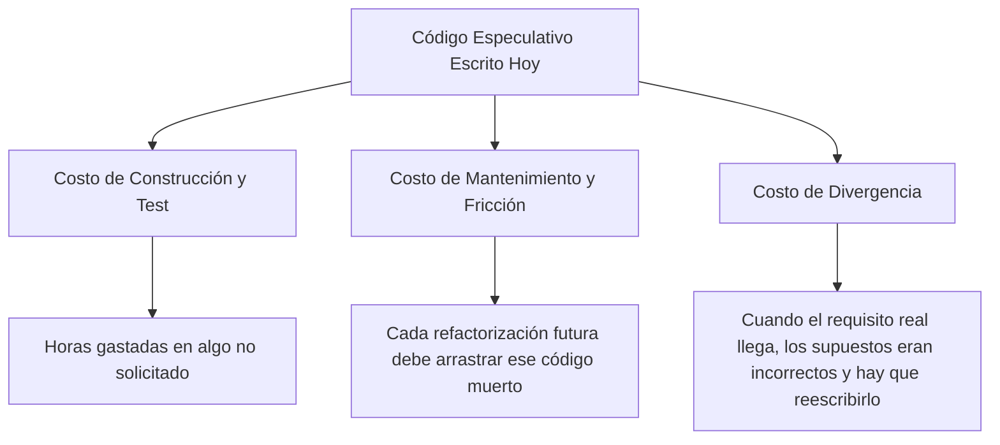

#architecture #design-principles #yagni #kiss #xp #agile #lean #interview-prep #go #kotlin

# Principio de Diseño: YAGNI (You Aren't Gonna Need It)

El principio **YAGNI (You Aren't Gonna Need It - *No vas a necesitarlo*)** es una de las directrices medulares de la metodología de desarrollo ágil **Extreme Programming (XP)**, formulada originalmente por **Kent Beck** y popularizada por **Martin Fowler** y **Ron Jeffries**.

Establece una regla estricta contra la generalización especulativa:
> *"Always implement things when you actually need them, never when you just foresee that you may need them."*  
> *(Implementa las cosas siempre cuando realmente las necesites, nunca cuando solo preveas que podrías llegar a necesitarlas).*

---

## Índice

- [[Diseño y Arquitectura/Diseño y Arquitectura.md|<- Volver a Diseño y Arquitectura]]
- [[Diseño y Arquitectura/Principios de Diseño/Principios de Diseño.md|<- Hub de Principios de Diseño]]
- [[Diseño y Arquitectura/Principios de Diseño/Principio de Diseño - SOLID.md|Ver SOLID]]
- [[Diseño y Arquitectura/Principios de Diseño/Principio de Diseño - DRY.md|Ver DRY]]
- [[Diseño y Arquitectura/Principios de Diseño/Principio de Diseño - KISS.md|Ver KISS]]

---

## El Costo Oculto del Código Especulativo

Muchos desarrolladores piensan: *"Escribir este método extra o esta capa genérica ahora solo me toma 30 minutos; así ya estará lista para el futuro"*. Martin Fowler demostró que este razonamiento ignora dos factores económicos devastadores:



1. **Costo de arrastre**: Cualquier código añadido debe ser leído, comprendido, testeado y migrado en cada actualización de frameworks o refactorizaciones, incluso si nadie lo está usando en producción.
2. **Costo de divergencia (La trampa de la adivinación)**: La probabilidad de que aciertes con precisión exacta los requisitos de una característica 6 meses antes de que el negocio la pida es cercana a cero. Cuando el requisito real finalmente llega, tu diseño especulativo casi siempre será incompatible y requerirá esfuerzo extra para ser desmontado o adaptado.

---

## ¿YAGNI vs. Buena Arquitectura?

Un malentendido común es pensar que YAGNI justifica escribir código descuidado, rígido o lleno de valores cableados (*hardcoded*).

| Lo que YAGNI **NO** es | Lo que YAGNI **SÍ** es |
| :--- | :--- |
| Dejar de escribir tests o ignorar Clean Architecture. | Diseñar código limpio, modular y desacoplado que sea **fácil de cambiar mañana** cuando la necesidad aparezca. |
| Hardcodear URLs o credenciales porque "hoy no las cambiaré". | No construir un plugin engine distribuido con soporte para 10 bases de datos cuando el cliente solo usa PostgreSQL. |
| Negligencia arquitectónica o falta de visión técnica. | **Diferir decisiones** hasta el último momento responsable (*Last Responsible Moment*). |

---

## Ejemplo Práctico en Go: Especulativo vs. YAGNI

### Violación de YAGNI (Generalización Prematura)
El desarrollador crea un sistema de persistencia multi-base de datos con soporte para SQL, MongoDB y Cassandra porque *"quizás el próximo año migremos a NoSQL"*:

```go
// VIOLACIÓN DE YAGNI: 100 líneas de abstracciones para algo que nadie pidió
type MotorBD string
const (
    MotorPostgres  MotorBD = "POSTGRES"
    MotorCassandra MotorBD = "CASSANDRA"
    MotorDynamoDB  MotorBD = "DYNAMO"
)

type MultiStoreUniversalEngine interface {
    EjecutarQueryNoSQL(tabla string, particion string) ([]byte, error)
    EjecutarQueryRelacional(sql string) ([]byte, error)
    SincronizarClusterGlobal() error // ¿En serio?
}
```

### Aplicando YAGNI con Diseño Limpio
Diseña una interfaz limpia y simple para la necesidad real de hoy:

```go
// APLICANDO YAGNI: Resuelve el problema actual con precisión quirúrgica
type RepositorioUsuario interface {
    BuscarPorID(ctx context.Context, id string) (*Usuario, error)
    Guardar(ctx context.Context, u *Usuario) error
}

// Si en 2 años migran a Cassandra, simplemente se escribe una nueva implementación
// de la interfaz 'RepositorioUsuario' sin haber arrastrado complejidad durante 24 meses.
```

---

## Ejemplo Práctico en Kotlin

```kotlin
// VIOLACIÓN DE YAGNI: Crear un sistema de exportación en 5 formatos cuando solo se pidió JSON
class ReportService {
    fun exportToJson(data: ReportData): String = /* código real */ ""
    
    // YAGNI: Métodos no solicitados que nadie utiliza pero añaden deuda técnica
    fun exportToXml(data: ReportData): String = TODO("No requerido aún")
    fun exportToCsv(data: ReportData): String = TODO("No requerido aún")
    fun exportToYaml(data: ReportData): String = TODO("No requerido aún")
}

// APLICANDO YAGNI:
class ReportServiceYAGNI {
    // Solo lo que aporta valor hoy
    fun exportToJson(data: ReportData): String {
        return "{ \"reportId\": \"${data.id}\" }"
    }
}
```

---

## Preguntas Frecuentes en Entrevistas Técnicas

### 1. ¿Cuál es la diferencia entre YAGNI y KISS?
- **KISS (Keep It Simple, Stupid)**: Se enfoca en la **simplicidad de la solución** que estás construyendo en el presente (evitar complicaciones innecesarias en lo que *sí* debes hacer).
- **YAGNI (You Aren't Gonna Need It)**: Se enfoca en el **alcance y los requisitos** (evitar construir cosas que directamente *no* debes hacer hoy).

### 2. ¿Cómo se equilibra YAGNI con el Principio de Abierto/Cerrado (OCP)?
- OCP te pide que el sistema permita extensiones sin modificar código existente.
- YAGNI te impide construir la extensión **antes** de que sea necesaria.
- **El balance perfecto**: Diseña puntos de extensión simples (interfaces, inversión de dependencias) para que agregar la extensión a futuro sea indoloro, pero **no implementes las extensiones especulativas** hasta que el caso de uso real toque a tu puerta.

### 3. ¿Cuándo puede ser riesgoso aplicar YAGNI de manera extrema?
En decisiones de **infraestructura estructural irreversible** (aquellas de "puerta de una sola vía" o *One-Way Doors* según Jeff Bezos):
- Ejemplos: soporte para internacionalización (i18n), zonas horarias UTC, encoding UTF-8, o modelos de seguridad / tenants.
- Modificar estas bases estructurales a posteriori suele ser órdenes de magnitud más caro que contemplarlas desde el día uno. YAGNI aplica fuertemente a **funcionalidades y lógica de negocio**, pero debe equilibrarse con un buen criterio de arquitectura fundacional.

---

## Referencias y Enlaces

- [[Diseño y Arquitectura/Diseño y Arquitectura.md|Índice de Diseño y Arquitectura]]
- [[Diseño y Arquitectura/Principios de Diseño/Principios de Diseño.md|Hub de Principios de Diseño]]
- [[Diseño y Arquitectura/Principios de Diseño/Principio de Diseño - SOLID.md|Principio SOLID]]
- [[Diseño y Arquitectura/Principios de Diseño/Principio de Diseño - DRY.md|Principio DRY]]
- [[Diseño y Arquitectura/Principios de Diseño/Principio de Diseño - KISS.md|Principio KISS]]
- Beck, Kent. *Extreme Programming Explained: Embrace Change.* Addison-Wesley, 2000.
- Fowler, Martin. *"Yagni"* (martinfowler.com/bliki/Yagni.html).
