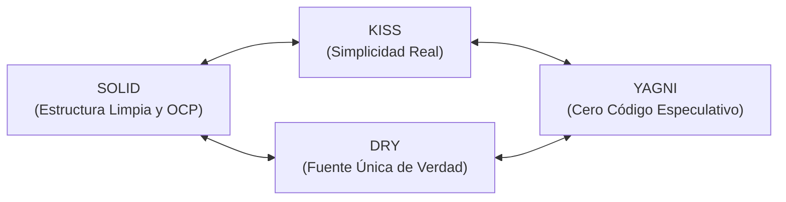

#architecture #design-principles #solid #dry #kiss #yagni #clean-code

# Principios de Diseño de Software

Los **principios de diseño** son directrices, heurísticas y normas fundamentales que guían a los ingenieros de software hacia la construcción de sistemas modulares, comprensibles, testeables y fáciles de mantener en el tiempo.

A diferencia de los **patrones de diseño** (que son planos y recetas estructurales concretas para resolver problemas específicos en código), los **principios** son leyes filosóficas universales que rigen la toma de decisiones técnicas diarias.

---

## Catálogo de Principios de Diseño

| Principio | Autoría / Origen | Idea Central | Documento Detallado |
| :--- | :--- | :--- | :--- |
| **SOLID** | Robert C. Martin ("Uncle Bob") | 5 principios esenciales para el diseño orientado a objetos y desacoplamiento modular (SRP, OCP, LSP, ISP, DIP). | [[Diseño y Arquitectura/Principios de Diseño/Principio de Diseño - SOLID.md\|Ver Principios SOLID]] |
| **DRY** | Andy Hunt & Dave Thomas | *Don't Repeat Yourself*: Cada pieza de conocimiento debe tener una representación única y autoritativa en el sistema. | [[Diseño y Arquitectura/Principios de Diseño/Principio de Diseño - DRY.md\|Ver Principio DRY]] |
| **KISS** | Kelly Johnson | *Keep It Simple, Stupid*: Minimizar la complejidad accidental; la simplicidad debe ser una prioridad explícita de diseño. | [[Diseño y Arquitectura/Principios de Diseño/Principio de Diseño - KISS.md\|Ver Principio KISS]] |
| **YAGNI** | Extreme Programming (Kent Beck) | *You Aren't Gonna Need It*: No construir funcionalidades de forma especulativa para un futuro hipotético. | [[Diseño y Arquitectura/Principios de Diseño/Principio de Diseño - YAGNI.md\|Ver Principio YAGNI]] |
| **CoC** | David Heinemeier Hansson (Rails) | *Convention over Configuration*: Minimizar la configuración manual adoptando convenciones estándar predecibles. | Conceptual |
| **Law of Demeter** | Ian Holland (1987) | *Principio de Mínimo Conocimiento*: Un objeto solo debe hablar con sus colaboradores inmediatos, no con extraños. | Conceptual |

---

## Relación y Sinergia entre los Principios

Los principios no operan de forma aislada; forman un ecosistema de pesos y contrapesos:

- **KISS y YAGNI** actúan como escudos contra la sobreingeniería: evitan que abuses de **SOLID** creando 10 capas de abstracción para un caso de uso trivial.
- **DRY** unifica el conocimiento de negocio, pero debe ser templado por **KISS** (evitando la trampa de *AHA: Avoid Hasty Abstractions*).
- **SOLID** proporciona las herramientas (polimorfismo, interfaces e inyección de dependencias) para que cuando **YAGNI** determine que ha llegado el momento de extender el sistema, la extensión sea sencilla y sin fricción.

---

## Navegación

- [[Diseño y Arquitectura/Diseño y Arquitectura.md|<- Volver al Índice Principal de Diseño y Arquitectura]]
- [[Diseño y Arquitectura/Principios de Diseño/Principio de Diseño - SOLID.md|1. SOLID (SRP, OCP, LSP, ISP, DIP)]]
- [[Diseño y Arquitectura/Principios de Diseño/Principio de Diseño - DRY.md|2. DRY (Don't Repeat Yourself)]]
- [[Diseño y Arquitectura/Principios de Diseño/Principio de Diseño - KISS.md|3. KISS (Keep It Simple, Stupid)]]
- [[Diseño y Arquitectura/Principios de Diseño/Principio de Diseño - YAGNI.md|4. YAGNI (You Aren't Gonna Need It)]]
