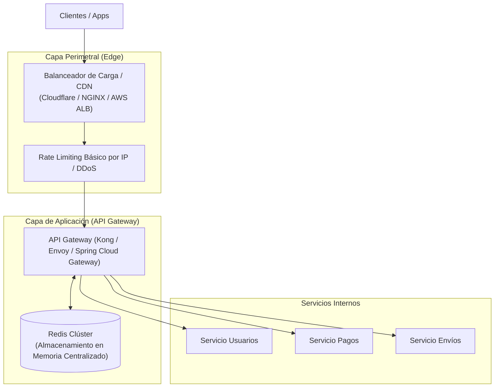

#architecture #system-design #distributed-systems #api #rate-limit #security

# Rate Limiting (Limitación de Tasa)

El **Rate Limiting** (limitación de tasa) es un patrón de diseño y mecanismo de control de tráfico que restringe el número de peticiones que un cliente, usuario o servicio puede realizar sobre un recurso o API dentro de un período de tiempo determinado (por ejemplo, 100 peticiones por minuto).

Si un cliente excede el límite permitido, las peticiones subsiguientes son bloqueadas o degradadas temporalmente, devolviendo habitualmente el código de estado HTTP **`429 Too Many Requests`**.

---

## Índice

- [[Diseño y Arquitectura/Diseño y Arquitectura.md|<- Volver a Diseño y Arquitectura]]
- [[Diseño y Arquitectura/Sistemas Distribuidos/Teorema CAP.md|Ver Teorema CAP]]
- [[Diseño y Arquitectura/Sistemas Distribuidos/Teorema PACELC.md|Ver Teorema PACELC]]
- [[Diseño y Arquitectura/APIs y Comunicación/Diseño de APIs.md|Ver Diseño de APIs]]

---

## ¿Por qué es Fundamental el Rate Limiting?

```mermaid
flowchart LR
    Traffic["Tráfico Entrante\n(Clientes, Bots, Ataques)"] --> Gate["🛡️ Rate Limiter\n(API Gateway / Proxy)"]
    Gate -->|Permitido (<= Cuota)| Backend["Servicios Backend\n& Bases de Datos"]
    Gate -->|Rechazado (> Cuota)| Block["❌ HTTP 429\nToo Many Requests"]
```

1. **Prevención de Ataques de Denegación de Servicio (DoS / DDoS)**: Evita que peticiones masivas saturen la memoria, conexiones de base de datos o CPU del backend.
2. **Protección contra Fuerza Bruta y Scraping**: Dificulta ataques a endpoints sensibles como `/api/v1/login` o extracción masiva no autorizada de datos.
3. **Problema del Vecino Ruidoso (*Noisy Neighbor*)**: En sistemas multi-tenant (SaaS), evita que un único usuario consuma todos los recursos compartidos, degradando la experiencia de los demás.
4. **Control de Costes Operativos**: Limita llamadas a APIs externas de pago o servicios con consumo intensivo de recursos (p. ej., modelos de lenguaje/LLMs como OpenAI, Gemini o servicios de envío de SMS).
5. **Monetización y Niveles de Servicio (Tiers)**: Permite segmentar planes de negocio (Plan Gratuito: 60 req/min; Plan Pro: 1,000 req/min; Plan Enterprise: Ilimitado).

---

## Estándar HTTP: Códigos y Cabeceras

Cuando se implementa un Rate Limiter en una API REST, se utilizan cabeceras HTTP específicas para comunicar el estado de la cuota al cliente:

### Código de Estado
- **`429 Too Many Requests`** (definido en el [RFC 6585](https://datatracker.ietf.org/doc/html/rfc6585)).

### Cabeceras Tradicionales (De Facto)
```http
HTTP/1.1 429 Too Many Requests
Content-Type: application/json
Retry-After: 30
X-RateLimit-Limit: 100
X-RateLimit-Remaining: 0
X-RateLimit-Reset: 1714567890
```

| Cabecera | Descripción | Ejemplo |
| :--- | :--- | :--- |
| **`Retry-After`** | Número de segundos que el cliente debe esperar antes de volver a intentarlo. | `30` |
| **`X-RateLimit-Limit`** | Número máximo de peticiones permitidas en la ventana de tiempo. | `100` |
| **`X-RateLimit-Remaining`** | Número de peticiones que el cliente aún puede realizar en la ventana actual. | `0` |
| **`X-RateLimit-Reset`** | Marca de tiempo (Unix timestamp en segundos) cuando la cuota se restablece. | `1714567890` |

> [!NOTE] Estándar Moderno IETF (Draft)
> El IETF está estandarizando las cabeceras omitiendo el prefijo `X-`:
> - `RateLimit-Limit: 100, 100;w=60`
> - `RateLimit-Remaining: 0`
> - `RateLimit-Reset: 30`

---

## Algoritmos de Rate Limiting

La elección del algoritmo determina la precisión, el uso de memoria y la tolerancia a ráfagas de tráfico.

```
Algoritmos Principales
├── Token Bucket (Cubo de Fichas)
├── Leaky Bucket (Cubo con Fuga)
├── Fixed Window Counter (Ventana Fija)
├── Sliding Window Log (Registro de Ventana Deslizante)
└── Sliding Window Counter (Ventana Deslizante Ponderada)
```

---

### 1. Token Bucket (Cubo de Fichas)
Es el algoritmo más utilizado en la industria (usado por **AWS API Gateway**, **Stripe** y librerías de Google).

- **Mecanismo**:
  1. Existe un "cubo" con capacidad máxima de $B$ tokens.
  2. Periódicamente se añaden tokens al cubo a una tasa constante de $r$ tokens por segundo.
  3. Si el cubo está lleno, los nuevos tokens se descartan.
  4. Cada petición entrante debe retirar $1$ (o $N$) tokens para ser procesada.
  5. Si no hay suficientes tokens, la petición se rechaza (`429`).

```
           Tokens añadidos a tasa fija 'r'
                       │
                       ▼
              ┌────────────────┐
              │  ●  ●  ●  ●   │  Capacidad máxima = B
              │   Tokens (B)   │
              └────────┬───────┘
                       │
        Petición ───► [¿Hay token?]
                        ├── Sí ──► Consume 1 token y pasa al Backend
                        └── No ──► Rechazada (HTTP 429)
```

- **Ventajas**:
  - Permite **ráfagas de tráfico controladas** (*bursts*): si el cubo está lleno, pueden procesarse hasta $B$ peticiones simultáneas de inmediato.
  - Extremadamente eficiente en memoria (solo requiere almacenar el contador de tokens y el timestamp de la última recarga: 2 números).
- **Desventajas**: Requiere calibrar con precisión la capacidad máxima $B$ y la tasa de reposición $r$.

---

### 2. Leaky Bucket (Cubo con Fuga)
A diferencia de Token Bucket, este algoritmo fuerza un procesamiento a velocidad estrictamente constante (**Traffic Shaping**).

- **Mecanismo**:
  1. Las peticiones entrantes entran a una cola FIFO con un tamaño máximo fijo.
  2. La cola "gotea" (procesa peticiones hacia el backend) a una tasa fija y constante.
  3. Si la cola se llena (*desbordamiento del cubo*), las nuevas peticiones entrantes se descartan de inmediato.

```
       Peticiones entrantes (velocidad variable / ráfagas)
                       │
                       ▼
              ┌────────────────┐
              │  [req]  [req]  │  Cola FIFO (Capacidad fija)
              │     [req]      │
              └────────┬───────┘
                       │
                       ▼ Goteo a tasa constante (1 req cada 100ms)
                    Backend
```

- **Ventajas**: Garantiza que el backend **nunca reciba picos de carga**. El flujo es 100% plano y predecible.
- **Desventajas**: No tolera ráfagas legítimas de usuarios rápidos; si la cola está llena, introduce latencia a las peticiones encoladas o las descarta.

---

### 3. Fixed Window Counter (Contador de Ventana Fija)
Divide el tiempo en bloques fijos discretos (por ejemplo, de 10:00 a 10:01, de 10:01 a 10:02).

- **Mecanismo**:
  1. Cada ventana tiene un contador numérico que inicia en 0.
  2. Cada petición incrementa el contador.
  3. Si el contador supera el límite en esa ventana, se bloquean las peticiones hasta que empiece la siguiente ventana.

> [!WARNING] El Problema del Borde de Ventana (*Boundary Spike*)
> Si el límite es de 100 peticiones por minuto:
> - Un cliente envía 100 peticiones a las `10:00:59` (último segundo de la ventana 1).
> - La ventana se reinicia a las `10:01:00`.
> - El cliente envía otras 100 peticiones a las `10:01:01` (primer segundo de la ventana 2).
> - **Resultado**: El sistema procesó **200 peticiones en 2 segundos**, duplicando el límite teórico permitido.

---

### 4. Sliding Window Log (Registro de Ventana Deslizante)
Resuelve por completo el problema del borde de ventana mediante un registro de tiempos exactos.

- **Mecanismo**:
  1. Guarda una lista de timestamps de cada petición realizada por el cliente (usualmente en un *Sorted Set* en Redis).
  2. Cuando llega una petición en el tiempo $T$:
     - Elimina del registro todos los timestamps menores a $T - \text{tamaño de ventana}$.
     - Cuenta los elementos restantes.
     - Si la cantidad es menor al límite, agrega $T$ al registro y permite la petición.
     - Si es mayor o igual, rechaza la petición.

- **Ventajas**: **Precisión absoluta**. El límite nunca se vulnera en ningún intervalo continuo de 60 segundos.
- **Desventajas**: **Alto consumo de memoria**. Guardar un timestamp por cada petición puede agotar la memoria si hay millones de usuarios activos.

---

### 5. Sliding Window Counter (Contador de Ventana Deslizante Ponderado)
Combina la ligereza de la ventana fija con la suavidad de la ventana deslizante mediante una **aproximación matemática**. Es el algoritmo adoptado por plataformas a escala masiva como **Cloudflare**.

- **Fórmula de Cálculo**:
  $$\text{Peticiones Estimadas} = \text{Conteo Ventana Actual} + \left( \text{Conteo Ventana Anterior} \times (1 - \text{Porcentaje Transcurrido}) \right)$$

```
      Ventana Anterior (10:00 - 10:01)         Ventana Actual (10:01 - 10:02)
   ┌─────────────────────────────────────┬───────────────────┬─────────────────┐
   │          80 peticiones              │   30 peticiones   │     (Futuro)    │
   └─────────────────────────────────────┴───────────────────┴─────────────────┘
                                         ▲
                                      10:01:18 (30% transcurrido de la ventana)
   
   Peticiones estimadas = 30 + (80 * (1 - 0.30)) = 30 + (80 * 0.70) = 30 + 56 = 86 peticiones.
   Si el límite es 100, 86 <= 100 -> Petición ACEPTADA.
```

- **Ventajas**:
  - Elimina los picos artificiales en los bordes.
  - Requiere almacenar solo **dos enteros** por cliente y ventana (huella de memoria insignificante).
  - El margen de error frente al registro exacto es inferior al $0.05\%$ en tráfico real.

---

## Comparativa de Algoritmos

| Algoritmo | Memoria | CPU | Permite Ráfagas (*Bursts*) | Suaviza Tráfico | Precisión |
| :--- | :--- | :--- | :--- | :--- | :--- |
| **Token Bucket** | Mínima ($O(1)$) | Mínimo | **Sí** | Moderada | Alta |
| **Leaky Bucket** | Pequeña ($O(\text{Queue})$) | Mínimo | No (constante) | **Máxima** | Alta |
| **Fixed Window** | Mínima ($O(1)$) | Mínimo | Sí (incontrolada) | Nula | Baja (efecto borde) |
| **Sliding Window Log** | Alta ($O(N)$) | Moderado | Moderada | Alta | **Perfecta** |
| **Sliding Window Counter** | Mínima ($O(1)$) | Mínimo | Moderada | Alta | Muy Alta (~99.9%) |

---

## Arquitectura de Implementación: ¿Dónde colocar el Rate Limiter?



### 1. En Memoria Local (In-Process)
- Implementado con librerías dentro del propio proceso de la aplicación (ej. `golang.org/x/time/rate`, Guava `RateLimiter` en Java, `express-rate-limit`).
- **Pros**: Cero latencia de red adicional (en memoria RAM directa).
- **Contras**: Si la aplicación escala a 10 pods o réplicas tras un balanceador de carga, el cliente puede hacer 10 veces más peticiones si estas se distribuyen entre distintas réplicas.

### 2. Distribuido y Centralizado (Redis)
- Las instancias del API Gateway consultan un almacén rápido en memoria como **Redis**.
- **Manejo de Concurrencia**:
  - Para evitar condiciones de carrera (*race conditions*) donde múltiples llamadas concurrentes leen y escriben a la vez, se ejecutan **Scripts Lua** atómicos en Redis o la estructura de datos nativa `INCR` + `EXPIRE`.

---

## Criterios de Identificación: ¿A quién aplicar el límite?

| Clave de Identificación | Casos de Uso | Consideraciones / Desafíos |
| :--- | :--- | :--- |
| **Dirección IP** | Usuarios no autenticados, páginas de login, prevención DDoS. | Problemas con redes corporativas o Wi-Fi público (múltiples usuarios comparten la misma IP pública por NAT). |
| **API Key / User ID** | Usuarios autenticados, APIs comerciales. | Requiere autenticar o verificar la clave antes de comprobar la tasa. Es el estándar para SaaS. |
| **Por Endpoint (Ruta)** | Operaciones costosas (`POST /export-pdf`, `POST /login`). | Límites estrictos para rutas pesadas y límites relajados para lecturas comunes (`GET /items`). |
| **Híbrido (IP + Endpoint)** | Endpoints críticos públicos (registro, recuperación de contraseña). | Evita ataques de fuerza bruta distribuidos sobre una misma cuenta. |

---

## Buenas Prácticas para Clientes: Cómo Consumir APIs con Rate Limit

Cuando tu sistema consume una API externa que implementa Rate Limiting, debes incorporar estrategias de resiliencia:

1. **Lectura de Cabeceras**: Leer `X-RateLimit-Remaining` y reducir la velocidad antes de recibir un `429`.
2. **Exponential Backoff con Jitter**: Si recibes un `429`, espera antes de reintentar incrementando el tiempo exponencialmente ($1s, 2s, 4s, 8s$) y agregando una variación aleatoria (*jitter*) para evitar que todos los clientes reintenten al mismo milisegundo (*Thundering Herd*).
3. **Respetar `Retry-After`**: Utilizar exactamente el tiempo indicado por el servidor si la cabecera está presente.
4. **Colas de Peticiones Internas**: Utilizar colas locales con un worker que despache a la tasa máxima permitida por el proveedor.

---

## Referencias y Enlaces

- [[Diseño y Arquitectura/Diseño y Arquitectura.md|Índice de Diseño y Arquitectura]]
- [[Diseño y Arquitectura/APIs y Comunicación/Diseño de APIs.md|Diseño de APIs]]
- [[Diseño y Arquitectura/Seguridad/Seguridad en Arquitectura.md|Seguridad en Arquitectura de Software]]
- RFC 6585: *Additional HTTP Status Codes (Section 4: 429 Too Many Requests).*
- Stripe Engineering Blog: *Scaling your API with rate limiters.*
