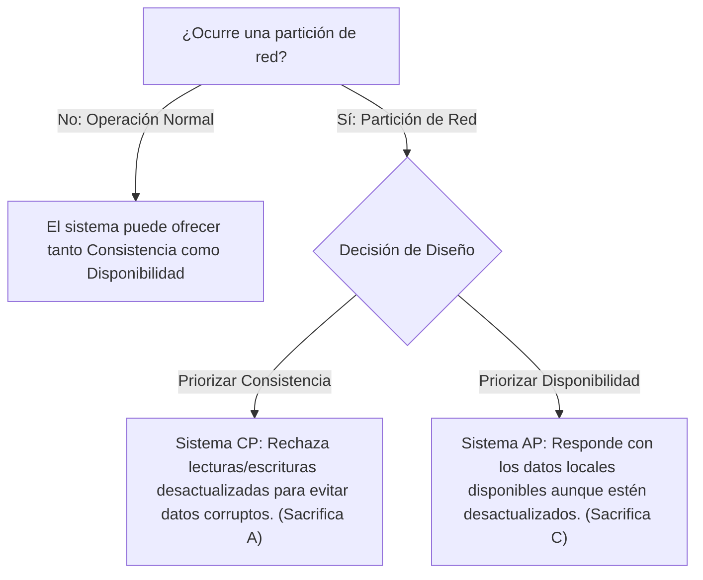
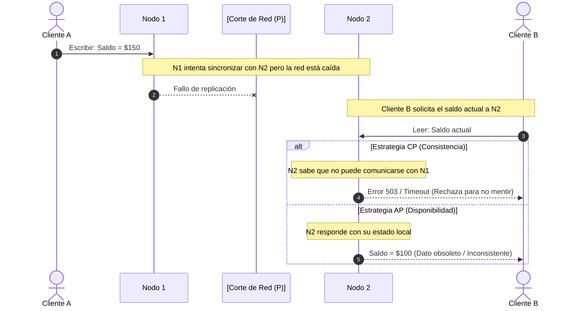

#architecture #system-design #distributed-systems #cap #teorema-cap

# Teorema CAP

El **Teorema CAP** (también conocido como **Conjetura de Brewer**) es uno de los principios fundamentales en el diseño de sistemas distribuidos y bases de datos. Establece los límites fundamentales de lo que un sistema de almacenamiento distribuido puede garantizar en presencia de fallos de red.

Fue formulado originalmente por el informático **Eric Brewer** en el año 2000 y formalmente demostrado por **Seth Gilbert y Nancy Lynch** del MIT en 2002.

---

## Índice

- [[Diseño y Arquitectura/Diseño y Arquitectura.md|<- Volver a Diseño y Arquitectura]]
- [[Diseño y Arquitectura/Sistemas Distribuidos/Teorema PACELC.md|Ver extensión: Teorema PACELC]]

---

## Las Tres Propiedades (C, A, P)

El teorema toma su nombre de tres garantías deseables en cualquier sistema distribuido:

```
                  Consistencia (C)
                        ▲
                       / \
                      /   \
                     /     \
                    /  CAP  \
                   /         \
  Disponibilidad (A) ───────── Tolerancia a Particiones (P)
```

### 1. Consistencia (Consistency)
> En el contexto de CAP, Consistencia significa **Linearizabilidad** (Strong Consistency).

- **Definición**: Cada lectura debe devolver el valor de la **escritura más reciente** o fallar con un error.
- Todos los nodos del clúster ven exactamente el mismo dato al mismo tiempo, comportándose externamente como si existiera una única copia atómica de los datos.

> [!NOTE] Diferencia entre la "C" de CAP y la "C" de ACID
> - **C en ACID (Consistency)**: Se refiere a la integridad del modelo de datos y reglas de negocio (invariantes, llaves foráneas, restricciones de unicidad). Si una transacción rompe una regla, se hace rollback.
> - **C en CAP (Linearizability)**: Se refiere a la consistencia secuencial temporal distribuida. Si el nodo $A$ procesa una escritura confirmada en $T_1$, cualquier lectura en el nodo $B$ en $T_2 > T_1$ debe reflejar dicho cambio.

---

### 2. Disponibilidad (Availability)
- **Definición**: Cada petición no fallida recibida por un nodo que esté en funcionamiento debe recibir una **respuesta no-errónea** (sin garantizar que sea el dato más reciente).
- El sistema no puede devolver un error 500, lanzar un timeout o rechazar la solicitud solo porque no pudo comunicarse con sus pares.

> [!WARNING] Cuidado con el término "Disponibilidad"
> En la ingeniería de operaciones habitual, disponibilidad suele medirse como "los 9s" de uptime (ej. 99.999%). En CAP, la disponibilidad es una garantía formal estricta por nodo: **si un nodo está encendido, está obligado a responder con éxito al cliente**.

---

### 3. Tolerancia a Particiones (Partition Tolerance)
- **Definición**: El sistema continúa operando a pesar de que un número arbitrario de mensajes se pierdan, se descarten o se retrasen debido a una caída de la red entre nodos.
- Una **partición de red** ocurre cuando dos o más grupos de nodos quedan incomunicados entre sí (comúnmente llamado *Split-Brain* o corte de enlace).

---

## El Mito de "Elige 2 de 3"

Tradicionalmente se explicaba que *"en un sistema distribuido puedes elegir 2 de las 3 propiedades: CA, CP o AP"*. **Esto es un mito y una simplificación errónea.**

En el mundo real:
1. Las redes físicas son imperfectas (cables desconectados, fallos de switches, saturación, latencias excesivas que disparan timeouts).
2. De acuerdo con las **Falacias de la Computación Distribuida**, la red nunca es 100% confiable ni su latencia es cero.
3. Por lo tanto, **la Tolerancia a Particiones (P) no es una opción negociable; es una necesidad física de la computación distribuida**.

> [!IMPORTANT] La Verdadera Elección de CAP
> En un sistema distribuido real, la elección no es entre $C$, $A$ y $P$, sino:
> **En presencia de una partición de red ($P$), ¿priorizas la Consistencia ($CP$) o la Disponibilidad ($AP$)?**



---

## Anatomía de una Partición de Red

Imaginemos un clúster distribuido con 2 nodos: **Nodo 1** y **Nodo 2**, replicando un registro de balance bancario con valor inicial `$100`. Ocurre un corte de enlace entre ambos nodos.



---

## Comparativa de Diseños Arquitectónicos

| Tipo | Comportamiento en Partición | Sacrifica | Ejemplos Representativos |
| :--- | :--- | :--- | :--- |
| **CP** | Rechaza operaciones o bloquea nodos aislados para evitar inconsistencias. Garantiza integridad matemática. | **Disponibilidad** (Devuelve errores o latencias infinitas mientras dure la partición). | Google Cloud Spanner, CockroachDB, HBase, etcd, ZooKeeper, Redis Sentinel. |
| **AP** | Permite lecturas y escrituras en cualquier partición. Las réplicas divergen temporalmente y se reconcilian después. | **Consistencia Fuerte** (Clientes pueden leer datos viejos o sobrescribir cambios ajenos). | Apache Cassandra, Amazon DynamoDB (modo eventual), CouchDB, DNS. |
| **CA** | Ofrece consistencia y disponibilidad perfecta asumiendo que la red jamás fallará. | **Tolerancia a Particiones** (No apto para arquitecturas distribuidas multinodo). | RDBMS tradicionales mononodo: PostgreSQL standalone, MySQL standalone, SQLite. |

---

## ¿Cuándo Elegir CP vs AP?

### Casos de Uso para Sistemas CP
- **Transacciones Financieras y Banca**: No es aceptable que un cajero automático dispense dinero basado en un saldo viejo que ya fue retirado en otra sucursal.
- **Coordinación Distribuida y Bloqueos (Locks)**: Herramientas como `etcd`, `ZooKeeper` o `Consul` eligen líderes y mantienen candados distribuidos (`mutex`). Si dos nodos creyeran ser líderes a la vez (*Split-Brain*), el daño sería catastrófico.
- **Sistemas de Inventario con Stock Limitado**: Venta de entradas para conciertos o vuelos de avión donde el sobre-vender un asiento genera problemas legales.

### Casos de Uso para Sistemas AP
- **Redes Sociales y Feeds**: Si un usuario publica un "Me gusta" o un tweet y sus amigos en otra región lo ven 3 segundos más tarde, no hay impacto crítico en el negocio. Lo importante es que la app nunca muestre un error.
- **Carrito de Compras en E-Commerce**: Amazon descubrió históricamente que rechazar la adición de un artículo al carrito genera pérdida inmediata de ventas. Es preferible aceptar la escritura en cualquier nodo y fusionar carritos duplicados después (*Eventual Consistency*).
- **Métricas y Telemetría IoT**: La pérdida o retraso de lecturas de sensores de temperatura es preferible a detener la ingestión de millones de dispositivos.

---

## Limitaciones del Teorema CAP

Aunque el Teorema CAP es un hito de la informática distribuida, en la práctica moderna presenta varias limitaciones:

1. **Visión 100% Binaria**: Trata la consistencia y la disponibilidad como interruptores de todo o nada (0 ó 1), cuando en los sistemas reales existen múltiples niveles continuos de consistencia (consistencia causal, de sesión, eventual, read-your-writes).
2. **Las Particiones son Raras**: En centros de datos modernos con enlaces redundantes, las particiones de red ocurren un porcentaje minúsculo del tiempo (0.01% - 0.1%).
3. **Omite el Estado Normal**: CAP no describe qué ocurre durante el **99.9% del tiempo restante** cuando la red está funcionando perfectamente. ¿Qué compensaciones enfrentamos cuando todo está bien?

Para responder a esta última limitación crucial surgió la extensión moderna del Teorema CAP: el **Teorema PACELC**.

---

## Referencias y Enlaces

- [[Diseño y Arquitectura/Sistemas Distribuidos/Teorema PACELC.md|Teorema PACELC (Extensión moderna del Teorema CAP)]]
- [[Diseño y Arquitectura/Diseño y Arquitectura.md|Índice de Diseño y Arquitectura]]
- [[Diseño y Arquitectura/Diseño y Arquitectura.md|Arquitectura de Software]]
- Paper Original: *Seth Gilbert and Nancy Lynch, "Brewer's conjecture and the feasibility of consistent, available, partition-tolerant web services", ACM SIGACT News, 2002.*
