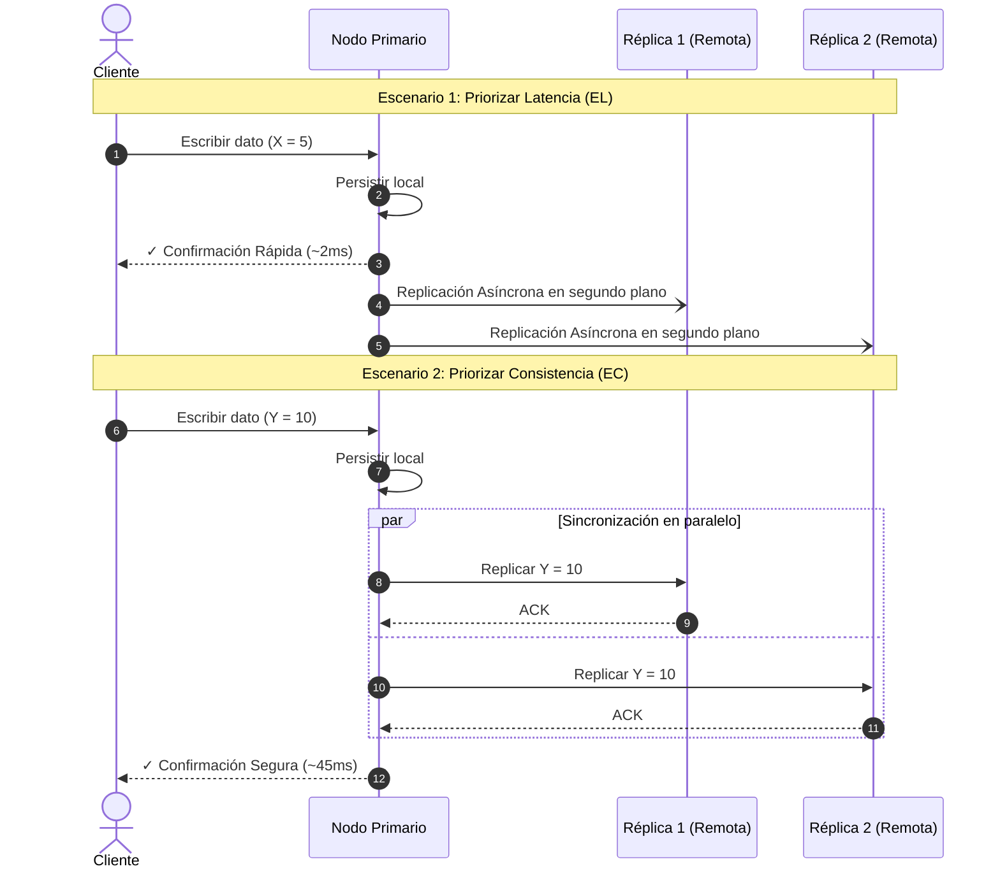
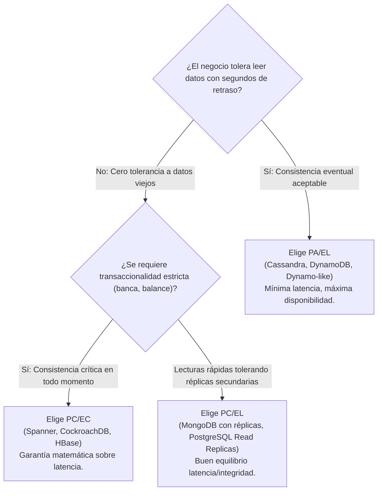

#architecture #system-design #distributed-systems #pacelc #teorema-pacelc #latency #consistency

# Teorema PACELC

El **Teorema PACELC** es una extensión del [[Diseño y Arquitectura/Sistemas Distribuidos/Teorema CAP.md|Teorema CAP]] para sistemas distribuidos. Fue propuesto en 2012 por **Daniel Abadi**, profesor e investigador de la Universidad de Yale, en su influyente artículo *"Consistency Tradeoffs in Modern Distributed Database System Design"*.

PACELC surge para llenar el vacío fundamental de CAP: **explicar qué decisiones y sacrificios de diseño ocurren durante la operación normal del sistema (cuando no hay fallos de red)**.

---

## Índice

- [[Diseño y Arquitectura/Diseño y Arquitectura.md|<- Volver a Diseño y Arquitectura]]
- [[Diseño y Arquitectura/Sistemas Distribuidos/Teorema CAP.md|Ver base teórica: Teorema CAP]]

---

## ¿Por qué surgió PACELC?

El [[Diseño y Arquitectura/Sistemas Distribuidos/Teorema CAP.md|Teorema CAP]] solo contempla la situación cuando ocurre una partición de red ($P$):
- *¿Elegir Consistencia ($C$) o Disponibilidad ($A$)?*

Sin embargo:
1. En infraestructuras modernas (AWS, GCP, Azure, centros de datos privados), las particiones de red ocurren un porcentaje mínimo del tiempo (típicamente $< 0.1\%$).
2. Durante el **$99.9\%$ del tiempo**, la red opera con normalidad.
3. No obstante, incluso sin particiones, los arquitectos se enfrentan a un compromiso diario ineludible: **Consistencia vs Latencia**.

> [!IMPORTANT] La Premisa de Abadi
> Aunque no haya fallos de red, **la luz tiene una velocidad finita**. Replicar datos a través de múltiples nodos físicos o regiones geográficas toma tiempo. Si quieres que todos los nodos tengan el dato antes de responder al usuario (Consistencia), debes pagar el costo en tiempo de espera (Latencia).

---

## Desglose del Acrónimo PACELC

La regla se lee como una condición lógica estructurada en dos partes:

$$\text{If } \mathbf{P} \rightarrow (\mathbf{A} \lor \mathbf{C}) \quad \mathbf{E}\text{lse} \rightarrow (\mathbf{L} \lor \mathbf{C})$$

```
  ┌─────────────────────────────────────────────────────────────┐
  │                         P  A  C  E  L  C                    │
  └──────┬──────┬──────┬──────┬───────┬──────┬───────┬──────────┘
         │      │      │      │       │      │       │
       Si hay   │      ó      │       │      │       ó
     Partición  │ Consistencia│       │   Latencia   │ Consistencia
        (P)     │     (C)     │    En caso  (L)      │     (C)
                │             │   contrario          │
          Disponibilidad      │     (Else)           │
               (A)            │      (E)             │
```

### 1. Primera Mitad: En Presencia de Partición ($\text{If } P$)
Si hay una partición en la red ($P$), el sistema debe elegir entre:
- **$A$ (Availability / Disponibilidad)**: Mantenerse disponible para responder peticiones aunque entregue datos viejos.
- **$C$ (Consistency / Consistencia)**: Garantizar datos exactos bloqueando o rechazando peticiones que no puedan confirmarse.

*(Esta mitad equivale exactamente a la disyuntiva clásica del Teorema CAP: AP vs CP).*

### 2. Segunda Mitad: En Operación Normal ($\text{Else}$)
Si la red funciona normalmente y no hay particiones ($E$), el sistema debe elegir entre:
- **$L$ (Latency / Latencia)**: Responder lo más rápido posible al cliente, replicando asíncronamente en segundo plano a las demás réplicas.
- **$C$ (Consistency / Consistencia)**: Esperar a que las réplicas sincronicen la escritura antes de responder, garantizando consistencia a costa de una mayor latencia.

---

## El Compromiso Latencia vs Consistencia ($L \text{ vs } C$)



- **Enfoque EL (Else Latency)**: Latencia ultra baja. La respuesta es casi instantánea, pero si un cliente lee de la `Réplica 1` antes de que termine la sincronización asíncrona, leerá un dato desactualizado (*stale read*).
- **Enfoque EC (Else Consistency)**: Coherencia estricta. Todo lector verá siempre el dato confirmado, pero cada escritura incurre en la penalización del viaje de ida y vuelta de la red (*RTT*), bloqueos y posible coordinación de consenso (Paxos/Raft).

---

## Las 4 Clases de Sistemas PACELC

Al combinar ambas ramas de decisión surgen cuatro cuadrantes posibles:

```
                      EN PARTICIÓN (P)
                  Disponibilidad (A)   Consistencia (C)
                 ┌───────────────────┬───────────────────┐
  Latencia (L)   │       PA/EL       │       PC/EL       │
                 │ (Cassandra,       │ (MongoDB default, │
EN OPERACIÓN     │  DynamoDB)        │  MySQL/PG async)  │
NORMAL (E)       ├───────────────────┼───────────────────┤
                 │       PA/EC       │       PC/EC       │
Consistencia (C) │ (Poco común /     │ (Spanner,         │
                 │  Híbridos raros)  │  CockroachDB)     │
                 └───────────────────┴───────────────────┘
```

### 1. PC/EC (Partition: Consistency / Else: Consistency)
- **Comportamiento**: Prioriza la **consistencia en todo momento**. Si hay partición de red, rechaza escrituras antes de comprometer la integridad. En operación normal, sincroniza entre réplicas antes de responder para asegurar linealizabilidad.
- **Ventajas**: Consistencia ACID distribuida absoluta. Cero datos fantasma.
- **Desventajas**: Mayor latencia global y menor resiliencia a caídas parciales de nodos.
- **Ejemplos**:
  - **Google Cloud Spanner** (utiliza relojes atómicos TrueTime y Paxos)
  - **CockroachDB** (consenso Raft distribuido)
  - **Apache HBase / Hadoop HDFS**
  - **etcd / ZooKeeper / Consul**

### 2. PC/EL (Partition: Consistency / Else: Latency)
- **Comportamiento**: En partición de red protege la consistencia (evita escrituras conflictivas desconectando particiones minoritarias). Sin embargo, en operación normal prefiere responder rápido y replicar asíncronamente.
- **Ventajas**: Excelente velocidad de respuesta en lecturas/escrituras locales durante el día a día, con protección contra divergencia de datos en fallos graves.
- **Desventajas**: Lecturas secundarias en estado normal pueden observar datos con retraso (*replication lag*).
- **Ejemplos**:
  - **MongoDB** (por defecto: lecturas locales y `w: 1`)
  - **PostgreSQL / MySQL** con replicación primaria-secundaria asíncrona y failover automático
  - **Redis** con replicación réplica y Sentinel

### 3. PA/EL (Partition: Availability / Else: Latency)
- **Comportamiento**: El paradigma del rendimiento extremo y la alta disponibilidad. Si hay partición, sigue aceptando lecturas y escrituras en cualquier nodo disponible. En operación normal, minimiza la latencia respondiendo de inmediato sin esperar consenso global.
- **Ventajas**: Uptime casi ininterrumpido, latencias de milisegundos de un solo dígito a escala masiva.
- **Desventajas**: **Consistencia Eventual** (*Eventual Consistency*). Requiere resolución de conflictos posterior (*Last-Write-Wins*, CRDTs o vector clocks).
- **Ejemplos**:
  - **Apache Cassandra**
  - **Amazon DynamoDB** (configuración por defecto de lecturas eventuales)
  - **CouchDB**
  - **Riak KV**

### 4. PA/EC (Partition: Availability / Else: Consistency)
- **Comportamiento**: En caso de partición prefiere disponibilidad, pero en estado normal paga la latencia para mantener todas las réplicas sincronizadas.
- **Realidad práctica**: Es una combinación sumamente inusual en la industria porque resulta contradictoria: si una arquitectura está dispuesta a pagar la latencia de sincronización síncrona el 99.9% del tiempo, usualmente también exige consistencia cuando ocurre una falla.

---

## Matriz Comparativa de Motores Populares

| Motor / Base de Datos | Clasificación CAP | Clasificación PACELC | Mecanismo de Replicación / Consenso | Caso de Uso Típico |
| :--- | :--- | :--- | :--- | :--- |
| **Google Spanner** | CP | **PC/EC** | Paxos + Hardware TrueTime GPS/Atómico | Finanzas globales, pagos multinacionales. |
| **CockroachDB** | CP | **PC/EC** | Raft consensus multinodo | RDBMS escalable globalmente con SQL y ACID. |
| **Apache HBase** | CP | **PC/EC** | ZooKeeper + HDFS write-ahead-log | Big Data analítico consistente en Hadoop. |
| **etcd / Consul** | CP | **PC/EC** | Raft consensus | Configuración de Kubernetes, Service Discovery. |
| **MongoDB** *(default)* | CP | **PC/EL** | Primary-Replica Set (asíncrono por defecto) | Apps web generales, catálogos, documentos JSON. |
| **PostgreSQL / MySQL** | CA / CP | **PC/EL** | Master-Slave / Read Replicas (asíncrono) | Sistemas empresariales transaccionales tradicionales. |
| **Apache Cassandra** | AP | **PA/EL** | Gossip Protocol, Quorums configurables | Series temporales, telemetría IoT, mensajería masiva. |
| **Amazon DynamoDB** | AP | **PA/EL** | Multi-AZ replication con consistencia eventual | Aplicaciones serverless de alta escala y baja latencia. |
| **CouchDB** | AP | **PA/EL** | Multi-Master con reconciliación MVCC | Aplicaciones offline-first y móviles sincronizadas. |

---

## Configurabilidad Dinámica: Ajuste de PACELC por Operación

Muchos motores NoSQL modernos no están rígidamente anclados a una sola categoría, sino que permiten ajustar el balance PACELC en tiempo de ejecución por cada consulta mediante **Quórums**:

$$R + W > N$$

Donde:
- $N$ = Factor de replicación (número total de copias).
- $W$ = Número de nodos que deben confirmar una escritura.
- $R$ = Número de nodos que deben responder a una lectura.

### En Apache Cassandra / DynamoDB:
- Si configuras **$W = 1$ y $R = 1$**: El sistema opera en modo **PA/EL** puro (máxima velocidad, consistencia eventual).
- Si configuras **$W = \text{QUORUM}$ y $R = \text{QUORUM}$** (donde $\text{QUORUM} = \lfloor N/2 \rfloor + 1$): Como $R + W > N$, la lectura siempre intersecta al menos un nodo con la última escritura. El sistema se transforma dinámicamente en **PC/EC** (mayor latencia, consistencia fuerte garantizada).

### En MongoDB:
- **Write Concern**: `w: 1` (PC/EL) vs `w: "majority"` con `j: true` (PC/EC).
- **Read Concern**: `readConcern: "local"` (PC/EL) vs `readConcern: "linearizable"` (PC/EC).

---

## Comparativa Directa: CAP vs PACELC

```
┌─────────────────────────┬───────────────────────────────┬────────────────────────────────┐
│ Dimensión               │ Teorema CAP                   │ Teorema PACELC                 │
├─────────────────────────┼───────────────────────────────┼────────────────────────────────┤
│ Origen                  │ Eric Brewer (2000)            │ Daniel Abadi (2012)            │
│ Escenarios Evaluados    │ Solo ante fallos (partición)  │ En fallos Y en estado normal   │
│ Factores Analizados     │ Consistencia, Disponibilidad, │ Consistencia, Disponibilidad,  │
│                         │ Partición (C, A, P)           │ Partición, Latencia (C,A,P,L)  │
│ Papel de la Latencia    │ Ignorada                      │ Factor de primer nivel         │
│ Utilidad en Producción  │ Teórica / Clasificación macro │ Guía práctica para arquitectos │
└─────────────────────────┴───────────────────────────────┴────────────────────────────────┘
```

---

## Guía Práctica de Decisión para Arquitectura de Software



1. **Si desarrollas servicios bancarios, pasarelas de pago o inventario con sobreventa restringida**:
   - Orientación recomendada: **PC/EC**. La corrección matemática es prioritaria frente a la latencia de red.
2. **Si desarrollas redes sociales, telemetría IoT, carritos de compra o catálogos de streaming**:
   - Orientación recomendada: **PA/EL**. Los usuarios abandonan una web que tarda más de 2 segundos en cargar, pero no notan si una estadística tiene un segundo de desfase.
3. **Si tienes una aplicación SaaS B2B general con lecturas intensivas**:
   - Orientación recomendada: **PC/EL**. Base de datos relacional o de documentos con réplicas asíncronas de lectura para baja latencia.

---

## Referencias y Enlaces

- [[Diseño y Arquitectura/Sistemas Distribuidos/Teorema CAP.md|Teorema CAP (Fundamentos)]]
- [[Diseño y Arquitectura/Diseño y Arquitectura.md|Índice de Diseño y Arquitectura]]
- [[Diseño y Arquitectura/Diseño y Arquitectura.md|Arquitectura de Software]]
- Paper Original: *Daniel J. Abadi, "Consistency Tradeoffs in Modern Distributed Database System Design: CAP is Only Part of the Story", IEEE Computer, 2012.*
