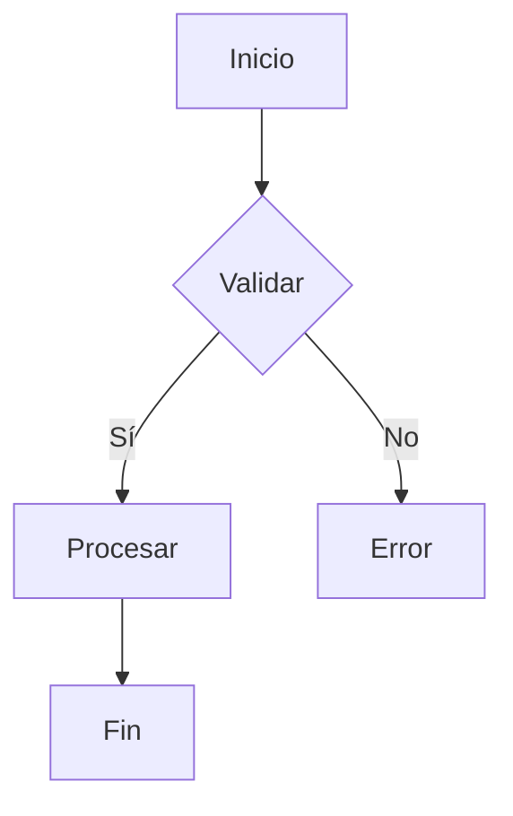
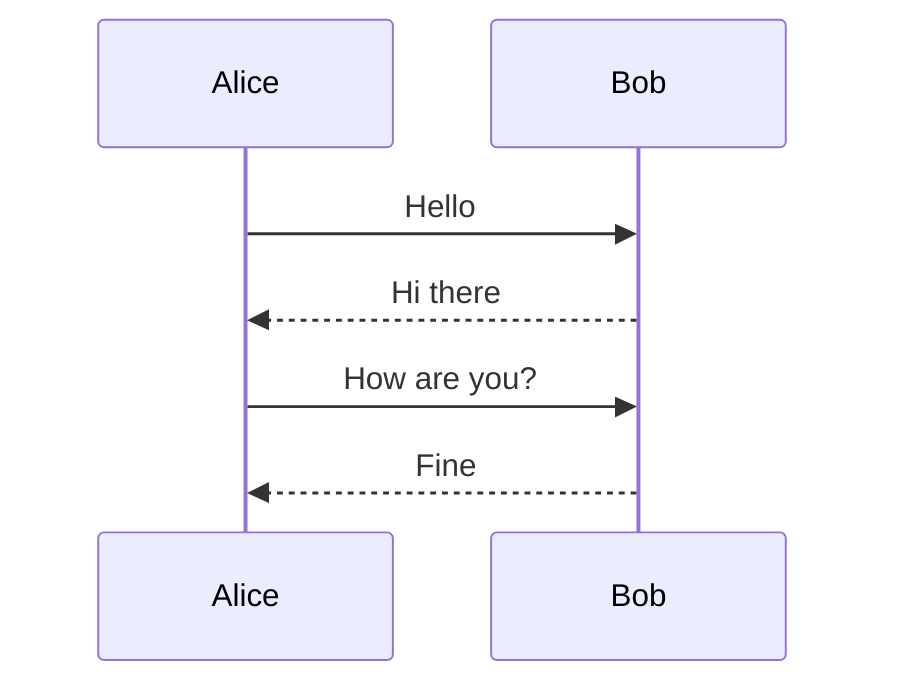
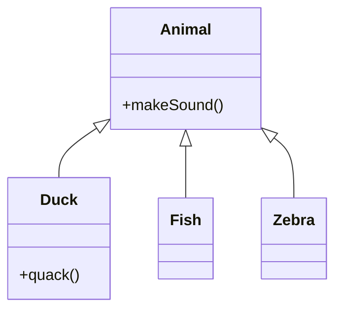

#engineering #tools #diagramas

Mermaid permite crear diagramas usando sintaxis similar a Markdown, integrado en múltiples plataformas.

## Características

| Feature | Descripción |
|---------|-------------|
| **Como código** | Sintaxis texto simple |
| **Integrado** | GitHub, GitLab, VS Code, Notion |
| **Gratis** | Open source |
| **Liviano** | No requiere instalación |

## Ejemplo: Diagrama de Flujo

## Ejemplo: Diagrama de Secuencia

## Ejemplo: Diagrama de Clases

## Plataformas con Soporte

- GitHub (README.md)
- GitLab
- Notion
- Obsidian
- VS Code (extensión)
- Typora

## Ventajas

- Syntaxis simple y legible
- Versionable en Git
- Preview en tiempo real
- Ideal para docs

## Desventajas

- Menos flexible que visual
- diagrams limitado vs PlantUML

[[Ingeniería/Diseño de Sistemas/Herramientas/Herramientas de Diagramación.md]]