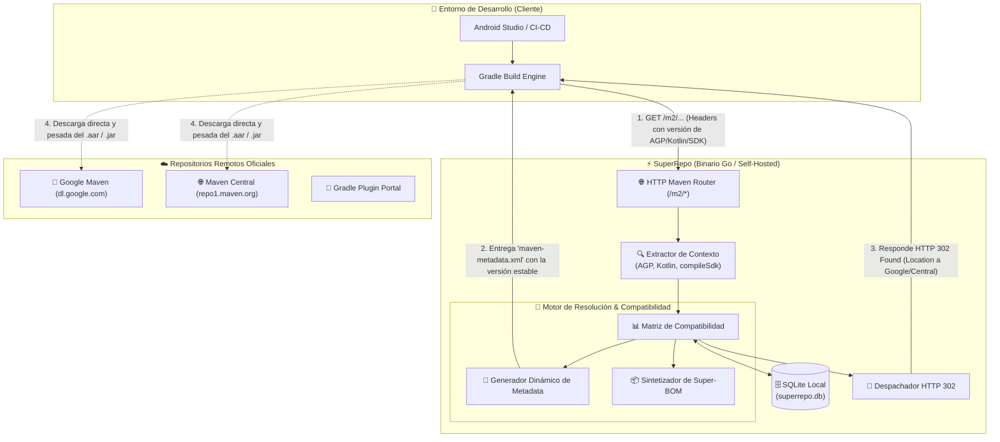

 🚀 SuperRepo

  │ Smart Maven Proxy & Context-Aware Dependency Resolver for Android
  │ Una herramienta de código abierto y autoalojada (self-hosted) desarrollada en Go que unifica repositorios, elimina el caos de versiones y garantiza la compatibilidad de dependencias en proyectos Android.
  ──────
  ## 1. Visión y Propósito

  El ecosistema de dependencias en Android/JVM está fragmentado entre múltiples repositorios (google(), mavenCentral(), jitpack.io), metadatos en XML heredados y una sincronización manual propensa a errores entre versiones de AGP,
  Kotlin, KSP, Compose y Android SDKs.

  SuperRepo actúa como un servidor proxy local/on-premise ultraligero en Go que se interpone entre Gradle y los repositorios remotos. Resuelve automáticamente las versiones estables óptimas según el entorno de cada proyecto y entrega
  los artefactos mediante redirecciones directas o caché local.
  ──────
  ## 2. El Problema que Resuelve

  1. Fragmentación de repositorios: Obligación de configurar y consultar múltiples fuentes simultáneas.
  2. Incompatibilidades silenciosas: Conflictos entre versiones de compiladores (ej. Kotlin 2.0.21 vs KSP) o dependencias que exigen un compileSdk superior al del proyecto.
  3. Mantenimiento manual de catálogos: Tiempo perdido buscando números de versión compatibles en lugar de centrarse en programar.
  4. Falta de un estándar moderno: Ausencia de un ecosistema unificado al estilo de cargo (Rust), go modules o npm.
  ──────
  ## 3. Arquitectura Técnica

  ### Componentes Clave:

  • Lenguaje: Go (binario único estático de ~15 MB, bajo consumo de RAM, alta concurrencia con goroutines).
  • Almacenamiento: SQLite embebido (sin necesidad de configurar servidores de base de datos externos).
  • Mecanismo de entrega: HTTP 302 Redirect (el cliente descarga el archivo .aar/.jar pesado directamente desde Google o Maven Central, reduciendo a cero los costos de transferencia y almacenamiento del servidor).
  • Caché opcional: Modo almacenamiento local para permitir compilaciones rápidas y trabajo offline.
  ──────
  ## 4. Modos de Despliegue (Costo $0 de Infraestructura)

  • Modo Local (Desarrollador individual):
  Se ejecuta como un daemon en la máquina del programador (http://localhost:8080/m2). Todo el procesamiento y descarga ocurre en su propio equipo.
  • Modo Servidor de Equipo / Empresa (On-Premise):
  Desplegado en un contenedor Docker (docker-compose.yml) dentro de la red privada de una empresa, funcionando como proxy compartido para todo el equipo.
  ──────
  ## 5. Experiencia de Uso (DX)

  ### En el proyecto Android (settings.gradle.kts):

    dependencyResolutionManagement {
        repositories {
            maven { url = uri("http://localhost:8080/m2") }
        }
    }

  ### En el módulo (build.gradle.kts):

    dependencies {
        // Declaración sin versiones manuales: SuperRepo inyecta las compatibles
        implementation("androidx.core:core-ktx")
        implementation("androidx.compose.material3:material3")
        implementation("androidx.room:room-runtime")
        implementation("com.google.zxing:core")
    }
  ──────
  ## 6. Roadmap para el MVP (Fases de Desarrollo)

  1. Fase 1 — Ingestor / Crawlers en Go:
      • Descarga concurrente del master-index.xml de Google Maven y del índice de Maven Central.
      • Almacenamiento de grupos, artefactos, versiones y fechas en SQLite.
  2. Fase 2 — Servidor HTTP Maven básico:
      • Endpoint GET /m2/{path...} en Go.
      • Lógica de respuesta con HTTP 302 Found hacia las URLs oficiales.
  3. Fase 3 — Matriz de Compatibilidad & Filtrado Semántico:
      • Clasificador de versiones (ignorar alpha/beta si se busca estabilidad).
      • Detección del contexto del cliente (versión de AGP, Kotlin y SDK).
  4. Fase 4 — Super-BOM dinámico:
      • Generación al vuelo de metadatos para permitir dependencias sin versión en Gradle.

---

[[README.md|<- Volver a Inicio]]
